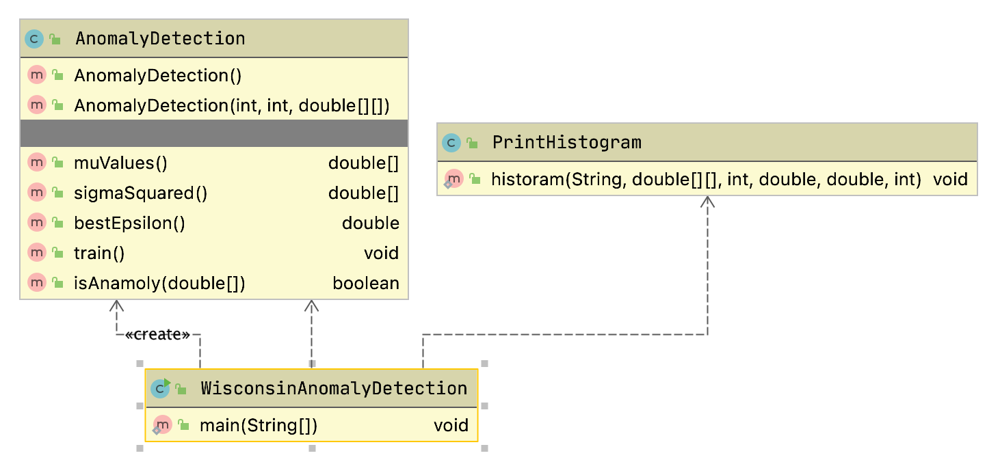

# Anomaly Detection Machine Learning Example

Anomaly detection models are used in one very specific class of use cases: when you have many negative (non-anomaly) examples and relatively few positive (anomaly) examples. We can refer to this as an unbalanced training set. For training we will ignore positive examples, create a model of "how things should be," and hopefully be able to detect anomalies different from the original negative examples.

If you have a large training set of both negative and positive examples then do not use anomaly detection models. If your training examples are balanced then use a classification model as we will see later in the chapter [Deep Learning Using Deeplearning4j](#dl4j).

## Motivation for Anomaly Detection

There are two other examples in this book using the University of Wisconsin cancer data. These other examples are supervised learning. Anomaly detection as we do it in this chapter is, more or less, unsupervised learning.

When should we use anomaly detection? You should use supervised learning algorithms like neural networks and logistic classification when there are roughly equal number of available negative and positive examples in the training data. The University of Wisconsin cancer data set is fairly evenly split between negative and positive examples.

Anomaly detection should be used when you have many negative ("normal") examples and relatively few positive ("anomaly") examples. For the example in this chapter we will simulate scarcity of positive ("anomaly") results by preparing the data using the Wisconsin cancer data as follows:

- We will split the data into training (60%), cross validation (20%) and testing (20%).
- For the training data, we will discard all but two positive ("anomaly") examples. We do this to simulate the real world test case where some positive examples are likely to end up in the training data in spite of the fact that we would prefer the training data to only contain negative ("normal") examples.
- We will use the cross validation data to find a good value for the epsilon meta parameter.
- After we find a good epsilon value, we will calculate the F1 measurement for the model.

## Math Primer for Anomaly Detection

We are trying to model "normal" behavior and we do this by taking each feature and fitting a Gaussian (bell curve) distribution to each feature. The learned parameters for a Gaussian distribution are the mean of the data (where the bell shaped curve is centered) and the variance.
You might be more familiar with the term standard deviation, `\sigma`$. 
Variance is defined as `\sigma^2`$.

We will need to calculate the probability: `P(x : \mu, \sigma ^2)`$
where `\mu`$ is the mean and `\sigma ^2`$  is the squared variance:

`P(x : \mu, \sigma ^2) = \frac{1}{{\sigma \sqrt {2\pi } }}e^{{{ - \left( {x - \mu } \right)^2 } \dots }}`$

where `x_i`$  are the samples and we can calculate the squared variance as:

`\sigma^2 = \frac{\displaystyle\sum_{i=1}^{m}(x_i - \mu)^2} {m}`$

We calculate the parameters of `\mu`$ and `\sigma ^2`$ for each feature. A bell shaped distribution in two dimensions is easy to visualize as is an inverted bowl shape in three dimensions. What if we have many features? Well, the math works and don't worry about not being able to picture it in your mind.
 

## AnomalyDetection Utility Class

The class **AnomalyDetection** developed in this section is fairly general purpose. 
It processes a set of training examples and for each feature calculates `\mu`$ and `\sigma ^2`$. We are also training for a third parameter: an epsilon "cutoff" value: if for a given input vector if `P(x : \mu, \sigma ^2)`$  evaluates
to a value greater than epsilon then the input vector is "normal", less than epsilon implies that the input vector is an "anomaly." The math for calculating these three features from training data is fairly easy but the code is not: we need to organize the training data and search for a value of epsilon that minimizes the error for a cross validation data set.

To be clear: we separate the input examples into three separate sets of training, cross validation, and testing data. We use the training data to set the model parameters, use the cross validation data to learn an epsilon value, and finally use the testing data to get precision, recall, and F1 scores that indicate how well the model detects anomalies in data not used for training and cross validation.

I present the example program as one long listing, with more code explanation after the listing. Please note the long loop over each input training example starting at line 28 and ending on line 74. The code in lines 25 through 44 processes the input training data sample into three disjoint sets of training, cross validation, and testing data. Then the code in lines 45 through 63 copies these three sets of data to Java arrays.

The code in lines 65 through 73 calculates, for a training example, the value of $\mu$ (the variable **mu** in the code).

Please note in the code example that I prepend class variables used in methods with "this." even when it is not required. I do this for legibility and is a personal style.

The following UML class diagram will give you an overview before we dive into the code:

{width: "80%"}

{width: "80%"}

{lang="java",linenos=on}
~~~~~~~~
package com.markwatson.anomaly_detection;

import java.util.ArrayList;
import java.util.List;
import java.util.Random;

/**
 * AnomalyDetection is a general purpose class for building anomaly detection
 * models. You should use this type of model when you have mostly negative
 * training examples with relatively few positive examples and you need a model
 * that detects positive (anomaly) inputs.
 *
 * 
The algorithm computes feature means and variances from training data,
 * then uses a multivariate Gaussian probability density to score new examples.
 * An epsilon threshold (tuned on cross-validation data) separates normal
 * examples from anomalies.

 */
public class AnomalyDetection {

  /**
   * Structured container for evaluation metrics returned by {@link #test}.
   */
  public record TestResult(
      double precision,
      double recall,
      double f1,
      int truePositives,
      int falsePositives,
      int trueNegatives,
      int falseNegatives
  ) {}

  /** Seed for reproducible train/cross-validation/test splits. */
  private static final long DEFAULT_SEED = 42L;

  private static final double SQRT_2_PI = Math.sqrt(2.0 * Math.PI);

  private double bestEpsilon = 0.02;
  private double[] mu;            // [num_features]
  private double[] sigmaSquared;  // [num_features]
  private int numFeatures;

  private double[][] trainingExamples;
  private double[][] crossValidationExamples;
  private double[][] testingExamples;
  private int numTrainingExamples;
  private int numCrossValidationExamples;
  private int numTestingExamples;

  public AnomalyDetection() { }

  /**
   * Build an anomaly detection model from the supplied training data.
   *
   * 
The data is split into training (60 %), cross-validation, and test
   * sets. Only normal (negative) examples go into the training set, with
   * ~10 % of positive examples intentionally leaked in to make the model
   * robust.

   *
   * @param numFeatures          number of features (including the target column)
   * @param numTrainingExamples  number of rows in {@code trainingExamples}
   * @param trainingExamples     [numTrainingExamples][numFeatures]
   */
  public AnomalyDetection(int numFeatures, int numTrainingExamples, double[][] trainingExamples) {
    var training = new ArrayList<double[]>();
    var crossValidation = new ArrayList<double[]>();
    var testing = new ArrayList<double[]>();
    int outcomeIndex = numFeatures - 1; // index of target outcome
    var rng = new Random(DEFAULT_SEED);

    for (int i = 0; i < numTrainingExamples; i++) {
      if (rng.nextDouble() < 0.6) { // 60% training
        // Only keep normal (negative) examples in training, except
        // remember the reason for using this algorithm is that it
        // works with many more negative examples than positive
        // examples, and that the algorithm works even with some positive
        // examples mixed into the training set. The random test is to
        // allow about 10% positive examples to get into the training set:
        if (trainingExamples[i][outcomeIndex] < 0.5 || rng.nextDouble() < 0.1)
          training.add(trainingExamples[i]);
      } else if (rng.nextDouble() < 0.7) {
          crossValidation.add(trainingExamples[i]);
      } else {
        testing.add(trainingExamples[i]);
      }
    }
    this.numTrainingExamples = training.size();
    this.numCrossValidationExamples = crossValidation.size();
    this.numTestingExamples = testing.size();

    this.trainingExamples = training.toArray(new double[0][]);
    this.crossValidationExamples = crossValidation.toArray(new double[0][]);
    this.testingExamples = testing.toArray(new double[0][]);

    this.mu = new double[numFeatures];
    this.sigmaSquared = new double[numFeatures];
    this.numFeatures = numFeatures;
    for (int nf = 0; nf < this.numFeatures; nf++) {
      double sum = 0;
      for (int nt = 0; nt < this.numTrainingExamples; nt++) sum += this.trainingExamples[nt][nf];
      this.mu[nf] = sum / this.numTrainingExamples;
    }
  }

  public double[] muValues()     { return mu; }
  public double[] sigmaSquared() { return sigmaSquared; }
  public double bestEpsilon()    { return bestEpsilon; }

  /**
   * Train the model using a range of epsilon values. Epsilon is a
   * hyper parameter that we want to find a value that
   * minimizes the error count.
   */
  public void train() {
    double bestErrorCount = 1e10;
    for (int epsilonLoop = 0; epsilonLoop < 200; epsilonLoop++) {
      double epsilon = 0.001 + 0.005 * epsilonLoop;
      double errorCount = trainHelper(epsilon);
      if (errorCount <= bestErrorCount) {
        bestErrorCount = errorCount;
        bestEpsilon = epsilon;
      }
    }
    System.out.println("\n**** Best epsilon value = " + bestEpsilon);

    // retrain for the best epsilon setting the maximum likelihood parameters
    // which are now in epsilon, mu[] and sigmaSquared[]:
    trainHelper(bestEpsilon);

    // finally, we are ready to see how the model performs with test data:
    test(bestEpsilon);
  }

  /**
   * Calculate probability p(x; mu, sigma_squared) using the
   * Gaussian PDF:  p(x_i) = (1 / (sqrt(2*pi) * sigma))
   *                         * exp(-(x_i - mu)^2 / (2 * sigma^2))
   *
   * @param x - example vector
   * @return average probability across features
   */
  private double p(double[] x) {
    double sum = 0;
    // use (numFeatures - 1) to skip target output:
    for (int nf = 0; nf < numFeatures - 1; nf++) {
      double sigma = Math.sqrt(sigmaSquared[nf]);
      double exponent = -(x[nf] - mu[nf]) * (x[nf] - mu[nf]) / (2.0 * sigmaSquared[nf]);
      sum += (1.0 / (SQRT_2_PI * sigma)) * Math.exp(exponent);
    }
    return sum / numFeatures;
  }

  /**
   * Returns {@code true} if the input vector is classified as an anomaly.
   *
   * @param x example vector
   * @return true when the Gaussian probability falls below the best epsilon threshold
   */
  public boolean isAnomaly(double[] x) {
    double sum = 0;
    // use (numFeatures - 1) to skip target output:
    for (int nf = 0; nf < numFeatures - 1; nf++) {
      double sigma = Math.sqrt(sigmaSquared[nf]);
      double exponent = -(x[nf] - mu[nf]) * (x[nf] - mu[nf]) / (2.0 * sigmaSquared[nf]);
      sum += (1.0 / (SQRT_2_PI * sigma)) * Math.exp(exponent);
    }
    return (sum / numFeatures) < bestEpsilon;
  }

  /**
   * @deprecated Use {@link #isAnomaly(double[])} instead (fixed spelling).
   */
  @Deprecated(since = "1.1", forRemoval = true)
  public boolean isAnamoly(double[] x) {
    return isAnomaly(x);
  }

  private double trainHelper(double epsilon) {
    int outcomeIndex = numFeatures - 1;
    // use (numFeatures - 1) to skip target output:
    for (int nf = 0; nf < numFeatures - 1; nf++) {
      double sum = 0;
      for (int nt = 0; nt < numTrainingExamples; nt++) {
        sum += (trainingExamples[nt][nf] - mu[nf]) * (trainingExamples[nt][nf] - mu[nf]);
      }
      sigmaSquared[nf] = sum / numTrainingExamples;
    }
    double crossValidationErrorCount = 0;
    for (int nt = 0; nt < numCrossValidationExamples; nt++) {
      var x = crossValidationExamples[nt];
      double calculatedValue = p(x);
      if (x[outcomeIndex] > 0.5) { // target training output is ANOMALY
        // if the calculated value is greater than epsilon
        // then this x vector is not an anomaly (e.g., it
        // is a normal sample):
        if (calculatedValue > epsilon) crossValidationErrorCount += 1;
      } else { // target training output is NORMAL
        if (calculatedValue < epsilon) crossValidationErrorCount += 1;
      }
    }
    System.out.println("   cross_validation_error_count = " + crossValidationErrorCount + " for epsilon = " + epsilon);
    return crossValidationErrorCount;
  }

  private TestResult test(double epsilon) {
    int outcomeIndex = numFeatures - 1;
    int numFalsePositives = 0, numFalseNegatives = 0;
    int numTruePositives = 0, numTrueNegatives = 0;
    for (int nt = 0; nt < numTestingExamples; nt++) {
      var x = testingExamples[nt];
      double calculatedValue = p(x);
      if (x[outcomeIndex] > 0.5) { // target training output is ANOMALY
        if (calculatedValue > epsilon) numFalseNegatives++;
        else                           numTruePositives++;
      } else { // target training output is NORMAL
        if (calculatedValue < epsilon) numFalsePositives++;
        else                           numTrueNegatives++;
      }
    }
    double precision = numTruePositives / (double) (numTruePositives + numFalsePositives);
    double recall = numTruePositives / (double) (numTruePositives + numFalseNegatives);
    double f1 = 2.0 * precision * recall / (precision + recall);

    System.out.println("""

         -- best epsilon = %s
         -- number of test examples = %d
         -- number of false positives = %d
         -- number of true positives = %d
         -- number of false negatives = %d
         -- number of true negatives = %d
         -- precision = %.4f
         -- recall = %.4f
         -- F1 = %.4f""".formatted(
        bestEpsilon, numTestingExamples,
        numFalsePositives, numTruePositives,
        numFalseNegatives, numTrueNegatives,
        precision, recall, f1));

    return new TestResult(precision, recall, f1,
        numTruePositives, numFalsePositives, numTrueNegatives, numFalseNegatives);
  }
}
~~~~~~~~

Once the training data and the values of {$$}\mu{/$$} (the varible **mu** in the code) are defined for each feature we can define the method **train** in lines 86 through 104 that calculated the best **epsilon** "cutoff" value for the training data set using the method **train_helper** defined in lines 138 through 165. We use the "best" **epsilon** value by testing with the separate cross validation data set; we do this by calling the method **test** that is defined in lines 167 through 198.

## Example Using the University of Wisconsin Cancer Data

The example in this section loads the University of Wisconsin data and uses the class **AnomalyDetection** developed in the last section to find anomalies, which for this example will be input vectors that represented malignancy in the original data.

{lang="java",linenos=on}
~~~~~~~~
package com.markwatson.anomaly_detection;

import java.io.IOException;
import java.nio.file.Files;
import java.nio.file.Path;
import java.util.List;

/**
 * Train a deep belief network on the University of Wisconsin Cancer Data Set.
 */
public class WisconsinAnomalyDetection {

  private static final boolean PRINT_HISTOGRAMS = true;
  private static final int NUM_HISTOGRAM_BINS = 5;

  public static void main(String[] args) throws IOException {

    var lines = Files.readAllLines(Path.of("data/cleaned_wisconsin_cancer_data.csv"));
    var trainingData = new double[lines.size()][];
    int lineCount = 0;

    for (var line : lines) {
      var sarr = line.strip().split(",");
      var xs = new double[10];
      for (int i = 0; i < 10; i++) xs[i] = Double.parseDouble(sarr[i]);
      for (int i = 0; i < 9; i++) xs[i] *= 0.1;

      // make the data look more like a Gaussian (bell curve shaped) distribution:
      double min = 1.e6, max = -1.e6;
      for (int i = 0; i < 9; i++) {
        xs[i] = Math.log(xs[i] + 1.2);
        if (xs[i] < min) min = xs[i];
        if (xs[i] > max) max = xs[i];
      }
      for (int i = 0; i < 9; i++) xs[i] = (xs[i] - min) / (max - min);

      xs[9] = (xs[9] - 2) * 0.5; // make target output be [0,1] instead of [2,4]
      trainingData[lineCount++] = xs;
    }

    if (PRINT_HISTOGRAMS) {
      PrintHistogram.histogram("Clump Thickness", trainingData, 0, 0.0, 1.0, NUM_HISTOGRAM_BINS);
      PrintHistogram.histogram("Uniformity of Cell Size", trainingData, 1, 0.0, 1.0, NUM_HISTOGRAM_BINS);
      PrintHistogram.histogram("Uniformity of Cell Shape", trainingData, 2, 0.0, 1.0, NUM_HISTOGRAM_BINS);
      PrintHistogram.histogram("Marginal Adhesion", trainingData, 3, 0.0, 1.0, NUM_HISTOGRAM_BINS);
      PrintHistogram.histogram("Single Epithelial Cell Size", trainingData, 4, 0.0, 1.0, NUM_HISTOGRAM_BINS);
      PrintHistogram.histogram("Bare Nuclei", trainingData, 5, 0.0, 1.0, NUM_HISTOGRAM_BINS);
      PrintHistogram.histogram("Bland Chromatin", trainingData, 6, 0.0, 1.0, NUM_HISTOGRAM_BINS);
      PrintHistogram.histogram("Normal Nucleoli", trainingData, 7, 0.0, 1.0, NUM_HISTOGRAM_BINS);
      PrintHistogram.histogram("Mitoses", trainingData, 8, 0.0, 1.0, NUM_HISTOGRAM_BINS);
    }

    var detector = new AnomalyDetection(10, lineCount - 1, trainingData);

    // the train method will print training results like
    // precision, recall, and F1:
    detector.train();

    // get best model parameters:
    double bestEpsilon = detector.bestEpsilon();
    var meanValues = detector.muValues();
    var sigmaSquared = detector.sigmaSquared();
    System.out.println("\nModel parameters:");
    System.out.println("  best epsilon = " + bestEpsilon);
    System.out.println("  num features = " + meanValues.length);
  }
}
~~~~~~~~

Data used by an anomaly detecton model should have (roughly) a Gaussian (bell curve shape) distribution. What form does the cancer data have? Unfortunately, each of the data features seems to either have a greater density at the lower range of feature values or large density at the extremes of the data feature ranges. This will cause our model to not perform as well as we would like. Here are the inputs displayed as five-bin histograms:

{line-numbers=off}
~~~~~~~~
Clump Thickness
0	177
1	174
2	154
3	63
4	80

Uniformity of Cell Size
0	393
1	86
2	54
3	43
4	72

Uniformity of Cell Shape
0	380
1	92
2	58
3	54
4	64

Marginal Adhesion
0	427
1	85
2	42
3	37
4	57

Single Epithelial Cell Size
0	394
1	117
2	76
3	28
4	33

Bare Nuclei
0	409
1	44
2	33
3	27
4	135

Bland Chromatin
0	298
1	182
2	41
3	97
4	30

Normal Nucleoli
0	442
1	56
2	39
3	37
4	74

Mitoses
0	567
1	42
2	8
3	17
4	14
~~~~~~~~

I won't do it in this example, but the feature "Bare Nuclei" should be removed because it is not even close to being a bell-shaped distribution. Another thing that you can do (recommended by Andrew Ng in his Coursera Machine Learning class) is to take the log of data and otherwise transform it to something that looks more like a Gaussian distribution. In the class WisconsinAnomalyDetection, you could for example, transform the data using something like:

{lang="java",linenos=on}
~~~~~~~~
  // make the data look more like a Gaussian (bell curve shaped) distribution:
  double min = 1.e6, max = -1.e6;
  for (int i=0; i<9; i++) {
    xs[i] = Math.log(xs[i] + 1.2);
    if (xs[i] < min) min = xs[i];
    if (xs[i] > max) max = xs[i];
  }
  for (int i=0; i<9; i++) xs[i] = (xs[i] - min) / (max - min);
~~~~~~~~

The constant 1.2 in line 4 is a tuning parameter that I got by trial and error by iterating on adjusting the factor and looking at the data histograms.

In a real application you would drop features that you can not transform to something like a Gaussian distribution.

Here are the results of running the code as it is in the github repository for this book:

{line-numbers=off}
~~~~~~~~
 -- best epsilon = 0.28
 -- number of test examples = 63
 -- number of false positives = 0.0
 -- number of true positives = 11.0
 -- number of false negatives = 8.0
 -- number of true negatives = 44.0
 -- precision = 1.0
 -- recall = 0.5789473684210527
 -- F1 = 0.7333333333333334

Using the trained model:
malignant result = true, benign result = false
~~~~~~~~

How do we evaluate these results? The precision value of 1.0 means that there were no false positives. False positives are predictions of a true result when it should have been false. The value 0.578 for recall means that of all the samples that should have been classified as positive, we only predicted about 57.8% of them. The F1 score is calculated as two times the product of precision and recall, divided by the sum of precision plus recall.

## Optional Practice Problems

1. **Feature Pruning & Gaussian Alignment (Easy)**
   In the chapter, it is noted that the "Bare Nuclei" feature in the Wisconsin Cancer dataset does not follow a Gaussian distribution. Since anomaly detection models assume features are roughly Gaussian, including non-Gaussian features can degrade performance. Modify the feature parser in [WisconsinAnomalyDetection](file:///Users/markwatson/GITHUB/Java-AI-Book/source-code/anomaly_detection/src/main/java/com/markwatson/anomaly_detection/WisconsinAnomalyDetection.java#L22-L39) to completely prune or skip the "Bare Nuclei" column (index 5). Update the constructor call for [AnomalyDetection](file:///Users/markwatson/GITHUB/Java-AI-Book/source-code/anomaly_detection/src/main/java/com/markwatson/anomaly_detection/WisconsinAnomalyDetection.java#L53) to reflect the new number of features, rerun the training process, and observe how the precision, recall, and F1 score are affected.

2. **Hyperparameter Tuning: Refining the Epsilon Sweep (Medium)**
   The [train()](file:///Users/markwatson/GITHUB/Java-AI-Book/source-code/anomaly_detection/src/main/java/com/markwatson/anomaly_detection/AnomalyDetection.java#L114-L132) method in [AnomalyDetection](file:///Users/markwatson/GITHUB/Java-AI-Book/source-code/anomaly_detection/src/main/java/com/markwatson/anomaly_detection/AnomalyDetection.java) performs a linear sweep of 200 epsilon threshold values from `0.001` to `1.001` with a step size of `0.005`. Implement a more refined sweep strategy, such as a logarithmic scale sweep or an adaptive step size search (similar to grid search). Verify if this dynamic search strategy identifies a better `bestEpsilon` that improves the final F1 score on the test dataset.

3. **Parametric Split Ratios (Medium)**
   The [AnomalyDetection constructor](file:///Users/markwatson/GITHUB/Java-AI-Book/source-code/anomaly_detection/src/main/java/com/markwatson/anomaly_detection/AnomalyDetection.java#L64-L103) currently uses hardcoded random probability boundaries (60% training, 10% CV, 30% testing) to partition the datasets. Refactor the class to parameterize these ratios (e.g., passing `double trainRatio`, `double cvRatio`, and `double testRatio` parameters). Ensure that your implementation performs input validation to confirm the sum of the ratios is exactly `1.0`, and dynamically splits the input examples accordingly.

4. **Multiplicative Multivariate Gaussian Model (Hard)**
   In [AnomalyDetection](file:///Users/markwatson/GITHUB/Java-AI-Book/source-code/anomaly_detection/src/main/java/com/markwatson/anomaly_detection/AnomalyDetection.java), the probability density function [p(double[] x)](file:///Users/markwatson/GITHUB/Java-AI-Book/source-code/anomaly_detection/src/main/java/com/markwatson/anomaly_detection/AnomalyDetection.java#L142-L151) computes the *average* probability across all features. Under the standard multivariate Gaussian model assumption where features are conditionally independent, the total probability is the *product* of individual feature probabilities: $p(x) = \prod_{j=1}^{n-1} p(x_j; \mu_j, \sigma_j^2)$. Implement this multiplicative formula in a new helper method or by updating the existing probability calculations. Since multiplying many small probabilities can cause numerical underflow, use a sum of log-probabilities for numeric stability. Compare the resulting F1 score and optimal epsilon threshold with the baseline additive model.
