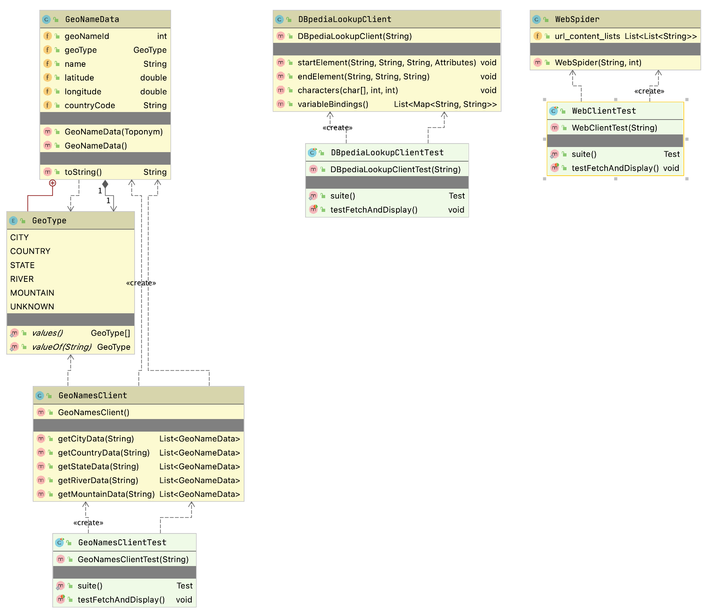

# Information Gathering

I often write software to automatically collect and use data from the web and other sources. In this chapter I have collected utility code that I have written over the years into a small library supporting two approaches to web scraping, DBPedia lookup, and GeoNames lookup. This code is simple but I hope you will find useful.

The following UML class diagram shows the public APIs the libraries developed in this chapter:

## Web Scraping Examples

As a practical matter, much of the data that many people use for machine learning either comes from the web or from internal data sources. This section provides some guidance and examples for getting text data from the web.

Before we start a technical discussion about web scraping I want to point out to you that much of the information on the web is copyright and the first thing that you should do is to read the terms of service for web sites to insure that your use of "scraped" or "spidered" data conforms with the wishes of the persons or organizations who own the content and pay to run scraped web sites.

### Motivation for Web Scraping

There is a huge amount of structured data available on the web via web services, semantic web/linked data markup, and APIs. That said, you will frequently find data that is useful to pull raw text from web sites but this text is usually fairly unstructured and in a messy (and frequently changing) format as web pages meant for human consumption and not meant to be ingested by software agents. In this chapter we will cover useful "web scraping" techniques. You will see that there is often a fair amount of work in dealing with different web design styles and layouts. To make things even more inconvenient you might find that your software information gathering agents will often break because of changes in web sites.

I tend to use one of three general techniques for scraping web sites. Only the first two will be covered in this chapter:

- Use an HTML parsing library that strips all HTML markup and Javascript from a page and returns a "pure text" block of text. The text in navigation menus, headers, etc. will be interspersed with what we might usually think of a "content" from a web site.
- Exploit HTML DOM (Document Object Model) formatting information on web sites to pick out headers, page titles, navigation menus, and large blocks of content text.
- Use a tool like [Selenium](http://docs.seleniumhq.org/) to programatically control a web browser so your software agents can login to site and otherwise perform navigation. In other words your software agents can simulate a human using a web browser.

I seldom need to use tools like Selenium but as the saying goes "when you need them, you need them." For simple sites I favor extracting all text as a single block and use DOM processing as needed.

I am not going to cover the use of Selenium and the Java Selenium Web-Driver APIs in this chapter because, as I mentioned, I tend to not use it frequently and I think that you are unlikely to need to do so either. I refer you to the Selenium documentation if the first two approaches in the last list do not work for your application. Selenium is primarily intended for building automating testing of complex web applications, so my occasional use in web spidering is not the common use case.

I assume that you have some experience with HTML and DOM. DOM is a tree data structure.

### Web Scraping Using the Jsoup Library

We will use the MIT licensed library [jsoup](http://jsoup.org/). One reason I selected jsoup for the examples in this chapter out of many fine libraries that provide similar functionality is the particularly nice documentation, especially [The jsoup Cookbook](http://jsoup.org/cookbook/) which I urge you to bookmark as a general reference. In this chapter I will concentrate on just the most frequent web scraping use cases that I use in my own work.

The following bit of example code uses jsoup to get the text inside all P (paragraph) elements that are direct children of any DIV element. On line 14 we use the jsoup library to fetch my home web page:

{lang="java",linenos=on}
~~~~~~~~
package com.markwatson.web_scraping;

import org.jsoup.*;
import org.jsoup.nodes.Document;
import org.jsoup.nodes.Element;
import org.jsoup.select.Elements;

/**
 * Examples of using jsoup
 */
public class MySitesExamples {

  public static void main(String[] args) throws Exception {
    Document doc = Jsoup.connect("https://markwatson.com")
        .userAgent("Mozilla/5.0 (Macintosh; Intel Mac OS X 10.0; rv:77.0) Gecko/20100101 Firefox/77.0")
        .timeout(2000).get();
    Elements newsHeadlines = doc.select("div p");
    for (Element element : newsHeadlines) {
      System.out.println(" next element text: " + element.text());
    }
    String all_page_text = doc.text();
    System.out.println("All text on web page:\n" + all_page_text);
    Elements anchors = doc.select("a[href]");
    for (Element anchor : anchors) {
      String uri = anchor.attr("href");
      System.out.println(" next anchor uri: " + uri);
      System.out.println(" next anchor text: " + anchor.text());
    }
    Elements absolute_uri_anchors = doc.select("a[href]");
    for (Element anchor : absolute_uri_anchors) {
      String uri = anchor.attr("abs:href");
      System.out.println(" next anchor absolute uri: " + uri);
      System.out.println(" next anchor absolute text: " + anchor.text());
    }

  }
}
~~~~~~~~

In line 18 I am selecting the pattern that returns all P elements that are direct children of any DIV element and in lines 19-21 print the text inside these P elements.

For training data for machine learning it is useful to just grab all text on a web page and assume that common phrases dealing with web navigation, etc. will be dropped from learned models because they occur in many different training examples for different classifications. In the above listing, line 22 shows how to fetch the plain text from an entire web page. The code on line 24 fetched anchor elements and the loop in lines 25-29 prints out this anchor data as URI and text. The code in lines 30-35 does the same thing except we are converting relative URIs to absolute URIs.

Output might look like (most of the output is not shown from running this example file **MySitesExamples.java**):

{linenos=off}
~~~~~~~~
 next element text: I am the author of 20+ books on Artificial Intelligence, Common Lisp, Deep Learning, Haskell, Java, Ruby, JavaScript, and the Semantic Web. I have 55 US Patents.
 next element text: My customer list includes: Google, Capital One, CompassLabs, Disney, SAIC, Americast, PacBell, CastTV, Lutris Technology, Arctan Group, Sitescout.com, Embed.ly, and Webmind Corporation.
All text on web page:
Mark Watson: consultant specializing in Common Lisp, deep learning and natural language processing
learning Toggle navigation Mark Watson consultant and author specializing in Common Lisp development and AI 
 ...
 
 next anchor uri: #
 next anchor text: Mark Watson consultant and author specializing in Common Lisp development and AI research projects and commercial products
 next anchor uri: /
 next anchor text: Home page
 next anchor uri: /consulting
 next anchor text: Consulting
 next anchor uri: /blog
 next anchor text: My Blog
 next anchor uri: /books
 next anchor text: My Books
 next anchor uri: /opensource
 next anchor text: Open Source
   ...
 next anchor absolute uri: https://markwatson.com#
 next anchor absolute text: Mark Watson consultant and author specializing in Common Lisp development and AI research projects and commercial products
 next anchor absolute uri: https://markwatson.com/
 next anchor absolute text: Home page
 next anchor absolute uri: https://markwatson.com/consulting
  ...
~~~~~~~~

The 2gram (i.e., two words in sequence) "Toggle navigation" in the last listing has nothing to do with the real content in my site and is an artifact of using the Bootstrap CSS and Javascript tools. Often "noise" like this is simply ignored by machine learning models if it appears on many different sites but beware that this might be a problem and you might need to precisely fetch text from specific DOM elements. Similarly, notice that this last listing picks up the plain text from the navigation menus.

Notice that there are different types of URIs like #, relative, and absolute. Any characters following a # character do not affect the routing of which web page is shown (or which API is called) but the characters after the # character are available for use in specifying anchor positions on a web page or extra parameters for API calls. Relative APIs like consulting/ are understood to be relative to the base URI of the web site.

I often require that URIs be absolute URIs (i.e., starts with a protocol like "http:" or "https:") and lines 28-33 show how to select just absolute URI anchors. In line 31 I am specifying the attribute as "abs:href" to be more selective.

#
## Web Spidering Using the Jericho Library

Here is another web spidering example that is different than the earlier example using the **jsoup** library. Here we will implement a spider using built in Java standard library network classes and also the Jericho HTML parser library.

{lang="java",linenos=off}
~~~~~~~~
package com.markwatson.info_spiders;

import net.htmlparser.jericho.*;

import java.io.InputStream;
import java.net.URL;
import java.net.URLConnection;
import java.util.*;

/**
 * This simple web spider returns a list of lists, each containing two strings
 * representing "URL" and "text".
 * Specifically, I do not return links on each page.
 */

/**
 * Copyright Mark Watson 2008-2020. All Rights Reserved.
 * License: Apache 2
 */

public class WebSpider {
  public WebSpider(String root_url, int max_returned_pages) throws Exception {
    String host = new URL(root_url).getHost();
    System.out.println("+ host: " + host);
    List<String> urls = new ArrayList<String>();
    Set<String> already_visited = new HashSet<String>();
    urls.add(root_url);
    int num_fetched = 0;
    while (num_fetched <= max_returned_pages && !urls.isEmpty()) {
      try {
        System.out.println("+ urls: " + urls);
        String url_str = urls.remove(0);
        System.out.println("+ url_str: " + url_str);
        if (url_str.toLowerCase().indexOf(host) > -1 &&
            !already_visited.contains(url_str)) {
          already_visited.add(url_str);
          URL url = new URL(url_str);
          URLConnection connection = url.openConnection();
          connection.setAllowUserInteraction(false);
          InputStream ins = url.openStream();
          Source source = new Source(ins);
          num_fetched++;
          TextExtractor te = new TextExtractor(source);
          String text = te.toString();
          // Skip any pages where text on page is identical to existing
          // page (e.g., http://example.com and http://exaple.com/index.html
          boolean process = true;
          for (List<String> ls : url_content_lists) {
            if (text.equals(ls.get(1))) {
              process = false;
              break;
            }
          }
          if (process) {
            try {
              Thread.sleep(500);
            } catch (Exception ignore) {
            }
            List<StartTag> anchorTags = source.getAllStartTags("a ");
            ListIterator iter = anchorTags.listIterator();
            while (iter.hasNext()) {
              StartTag anchor = (StartTag) iter.next();
              Attributes attr = anchor.parseAttributes();
              Attribute link = attr.get("href");
              String link_str = link.getValue();
              if (link_str.indexOf("http:") == -1) {
                String path = url.getPath();
                if (path.endsWith("/")) path = path.substring(0, path.length() - 1);
                int index = path.lastIndexOf("/");
                if (index > -1) path = path.substring(0, index);
                link_str = url.getHost() + "/" + path + "/" + link_str;
                link_str = "http://" + link_str.replaceAll("///", "/").replaceAll("//", "/");
              }
              urls.add(link_str);
            }
            List<String> ls = new ArrayList<String>(2);
            ls.add(url_str);
            ls.add(text);
            url_content_lists.add(ls);
          }
        }
      } catch (Exception ex) {
        System.out.println("Error: " + ex);
        ex.printStackTrace();
      }
    }
  }

  public List<List<String>> url_content_lists = new ArrayList<List<String>>();
}
~~~~~~~~

The test class **WebClientTest** shows how to use this class:

{lang="java",linenos=off}
~~~~~~~~
    WebSpider client = new WebSpider("http://pbs.org", 10);
    System.out.println("Found URIs: " + client.url_content_lists);
~~~~~~~~

Here is the output for the test class **WebClientTest**:

{linenos=off}
~~~~~~~~
+ host: pbs.org
+ urls: [http://pbs.org]
+ url_str: http://pbs.org
Found URIs: [[http://pbs.org, ]]
~~~~~~~~

## DBPedia Entity Lookup

DBPedia contains structured data for the WikiPedia web site. In later chapters we will learn how to use the SPARQL query language to access DBPedia. Here we use a simple lookup service for any entity name. If an entity name is found in DBPedia then information on the entity is returned as an XML payload.

The implementation file is DBpediaLookupClient.java:

{lang="java",linenos=off}
~~~~~~~~
package com.markwatson.info_spiders;

import org.apache.http.impl.client.CloseableHttpClient;
import org.apache.http.impl.client.HttpClients;
import org.xml.sax.Attributes;
import org.xml.sax.SAXException;
import org.xml.sax.helpers.DefaultHandler;

import javax.xml.parsers.SAXParser;
import javax.xml.parsers.SAXParserFactory;
import java.util.*;

/**
 * Copyright Mark Watson 2008-2020. All Rights Reserved.
 * License: Apache-2.0
 */

// Use Georgi Kobilarov's DBpedia lookup web service
//    ref: http://lookup.dbpedia.org/api/search.asmx?op=KeywordSearch
//    example:
// http://lookup.dbpedia.org/api/search.asmx/KeywordSearch?QueryString=Flagstaff

/**
 * Searches return results that contain any of the search terms. I am going to filter
 * the results to ignore results that do not contain all search terms.
 */

public class DBpediaLookupClient extends DefaultHandler {
  public DBpediaLookupClient(String query) throws Exception {
    this.query = query;
    CloseableHttpClient client = HttpClients.createDefault();

    String query2 = query.replaceAll(" ", "+");

    SAXParserFactory factory = SAXParserFactory.newInstance();
    SAXParser sax = factory.newSAXParser();
    sax.parse(
      "http://lookup.dbpedia.org/api/search.asmx/KeywordSearch?QueryString=" +
      query2, this);

  }

  private List<Map<String, String>> variableBindings = 
      new ArrayList<Map<String, String>>();
  private Map<String, String> tempBinding = null;
  private String lastElementName = null;

  public void startElement(String uri, String localName, String qName,
                           Attributes attributes) throws SAXException {
    if (qName.equalsIgnoreCase("result")) {
      tempBinding = new HashMap<String, String>();
    }
    lastElementName = qName;
  }

  public void endElement(String uri, String localName, String qName)
         throws SAXException {
    if (qName.equalsIgnoreCase("result")) {
      if (!variableBindings.contains(tempBinding) &&
           containsSearchTerms(tempBinding))
        variableBindings.add(tempBinding);
    }
  }

  public void characters(char[] ch, int start, int length) throws SAXException {
    String s = new String(ch, start, length).trim();
    if (s.length() > 0) {
      if ("Description".equals(lastElementName)) {
        if (tempBinding.get("Description") == null) {
          tempBinding.put("Description", s);
        }
        tempBinding.put("Description", "" + tempBinding.get("Description") +
                        " " + s);
      }
      if ("URI".equals(lastElementName) && s.indexOf("Category")==-1 &&
          tempBinding.get("URI") == null) {
        tempBinding.put("URI", s);
      }
      if ("Label".equals(lastElementName)) tempBinding.put("Label", s);
    }
  }

  public List<Map<String, String>> variableBindings() {
    return variableBindings;
  }
  private boolean containsSearchTerms(Map<String, String> bindings) {
    StringBuilder sb = new StringBuilder();
    for (String value : bindings.values()) sb.append(value);  // no white space
    String text = sb.toString().toLowerCase();
    StringTokenizer st = new StringTokenizer(this.query);
    while (st.hasMoreTokens()) {
      if (text.indexOf(st.nextToken().toLowerCase()) == -1) {
        return false;
      }
    }
    return true;
  }
  private String query = "";
}
~~~~~~~~

The unit test class **DBpediaLookupClientTest** shows how to call this library:

{lang="java",linenos=off}
~~~~~~~~
    DBpediaLookupClient client =
        new DBpediaLookupClient("London UK");
    List<Map<String, String>> results = client.variableBindings();
    System.out.println("# query results: " + results.size());
    for (Map<String, String> map : results) {
      for (Map.Entry<String, String> entry : map.entrySet()) {
        System.out.println(entry.getKey() + " - " + entry.getValue());
      }
    }
~~~~~~~~

Here is the output from this test code (with some output not shown):

{linenos=off}
~~~~~~~~
# query results: 2
Description - The O2 Arena (visually typeset in branding as The O2 arena, referred to as North Greenwich Arena in context of the 2012 Summer Olympics and Paralympics) is a multi-purpose indoor arena located in the centre of The O2, a large entertainment complex on the Greenwich peninsula in London, England.
  ...
Label - Sports venues in London
URI - http://dbpedia.org/resource/The_O2_Arena_(London)
Description - The City of London was a United Kingdom Parliamentary constituency. It was a constituency of the House of Commons of the Parliament of England then of the Parliament of Great Britain from 1707 to 1800 and of the Parliament of the United Kingdom from 1801 to 1950. The City of London was a United Kingdom Parliamentary constituency.
  ...
Label - United Kingdom Parliamentary constituencies represented by a sitting Prime Minister
URI - http://dbpedia.org/resource/City_of_London_(UK_Parliament_constituency)
~~~~~~~~

## Client for GeoNames Service

The GeoNames service looks up information about locations. You need to [sign up for a free account])http://www.geonames.org/login) and the access key needs to be stored in an environment variable **GEONAMES** which is accessed in Java code using:

{lang="java",linenos=off}
~~~~~~~~
  System.getenv("GEONAMES")
~~~~~~~~

The implementation file is **GeoNamesClient.java** uses the utility class **GeoNameData** that we will look at later:

{lang="java",linenos=off}
~~~~~~~~
package com.markwatson.info_spiders;

import org.geonames.*;

import java.util.ArrayList;
import java.util.List;

/**
 * Copyright Mark Watson 2008-2020. All Rights Reserved.
 * License: Apache 2
 */

// You will need a free GeoNames account. Sign up:  https://www.geonames.org/login
// Then, set an environment variable: export GEONAMES=your-geonames-account-name

public class GeoNamesClient {
  public GeoNamesClient() {
  }

  private List<GeoNameData> helper(String name, String type) throws Exception {
    List<GeoNameData> ret = new ArrayList<GeoNameData>();

    String geonames_account_name = System.getenv("GEONAMES");
    if (geonames_account_name == null) {
      System.err.println("You will need a free GeoNames account.");
      System.err.println("Sign up:  https://www.geonames.org/login");
      System.err.println("Then, set an environment variable:");
      System.err.println("     export GEONAMES=your-geonames-account-name");
      throw new Exception("Need API key");
    }
    WebService.setUserName(System.getenv("GEONAMES"));

    ToponymSearchCriteria searchCriteria = new ToponymSearchCriteria();
    searchCriteria.setStyle(Style.LONG);
    searchCriteria.setQ(name);
    ToponymSearchResult searchResult = WebService.search(searchCriteria);
    for (Toponym toponym : searchResult.getToponyms()) {
      if (toponym.getFeatureClassName() != null &&
        toponym.getFeatureClassName().toString().indexOf(type) > -1 &&
        toponym.getName().indexOf(name) > -1 &&
        valid(toponym.getName())) {
        ret.add(new GeoNameData(toponym));
      }
    }
    return ret;
  }

  private boolean valid(String str) {
    if (str.contains("0")) return false;
    if (str.contains("1")) return false;
    if (str.contains("2")) return false;
    if (str.contains("3")) return false;
    if (str.contains("4")) return false;
    if (str.contains("5")) return false;
    if (str.contains("6")) return false;
    if (str.contains("7")) return false;
    if (str.contains("8")) return false;
    return !str.contains("9");
  }

  public List<GeoNameData> getCityData(String city_name) throws Exception {
    return helper(city_name, "city");
  }

  public List<GeoNameData> getCountryData(String country_name) throws Exception {
    return helper(country_name, "country");
  }

  public List<GeoNameData> getStateData(String state_name) throws Exception {
    List<GeoNameData> states = helper(state_name, "state");
    for (GeoNameData state : states) {
      state.geoType = GeoNameData.GeoType.STATE;
    }
    return states;
  }

  public List<GeoNameData> getRiverData(String river_name) throws Exception {
    return helper(river_name, "stream");
  }

  public List<GeoNameData> getMountainData(String mountain_name) throws Exception {
    return helper(mountain_name, "mountain");
  }
}
~~~~~~~~

The class **GeoNamesClient** in the last listing uses the class **GeoNameData** which processes the structured data returned from the GeoNames service and provides public fields to access this information and an implementation of **toString** to pretty-print the data to a string:

{lang="java",linenos=off}
~~~~~~~~
package com.markwatson.info_spiders;

import org.geonames.Toponym;

/**
 * Copyright Mark Watson 2008-2020. All Rights Reserved.
 * License: Apache-2.0
 */
public class GeoNameData {
  public enum GeoType {
    CITY, COUNTRY, STATE, RIVER, MOUNTAIN, UNKNOWN
  }
  public int geoNameId = 0;
  public GeoType geoType = GeoType.UNKNOWN;
  public String name = "";
  public double latitude = 0;
  public double longitude = 0;
  public String countryCode = "";

  public GeoNameData(Toponym toponym) {
    geoNameId = toponym.getGeoNameId();
    latitude = toponym.getLatitude();
    longitude = toponym.getLongitude();
    name = toponym.getName();
    countryCode = toponym.getCountryCode();
    if (toponym.getFeatureClassName().startsWith("city")) geoType = GeoType.CITY;
    if (toponym.getFeatureClassName().startsWith("country"))
       geoType = GeoType.COUNTRY;
    if (toponym.getFeatureClassName().startsWith("state")) geoType = GeoType.STATE;
    if (toponym.getFeatureClassName().startsWith("stream")) geoType = GeoType.RIVER;
    if (toponym.getFeatureClassName().startsWith("mountain"))
        geoType = GeoType.MOUNTAIN;
  }

  public GeoNameData() {
  }

  public String toString() {
    return "[GeoNameData: " + name + ", type: " + geoType + ", country code: " + countryCode +
      ", ID: " + geoNameId + ", latitude: " + latitude +
      ", longitude: " + longitude + "]";
  }
}
~~~~~~~~

The test class **GeoNamesClientTest** shows how to use these two classes:

{lang="java",linenos=on}
~~~~~~~~
    GeoNamesClient client = new GeoNamesClient();
    System.out.println(client.getCityData("Paris"));    pause();
    System.out.println(client.getCountryData("Canada"));   pause();
    System.out.println(client.getStateData("California")); pause();
    System.out.println(client.getRiverData("Amazon"));     pause();
    System.out.println(client.getMountainData("Whitney"));
~~~~~~~~

The output from this test is shown below:

{linenos=on}
~~~~~~~~
[[GeoNameData: Paris, type: CITY, country code: FR, ID: 2988507, latitude: 48.85341, longitude: 2.3488], [GeoNameData: Le Touquet-Paris-Plage, type: CITY, country code: FR, ID: 2999139, latitude: 50.52432, longitude: 1.58571], [GeoNameData: Paris, type: CITY, country code: US, ID: 4717560, latitude: 33.66094, longitude: -95.55551], [GeoNameData: Balneario Nuevo Paris, type: CITY, country code: UY, ID: 3441475, latitude: -34.85, longitude: -56.23333], [GeoNameData: Paris, type: CITY, country code: BY, ID: 8221628, latitude: 55.15464, longitude: 27.38456], [GeoNameData: Paris, type: CITY, country code: TG, ID: 2364431, latitude: 7.15, longitude: 1.08333]]
[[GeoNameData: Canada, type: COUNTRY, country code: CA, ID: 6251999, latitude: 60.10867, longitude: -113.64258], [GeoNameData: Canada Bay, type: COUNTRY, country code: AU, ID: 7839706, latitude: -33.8659, longitude: 151.11591]]
[[GeoNameData: Baja California Sur, type: STATE, country code: MX, ID: 4017698, latitude: 25.83333, longitude: -111.83333], [GeoNameData: Baja California, type: STATE, country code: MX, ID: 4017700, latitude: 30.0, longitude: -115.0], [GeoNameData: California, type: STATE, country code: US, ID: 5332921, latitude: 37.25022, longitude: -119.75126]]
[[GeoNameData: Amazon Bay, type: RIVER, country code: PG, ID: 2133985, latitude: -10.30264, longitude: 149.36313]]
[[GeoNameData: Mount Whitney, type: MOUNTAIN, country code: US, ID: 5409018, latitude: 36.57849, longitude: -118.29194], [GeoNameData: Whitney Peak, type: MOUNTAIN, country code: AQ, ID: 6628058, latitude: -76.43333, longitude: -126.05], [GeoNameData: Whitney Point, type: MOUNTAIN, country code: AQ, ID: 6628059, latitude: -66.25, longitude: 110.51667], [GeoNameData: Whitney Island, type: MOUNTAIN, country code: RU, ID: 1500850, latitude: 81.01149, longitude: 60.88737], [GeoNameData: Whitney Island, type: MOUNTAIN, country code: AQ, ID: 6628055, latitude: -69.66187, longitude: -68.50341], [GeoNameData: Whitney Meadow, type: MOUNTAIN, country code: US, ID: 5409010, latitude: 36.43216, longitude: -118.26648], [GeoNameData: Whitney Peak, type: MOUNTAIN, country code: US, ID: 5444110, latitude: 39.43276, longitude: -106.47309], [GeoNameData: Whitney Portal, type: MOUNTAIN, country code: US, ID: 5409011, latitude: 36.58882, longitude: -118.22592], [GeoNameData: Whitney Mountain, type: MOUNTAIN, country code: US, ID: 4136375, latitude: 36.40146, longitude: -93.91742], [GeoNameData: Whitney Bridge Dip, type: MOUNTAIN, country code: AU, ID: 11878190, latitude: -28.61241, longitude: 153.16546], [GeoNameData: Whitney Point, type: MOUNTAIN, country code: US, ID: 5815920, latitude: 47.76037, longitude: -122.85127], [GeoNameData: Whitney Pass, type: MOUNTAIN, country code: US, ID: 5409024, latitude: 36.55577, longitude: -118.2812], [GeoNameData: Whitney Island, type: MOUNTAIN, country code: CA, ID: 6181293, latitude: 58.6505, longitude: -78.71621]]
~~~~~~~~

## Wrap-up for Information Gathering

Access to data is an advantage large companies usually have over individuals and small organizations. That said, there is a lot of free information on the web and I hope my simple utility classes we have covered here will be of some use to you.

I respect the rights of people and organizations who put information on the web. This includes:

- Read the terms of service on web sites to make sure your your of the site's data is compliant and also avoid accessing any one web site too frequently.
- When you access services like DBpedia and Geonames consider caching the results so that you don't ask the service for the same information repeatedly. This is particularly important during development and testing. In a later chapter we will see how to use the Apache Derby database to cache SPARQL queries to the DBPedia service.