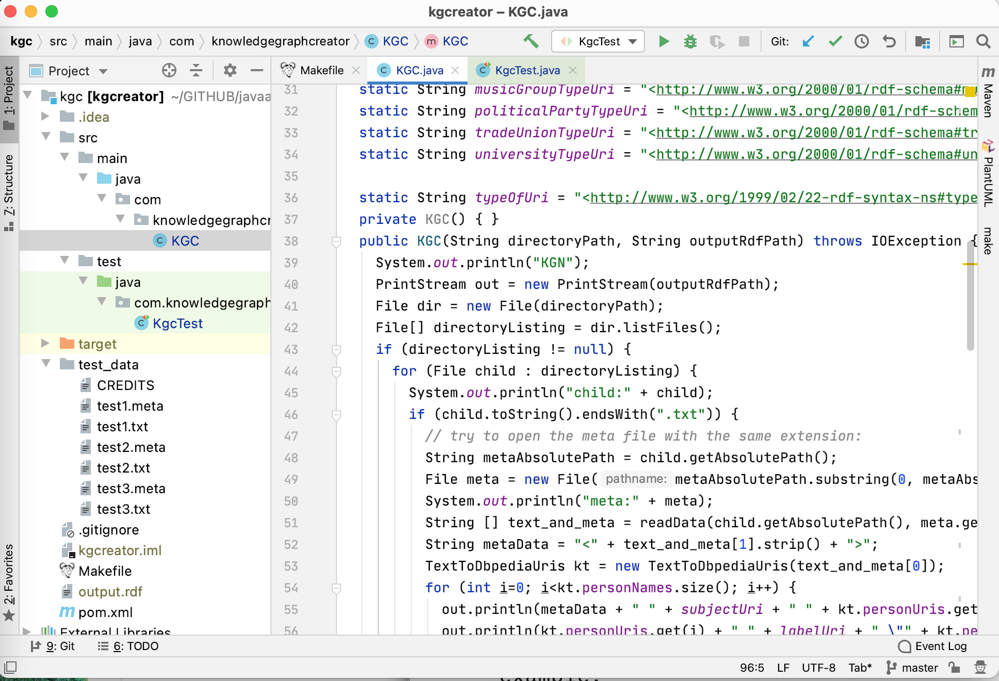

# Automatically Generating Data for Knowledge Graphs {#kgcreator}

Here we develop a complete application using the package developed in the earlier chapter [Resolve Entity Names to DBPedia References](#ner). The Knowledge Graph Creator (KGcreator) is a tool for automating the generation of data for Knowledge Graphs from raw text data. Here we generate RDF data for a Knowledge Graph. You might also be interested in the Knowledge Graph Creator implementation in [my Common Lisp book](https://leanpub.com/lovinglisp) that generates data for the Neo4J open source graph database in addition to generating RDF data.

Data created by KGcreator generates data in RDF triples suitable for loading into any linked data/semantic web data store.

This example application works by identifying entities in text. Example entity types are people, companies, country names, city names, broadcast network names, political party names, and university names. We saw earlier code for detecting entities in the chapter on making named entities to DBPedia URIs and we will reuse this code.

I originally wrote KGCreator as two research prototypes, one in Common Lisp (see my [Common Lisp book](https://leanpub.com/lovinglisp)) and one in [Haskell](https://leanpub.com/haskell-cookbook/). The example in this chapter is a port of these systems to Java.

## Implementation Notes

The implementation is contained in a single Java class **KGC** and the **junit** test class **KgcTest** is used to process the test files included with this example.

As can be seen in the following figure I have defined final static strings for each type of entity type URI. For example, **personTypeUri** has the value **<http://www.w3.org/2000/01/rdf-schema#person>**.

The following figure shows a screen shot of this example project in the free Community Edition of IntelliJ.

Notice in this screen shot that there are several test files in the directory **test_data**. The files with the file extension **.meta** contain a single line which is the URI for the source of the text in the matching text file. For example, the meta file **test1.meta** provides the URI for the source of the text in the file **test1.txt**.

## Generating RDF Data

RDF data is comprised of triples, where the value for each triple are a subject, a predicate, and an object. Subjects are URIs, predicates are usually URIs, and objects are either literal values or URIs. Here are two triples written by this example application:

{linenos=off}
~~~~~~~~
<http://dbpedia.org/resource/The_Wall_Street_Journal> 
  <http://knowledgebooks.com/schema/aboutCompanyName> 
  "Wall Street Journal" .
<https://newsshop.com/june/z902.html>
  <http://knowledgebooks.com/schema/containsCountryDbPediaLink>
  <http://dbpedia.org/resource/Canada> .
~~~~~~~~

The following listing of the file **KGC.java** contains the implementation the main Java class for generating RDF data. Code for different entity types is similar so the following listing only shows the code for handling entity types for people and companies. The following is reformatted to fit the page width:

{lang="java",linenos=on}
~~~~~~~~
package com.knowledgegraphcreator;

import com.markwatson.ner_dbpedia.TextToDbpediaUris;

import java.io.*;
import java.nio.charset.StandardCharsets;
import java.nio.file.Files;
import java.nio.file.Paths;

/**
 * Java implementation of Knowledge Graph Creator.
 *
 * Copyright 2020 Mark Watson. All Rights Reserved. Apache 2 license.
 *
 * For documentation see my book "Practical Artificial Intelligence Programming
 * With Java", chapter "Automatically Generating Data for Knowledge Graphs"
 * at https://leanpub.com/javaai that can be read free online.
 *
 */

public class KGC  {

	static String subjectUri = 
	  "<http://www.w3.org/1999/02/22-rdf-syntax-ns#/subject>";
	static String labelUri = 
	  "<http://www.w3.org/1999/02/22-rdf-syntax-ns#/label>";
	static String personTypeUri = 
	  "<http://www.w3.org/2000/01/rdf-schema#person>";
	static String companyTypeUri = 
	  "<http://www.w3.org/2000/01/rdf-schema#company>";

	static String typeOfUri = 
	  "<http://www.w3.org/1999/02/22-rdf-syntax-ns#type>";

	private KGC() { }
	
	public KGC(String directoryPath, String outputRdfPath) throws IOException {
		System.out.println("KGN");
		PrintStream out = new PrintStream(outputRdfPath);
		File dir = new File(directoryPath);
		File[] directoryListing = dir.listFiles();
		if (directoryListing != null) {
			for (File child : directoryListing) {
				System.out.println("child:" + child);
				if (child.toString().endsWith(".txt")) {
					// try to open the meta file with the same extension:
					String metaAbsolutePath = child.getAbsolutePath();
					File meta = 
					  new File(metaAbsolutePath.substring(0,
					                                  metaAbsolutePath.length() - 4)
					                                   + ".meta");
					System.out.println("meta:" + meta);
					String [] text_and_meta = 
					  readData(child.getAbsolutePath(), meta.getAbsolutePath());
					String metaData = "<" + text_and_meta[1].strip() + ">";
					TextToDbpediaUris kt = 
					  new TextToDbpediaUris(text_and_meta[0]);
					for (int i=0; i<kt.personNames.size(); i++) {
						out.println(metaData + " " + subjectUri + " " + 
						            kt.personUris.get(i) + " .");
						out.println(kt.personUris.get(i) + " " + labelUri + 
						            " \"" + kt.personNames.get(i) + "\" .");
						out.println(kt.personUris.get(i) + " " + typeOfUri + 
						            " " + personTypeUri + " .");
					}
					for (int i=0; i<kt.companyNames.size(); i++) {
						out.println(metaData + " " + 
						            subjectUri + " " + 
						            kt.companyUris.get(i) + " .");
						out.println(kt.companyUris.get(i) + " " +
						           labelUri + " \"" +
						           kt.companyNames.get(i) + "\" .");
						out.println(kt.companyUris.get(i) + " " + typeOfUri + 
						            " " + companyTypeUri + " .");
					}
				}
			}
		}
		out.close();
	}

	private String [] readData(String textPath, String metaPath) throws IOException {
		String text = Files.readString(Paths.get(textPath), StandardCharsets.UTF_8);
		String meta = Files.readString(Paths.get(metaPath), StandardCharsets.UTF_8);
		System.out.println("\n\n** text:\n\n" + text);
		return new String[] { text, meta };
	}
}
~~~~~~~~

This code works on a list of paired files for text data and the meta data for each text file. As an example, if there is an input text file test123.txt then there would be a matching meta file test123.meta that contains the source of the data in the file test123.txt. This data source will be a URI on the web or a local file URI. The class contractor for **KGC** takes an output file path for writing the generated RDF data and a list of pairs of text and meta file paths.

The **junit** test class **KgcTest** will process the local directory **test_data** and generate an RDF output file:

{lang="java",linenos=on}
~~~~~~~~
package com.knowledgegraphcreator;

import junit.framework.Test;
import junit.framework.TestCase;
import junit.framework.TestSuite;

public class KgcTest extends TestCase {

  public KgcTest(String testName) {
    super(testName);
  }

  public static Test suite() {
    return new TestSuite(KgcTest.class);
  }

  public void testKGC() throws Exception {
    assertTrue(true);
    KGC client = new KGC("test_data/", "output_with_duplicates.rdf");
  }
  private static void pause() {
    try { Thread.sleep(2000);
    } catch (Exception ignore) { }
  }
}
~~~~~~~~

If specific entity names occur in multiple input files there will be a few duplicated RDF statements generated. The simplest way to deal with this is to add a one line call to the **awk** utility to efficiently remove duplicate lines in the RDF output file. Here is a listing of the **Makefile** for this example:

{lang="bash",linenos=off}
~~~~~~~~
create_data_and_remove_duplicates:
	mvn test
	echo "Removing duplicate RDF statements"
	awk '!visited[$$0]++' output_with_duplicates.rdf > output.rdf
	rm -f output_with_duplicates.rdf
~~~~~~~~

If you are not familiar with **awk** and want to learn the basics then I recommend [this short tutorial](http://www.hcs.harvard.edu/~dholland/computers/awk.html).

## KGCreator Wrap Up

When developing applications or systems using Knowledge Graphs it is useful to be able to quickly generate test data which is the primary purpose of KGCreator. A secondary use is to generate  Knowledge Graphs for production use using text data sources. In this second use case you will want to manually inspect the generated data to verify its correctness or usefulness for your application.