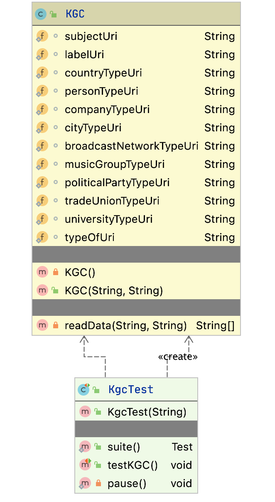
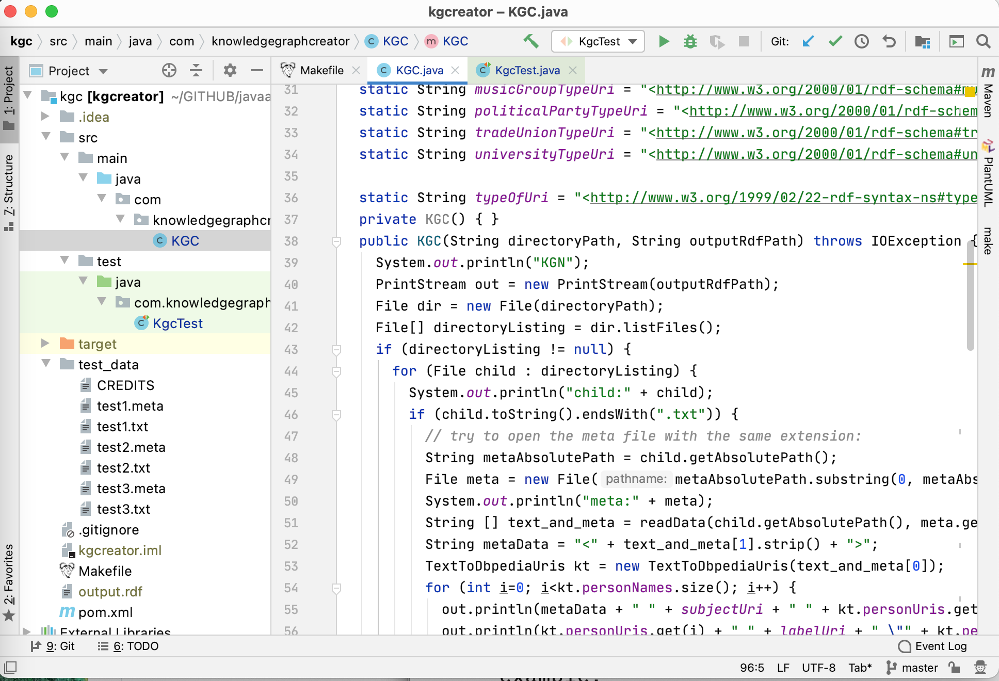

# Automatically Generating Data for Knowledge Graphs {#kgcreator}

Here we develop a complete application using the package developed in the earlier chapter [Resolve Entity Names to DBPedia References](#ner). The Knowledge Graph Creator (KGcreator) is a tool for automating the generation of data for Knowledge Graphs from raw text data. Here we generate RDF data for a Knowledge Graph. You might also be interested in the Knowledge Graph Creator implementation in [my Common Lisp book](https://leanpub.com/lovinglisp) that generates data for the Neo4J open source graph database in addition to generating RDF data.

Data created by KGcreator generates data in RDF triples suitable for loading into any linked data/semantic web data store.

This example application works by identifying entities in text. Example entity types are people, companies, country names, city names, broadcast network names, political party names, and university names. We saw earlier code for detecting entities in the chapter on making named entities to DBPedia URIs and we will reuse this code.

I originally wrote KGCreator as two research prototypes, one in Common Lisp (see my [Common Lisp book](https://leanpub.com/lovinglisp)) and one in [Haskell](https://leanpub.com/haskell-cookbook/). The example in this chapter is a port of these systems to Java.

## Implementation Notes

The implementation is contained in a single Java class **KGC** and the **junit** test class **KgcTest** is used to process the test files included with this example.

{width: "80%"}

As can be seen in the following figure I have defined final static strings for each type of entity type URI. For example, **personTypeUri** has the value **<http://www.w3.org/2000/01/rdf-schema#person>**.

{width: "80%"}

The following figure shows a screen shot of this example project in the free Community Edition of IntelliJ.

{width: "80%"}

Notice in this screen shot that there are several test files in the directory **test_data**. The files with the file extension **.meta** contain a single line which is the URI for the source of the text in the matching text file. For example, the meta file **test1.meta** provides the URI for the source of the text in the file **test1.txt**.

## Generating RDF Data

RDF data is comprised of triples, where the value for each triple are a subject, a predicate, and an object. Subjects are URIs, predicates are usually URIs, and objects are either literal values or URIs. Here are two triples written by this example application:

{linenos=off}
~~~~~~~~
<http://dbpedia.org/resource/The_Wall_Street_Journal> 
  <http://knowledgebooks.com/schema/aboutCompanyName> 
  "Wall Street Journal" .
<https://newsshop.com/june/z902.html>
  <http://knowledgebooks.com/schema/containsCountryDbPediaLink>
  <http://dbpedia.org/resource/Canada> .
~~~~~~~~

The following listing of the file **KGC.java** contains the implementation the main Java class for generating RDF data. Code for different entity types is similar so the following listing only shows the code for handling entity types for people and companies. The following is reformatted to fit the page width:

{lang="java",linenos=on}
~~~~~~~~
package com.knowledgegraphcreator;

import com.markwatson.ner_dbpedia.TextToDbpediaUris;

import java.io.*;
import java.nio.charset.StandardCharsets;
import java.nio.file.Files;
import java.nio.file.Path;
import java.util.List;

/**
 * Java implementation of Knowledge Graph Creator.
 *
 * Copyright 2020 Mark Watson. All Rights Reserved. Apache 2 license.
 *
 * For documentation see my book "Practical Artificial Intelligence Programming
 * With Java", chapter "Automatically Generating Data for Knowledge Graphs"
 * at https://leanpub.com/javaai that can be read free online.
 *
 */

public class KGC  {

	private static final System.Logger LOG = System.getLogger(KGC.class.getName());

	private static final String SUBJECT_URI = "<http://www.w3.org/1999/02/22-rdf-syntax-ns#/subject>";
	private static final String LABEL_URI = "<http://www.w3.org/1999/02/22-rdf-syntax-ns#/label>";
	private static final String COUNTRY_TYPE_URI = "<http://www.w3.org/2000/01/rdf-schema#country>";
	private static final String PERSON_TYPE_URI = "<http://www.w3.org/2000/01/rdf-schema#person>";
	private static final String COMPANY_TYPE_URI = "<http://www.w3.org/2000/01/rdf-schema#company>";
	private static final String CITY_TYPE_URI = "<http://www.w3.org/2000/01/rdf-schema#city>";
	private static final String BROADCAST_NETWORK_TYPE_URI = "<http://www.w3.org/2000/01/rdf-schema#broadcastNetwork>";
	private static final String MUSIC_GROUP_TYPE_URI = "<http://www.w3.org/2000/01/rdf-schema#musicGroup>";
	private static final String POLITICAL_PARTY_TYPE_URI = "<http://www.w3.org/2000/01/rdf-schema#politicalParty>";
	private static final String TRADE_UNION_TYPE_URI = "<http://www.w3.org/2000/01/rdf-schema#tradeUnion>";
	private static final String UNIVERSITY_TYPE_URI = "<http://www.w3.org/2000/01/rdf-schema#university>";
	private static final String TYPE_OF_URI = "<http://www.w3.org/1999/02/22-rdf-syntax-ns#type>";

	/** Immutable holder for a text file and its associated metadata. */
	private record TextAndMeta(String text, String meta) {}

	private KGC() { }

	public KGC(String directoryPath, String outputRdfPath) throws IOException {
		process(directoryPath, outputRdfPath);
	}

	/**
	 * Process all .txt/.meta file pairs in {@code directoryPath} and write
	 * RDF triples to {@code outputRdfPath}.
	 */
	public static void process(String directoryPath, String outputRdfPath) throws IOException {
		LOG.log(System.Logger.Level.INFO, "KGC processing directory: {0}", directoryPath);
		Path dirPath = Path.of(directoryPath);
		File[] directoryListing = dirPath.toFile().listFiles();
		if (directoryListing == null) {
			LOG.log(System.Logger.Level.WARNING, "Directory listing returned null for: {0}", directoryPath);
			return;
		}

		try (var out = new PrintStream(outputRdfPath)) {
			for (File child : directoryListing) {
				if (!child.toString().endsWith(".txt")) {
					continue;
				}
				LOG.log(System.Logger.Level.DEBUG, "Processing file: {0}", child);

				// try to open the meta file with the same extension:
				String metaAbsolutePath = child.getAbsolutePath();
				Path metaPath = Path.of(metaAbsolutePath.substring(0, metaAbsolutePath.length() - 4) + ".meta");
				LOG.log(System.Logger.Level.DEBUG, "Meta file: {0}", metaPath);

				TextAndMeta data = readData(child.toPath(), metaPath);
				String metaData = "<" + data.meta().strip() + ">";
				TextToDbpediaUris kt = new TextToDbpediaUris(data.text());

				writeTriples(out, metaData, kt.personNames, kt.personUris, PERSON_TYPE_URI);
				writeTriples(out, metaData, kt.companyNames, kt.companyUris, COMPANY_TYPE_URI);
				writeTriples(out, metaData, kt.cityNames, kt.cityUris, CITY_TYPE_URI);
				writeTriples(out, metaData, kt.countryNames, kt.countryUris, COUNTRY_TYPE_URI);
				writeTriples(out, metaData, kt.broadcastNetworkNames, kt.broadcastNetworkUris, BROADCAST_NETWORK_TYPE_URI);
				writeTriples(out, metaData, kt.musicGroupNames, kt.musicGroupUris, MUSIC_GROUP_TYPE_URI);
				writeTriples(out, metaData, kt.politicalPartyNames, kt.politicalPartyUris, POLITICAL_PARTY_TYPE_URI);
				writeTriples(out, metaData, kt.tradeUnionNames, kt.tradeUnionUris, TRADE_UNION_TYPE_URI);
				writeTriples(out, metaData, kt.universityNames, kt.universityUris, UNIVERSITY_TYPE_URI);
			}
		}
	}

	/**
	 * Write subject, label, and type triples for a list of named entities.
	 */
	private static void writeTriples(PrintStream out, String metaData,
			List<String> names, List<String> uris, String typeUri) {
		for (int i = 0; i < names.size(); i++) {
			out.println(metaData + " " + SUBJECT_URI + " " + uris.get(i) + " .");
			out.println(uris.get(i) + " " + LABEL_URI + " \"" + names.get(i) + "\" .");
			out.println(uris.get(i) + " " + TYPE_OF_URI + " " + typeUri + " .");
		}
	}

	private static TextAndMeta readData(Path textPath, Path metaPath) throws IOException {
		String text = Files.readString(textPath, StandardCharsets.UTF_8);
		String meta = Files.readString(metaPath, StandardCharsets.UTF_8);
		LOG.log(System.Logger.Level.DEBUG, "Read text ({0} chars) from {1}", text.length(), textPath);
		return new TextAndMeta(text, meta);
	}

}
~~~~~~~~

This code works on a list of paired files for text data and the meta data for each text file. As an example, if there is an input text file test123.txt then there would be a matching meta file test123.meta that contains the source of the data in the file test123.txt. This data source will be a URI on the web or a local file URI. The class contractor for **KGC** takes an output file path for writing the generated RDF data and a list of pairs of text and meta file paths.

The **junit** test class **KgcTest** will process the local directory **test_data** and generate an RDF output file:

{lang="java",linenos=on}
~~~~~~~~
package com.knowledgegraphcreator;

import org.junit.jupiter.api.Test;

import java.io.IOException;
import java.nio.file.Files;
import java.nio.file.Path;

import static org.junit.jupiter.api.Assertions.*;

public class KgcTest {

  @Test
  void testKGC() throws IOException {
    Path outputFile = Path.of("output_with_duplicates.rdf");
    KGC client = new KGC("test_data/", outputFile.toString());

    assertTrue(Files.exists(outputFile), "Output RDF file should be created");

    String content = Files.readString(outputFile);
    assertFalse(content.isBlank(), "Output RDF file should not be empty");

    // Verify that known entity types from test data appear in the output
    assertTrue(content.contains("<http://www.w3.org/1999/02/22-rdf-syntax-ns#type>"),
        "Output should contain RDF type triples");
    assertTrue(content.contains("<http://www.w3.org/1999/02/22-rdf-syntax-ns#/label>"),
        "Output should contain label triples");
  }
}
~~~~~~~~

If specific entity names occur in multiple input files there will be a few duplicated RDF statements generated. The simplest way to deal with this is to add a one line call to the **awk** utility to efficiently remove duplicate lines in the RDF output file. Here is a listing of the **Makefile** for this example:

{lang="bash",linenos=off}
~~~~~~~~
create_data_and_remove_duplicates:
	mvn test
	echo "Removing duplicate RDF statements"
	awk '!visited[$$0]++' output_with_duplicates.rdf > output.rdf
	rm -f output_with_duplicates.rdf
~~~~~~~~

If you are not familiar with **awk** and want to learn the basics then I recommend [this short tutorial](http://www.hcs.harvard.edu/~dholland/computers/awk.html).

## KGCreator Wrap Up

When developing applications or systems using Knowledge Graphs it is useful to be able to quickly generate test data which is the primary purpose of KGCreator. A secondary use is to generate  Knowledge Graphs for production use using text data sources. In this second use case you will want to manually inspect the generated data to verify its correctness or usefulness for your application.

## Optional Practice Problems

1. **In-Memory Deduplication (Easy):** 
   Currently, [KGC.java](file:///Users/markwatson/GITHUB/Java-AI-Book/source-code/kgc/src/main/java/com/knowledgegraphcreator/KGC.java) writes all extracted RDF triples to a print stream directly, and relies on an external `awk` command in the `Makefile` to filter out duplicate statements. Modify the `process` and `writeTriples` methods in [KGC](file:///Users/markwatson/GITHUB/Java-AI-Book/source-code/kgc/src/main/java/com/knowledgegraphcreator/KGC.java#L44-L100) to keep track of already written triples in a memory-efficient collection (such as a `HashSet<String>`). Update [KgcTest.java](file:///Users/markwatson/GITHUB/Java-AI-Book/source-code/kgc/src/test/java/com.knowledgegraphcreator/KgcTest.java) to verify that the generated output file contains only unique RDF triples, eliminating the need for `awk`.

2. **Filtering Low-Confidence Entities (Medium):** 
   When processing raw text, some entities identified by `TextToDbpediaUris` might not be relevant or may be false positives. Modify the `process` method in [KGC.java](file:///Users/markwatson/GITHUB/Java-AI-Book/source-code/kgc/src/main/java/com/knowledgegraphcreator/KGC.java#L52-L88) to filter out entities whose names or URIs do not meet certain criteria (such as minimum string length or specific domain structures). Alternatively, explore the `TextToDbpediaUris` class to check if it provides confidence scores, and only generate triples for entities above a given threshold.

3. **Integrating Apache Jena or RDF4J (Hard):** 
   Instead of writing raw NTriples strings manually, integrate a professional semantic web library like Apache Jena or Eclipse RDF4J by updating the project's dependencies in `pom.xml`. Refactor the `process` and `writeTriples` methods in [KGC.java](file:///Users/markwatson/GITHUB/Java-AI-Book/source-code/kgc/src/main/java/com/knowledgegraphcreator/KGC.java#L52-L100) to construct a graph `Model` programmatically, populate it using statement objects, and write the graph to the output file using a standard format like Turtle (`.ttl`) or RDF/XML instead of plain N-Triples.