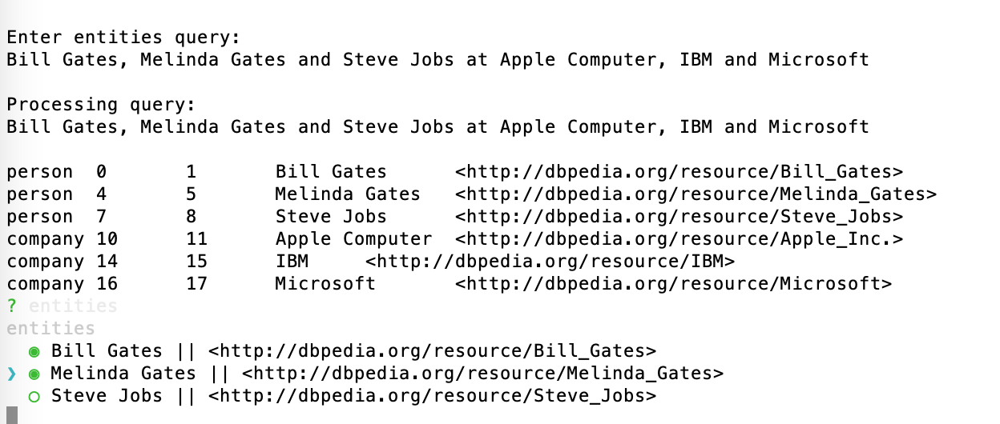

# Knowledge Graph Navigator {#kgn}

The Knowledge Graph Navigator (which I will often refer to as KGN) is a tool for processing a set of entity names and automatically exploring the public Knowledge Graph [DBPedia](http://dbpedia.org) using SPARQL queries. I started to write KGN for my own use, to automate some things I used to do manually when exploring Knowledge Graphs, and later thought that KGN might be useful also for educational purposes. KGN shows the user the auto-generated SPARQL queries so hopefully the user will learn by seeing examples. KGN uses NLP code developed in earlier chapters and we will reuse that code with a short review of using the APIs.

I chose to use DBPedia instead of WikiData for this example because DBPedia URIs are human readable. The following URIs represent the concept of a *person*. The semantic meanings of DBPedia and FOAF (friend of a friend) URIs are self-evident to a human reader.

{linenos=off}
~~~~~~~~
http://www.wikidata.org/entity/Q215627
http://dbpedia.org/ontology/Person
http://xmlns.com/foaf/0.1/name
~~~~~~~~

I frequently use WikiData in my work and WikiData is one of the most useful public knowledge bases. I have both DBPedia and WikiData Sparql endpoints in the file **Sparql.java**, with the WikiData endpoint comment out. You can try manually querying WikiData at the [WikiData SPARL endpoint](https://query.wikidata.org). For example, you might explore the WikiData URI for the *person* concept using:

{lang=sparql, linenos=off}
~~~~~~~~
select ?p ?o where { <http://www.wikidata.org/entity/Q215627> ?p ?o  } limit 10
~~~~~~~~

For the rest of this chapter we will just use DBPedia.

## We handle Person and Company Entity Types

To keep this example simple we only handle two entity types. However, the entity detection library that we use from an earlier chapter also supports, in addition to people and companies:

- Cities
- Countries
- Broadcast Networks
- Music Groups
- Political Parties
- Trade Unions
- Universities

As we look at the KGN implementation I will point out where and how you can easily add support for more entity types and in the wrap-up I will suggest further projects that you might want to try implementing with this example.

## General Design of the KGN Example

After looking an interactive session using the example program for this chapter (that also includes listing automatically generated SPARQL queries) we will look at the implementation.

The example application works by first having the user enter names of people and companies. Using libraries written in two previous chapters, we find entities in the user's input text, and generate SPARQL queries to DBPedia to find information about the entities and relationships between them.

We use Andreas Wegmann's **consoleui** library for showing the user a list of entities, allowing the user to select entities (toggle with the space character), and accept the list of selected entities by entering the return key. The following figure shows a screen shot of processing a list of person entities and selecting the first two using the up/down arrow keys and the space bare to toggle selections on or off:

Here is the console output for the example query *"Bill Gates, Melinda Gates and Steve Jobs at Apple Computer, IBM and Microsoft"*:

{linenos=on}
~~~~~~~~
Enter entities query:
Bill Gates, Melinda Gates and Steve Jobs at Apple Computer, IBM and Microsoft

Processing query:
Bill Gates, Melinda Gates and Steve Jobs at Apple Computer, IBM and Microsoft

person	0	1	Bill Gates	<http://dbpedia.org/resource/Bill_Gates>
person	4	5	Melinda Gates	<http://dbpedia.org/resource/Melinda_Gates>
person	7	8	Steve Jobs	<http://dbpedia.org/resource/Steve_Jobs>
company	10	11	Apple Computer	<http://dbpedia.org/resource/Apple_Inc.>
company	14	15	IBM	<http://dbpedia.org/resource/IBM>
company	16	17	Microsoft	<http://dbpedia.org/resource/Microsoft>
? entities [0 Bill Gates, 1 Melinda Gates, 2 Steve Jobs]
? entities [0 Apple Computer, 1 IBM, 2 Microsoft]

Individual People:

  Bill Gates                : http://dbpedia.org/resource/Bill_Gates
[QueryResult vars:[p, o]
Rows:
  [http://www.w3.org/1999/02/22-rdf-syntax-ns#type, http://www.w3.org/2002/07/owl#Thing]
  [http://www.w3.org/1999/02/22-rdf-syntax-ns#type, http://xmlns.com/foaf/0.1/Person]
  [http://www.w3.org/1999/02/22-rdf-syntax-ns#type, http://dbpedia.org/ontology/Person]
  [http://www.w3.org/1999/02/22-rdf-syntax-ns#type, http://www.ontologydesignpatterns.org/ont/dul/DUL.owl#Agent]
  [http://www.w3.org/1999/02/22-rdf-syntax-ns#type, http://www.ontologydesignpatterns.org/ont/dul/DUL.owl#NaturalPerson]
  [http://www.w3.org/1999/02/22-rdf-syntax-ns#type, http://www.wikidata.org/entity/Q215627]
  [http://www.w3.org/1999/02/22-rdf-syntax-ns#type, http://www.wikidata.org/entity/Q24229398]
  [http://www.w3.org/1999/02/22-rdf-syntax-ns#type, http://www.wikidata.org/entity/Q5]
  [http://www.w3.org/1999/02/22-rdf-syntax-ns#type, http://dbpedia.org/ontology/Agent]
  [http://www.w3.org/1999/02/22-rdf-syntax-ns#type, http://schema.org/Person]

  Melinda Gates             : http://dbpedia.org/resource/Melinda_Gates
[QueryResult vars:[p, o]
Rows:
  [http://www.w3.org/1999/02/22-rdf-syntax-ns#type, http://www.w3.org/2002/07/owl#Thing]
  [http://www.w3.org/1999/02/22-rdf-syntax-ns#type, http://xmlns.com/foaf/0.1/Person]
  [http://www.w3.org/1999/02/22-rdf-syntax-ns#type, http://dbpedia.org/ontology/Person]
  [http://www.w3.org/1999/02/22-rdf-syntax-ns#type, http://www.ontologydesignpatterns.org/ont/dul/DUL.owl#Agent]
  [http://www.w3.org/1999/02/22-rdf-syntax-ns#type, http://www.ontologydesignpatterns.org/ont/dul/DUL.owl#NaturalPerson]
  [http://www.w3.org/1999/02/22-rdf-syntax-ns#type, http://www.wikidata.org/entity/Q215627]
  [http://www.w3.org/1999/02/22-rdf-syntax-ns#type, http://www.wikidata.org/entity/Q24229398]
  [http://www.w3.org/1999/02/22-rdf-syntax-ns#type, http://www.wikidata.org/entity/Q5]
  [http://www.w3.org/1999/02/22-rdf-syntax-ns#type, http://dbpedia.org/ontology/Agent]
  [http://www.w3.org/1999/02/22-rdf-syntax-ns#type, http://schema.org/Person]

  Steve Jobs                : http://dbpedia.org/resource/Steve_Jobs
[QueryResult vars:[p, o]
Rows:
  [http://www.w3.org/1999/02/22-rdf-syntax-ns#type, http://www.w3.org/2002/07/owl#Thing]
  [http://www.w3.org/1999/02/22-rdf-syntax-ns#type, http://xmlns.com/foaf/0.1/Person]
  [http://www.w3.org/1999/02/22-rdf-syntax-ns#type, http://dbpedia.org/ontology/Person]
  [http://www.w3.org/1999/02/22-rdf-syntax-ns#type, http://www.ontologydesignpatterns.org/ont/dul/DUL.owl#Agent]
  [http://www.w3.org/1999/02/22-rdf-syntax-ns#type, http://www.ontologydesignpatterns.org/ont/dul/DUL.owl#NaturalPerson]
  [http://www.w3.org/1999/02/22-rdf-syntax-ns#type, http://www.wikidata.org/entity/Q215627]
  [http://www.w3.org/1999/02/22-rdf-syntax-ns#type, http://www.wikidata.org/entity/Q24229398]
  [http://www.w3.org/1999/02/22-rdf-syntax-ns#type, http://www.wikidata.org/entity/Q5]
  [http://www.w3.org/1999/02/22-rdf-syntax-ns#type, http://dbpedia.org/ontology/Agent]
  [http://www.w3.org/1999/02/22-rdf-syntax-ns#type, http://schema.org/Person]

Individual Companies:

  Apple Computer            : http://dbpedia.org/resource/Apple_Inc.
  IBM                       : http://dbpedia.org/resource/IBM
  Microsoft                 : http://dbpedia.org/resource/Microsoft

Relationships between person Bill Gates person Melinda Gates:
[QueryResult vars:[p]
Rows:
  [http://dbpedia.org/ontology/spouse]

Relationships between person Melinda Gates person Bill Gates:
[QueryResult vars:[p]
Rows:
  [http://dbpedia.org/ontology/spouse]

Relationships between person Bill Gates company Microsoft:
[QueryResult vars:[p]
Rows:
  [http://dbpedia.org/ontology/board]

Relationships between person Steve Jobs company Apple Computer:
[QueryResult vars:[p]
Rows:
  [http://www.w3.org/2000/01/rdf-schema#seeAlso]
  [http://dbpedia.org/ontology/board]
  [http://dbpedia.org/ontology/occupation]
~~~~~~~~

Since the DBPedia queries are time consuming, we use the caching layer from the earlier chapter *Resolve Entity Names to DBPedia References*. The cache is especially helpful during development when the same queries are repeatedly used for testing.

## UML Class Diagram for Example Application

TBD

## Implementation

{lang="java",linenos=on}
~~~~~~~~

~~~~~~~~
                      
This caching layer greatly speeds up my own personal use of KGN. Without caching, queries that contain many entity references simply take too long to run. The UI for the KGN application has a menu option for clearing the local cache but I almost never use this option because growing a large cache that is tailored for the types of information I search for makes the entire system much more responsive.

{lang="java",linenos=off}
~~~~~~~~
~~~~~~~~

## Wrap-up

If you enjoy running and experimenting with this example and want to modify it for your own projects then I hope that I provided a sufficient road map for you to do so.

I suggest further projects that you might want to try implementing with this example:

- TBD
- - TBD
- TBD

I got the idea for the KGN application because I was spending quite a bit of time manually setting up SPARQL queries for DBPedia (and other public sources like WikiData) and I wanted to experiment with partially automating this process.

