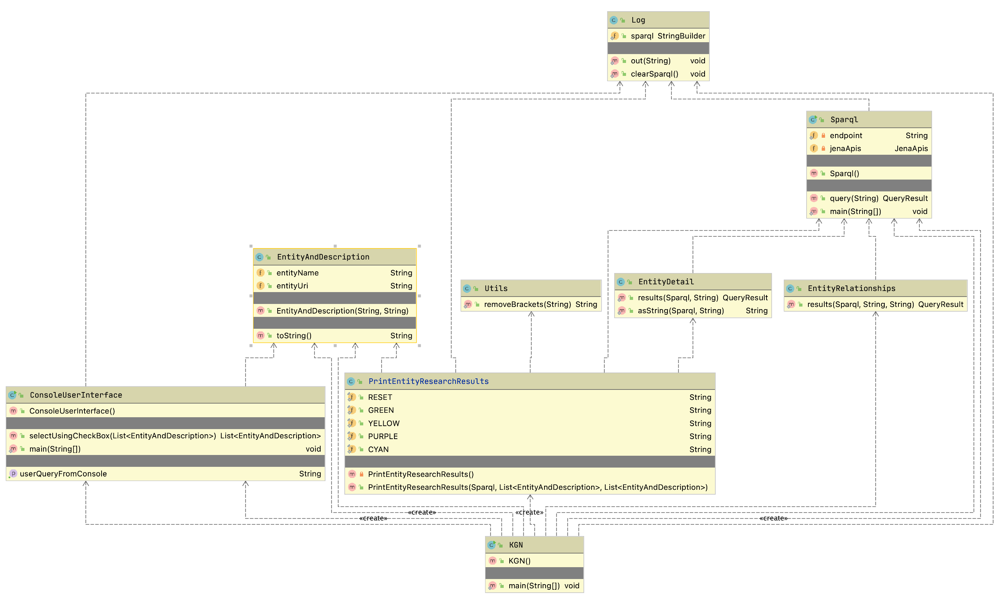

# Knowledge Graph Navigator {#kgn}

The Knowledge Graph Navigator (which I will often refer to as KGN) is a tool for processing a set of entity names and automatically exploring the public Knowledge Graph [DBPedia](http://dbpedia.org) using SPARQL queries. I started to write KGN for my own use, to automate some things I used to do manually when exploring Knowledge Graphs, and later thought that KGN might be also useful for educational purposes. KGN shows the user the auto-generated SPARQL queries so hopefully the user will learn by seeing examples. KGN uses code developed in the earlier chapter [Resolve Entity Names to DBPedia References](#ner) and we will reuse here as well as the two Java classes **JenaAPis** and **QueryResults** (which wrap the Apache Jena library) from the chapter [Semantic Web](#semantic-web).

I have a [web site devoted to different versions of KGN](http://www.knowledgegraphnavigator.com/) that you might find interesting. The most full featured version of KGN, including a full user interface, is featured in my book [Loving Common Lisp, or the Savvy Programmer's Secret Weapon](https://leanpub.com/lovinglisp) that you can read free online. That version performs more speculative SPARQL queries to find information compared to the example here that I designed for ease of understanding, modification, and embedding in larger Java projects.

I chose to use DBPedia instead of WikiData for this example because DBPedia URIs are human readable. The following URIs represent the concept of a *person*. The semantic meanings of DBPedia and FOAF (friend of a friend) URIs are self-evident to a human reader while the WikiData URI is not:

{linenos=off}
~~~~~~~~
http://www.wikidata.org/entity/Q215627
http://dbpedia.org/ontology/Person
http://xmlns.com/foaf/0.1/name
~~~~~~~~

I frequently use WikiData in my work and WikiData is one of the most useful public knowledge bases. I have both DBPedia and WikiData Sparql endpoints in the file **Sparql.java** that we will look at later, with the WikiData endpoint comment out. You can try manually querying WikiData at the [WikiData SPARL endpoint](https://query.wikidata.org). For example, you might explore the WikiData URI for the *person* concept using:

{lang=sparql, linenos=off}
~~~~~~~~
select ?p ?o where { <http://www.wikidata.org/entity/Q215627> ?p ?o  } limit 10
~~~~~~~~

For the rest of this chapter we will just use DBPedia.

After looking an interactive session using the example program for this chapter (that also includes listing automatically generated SPARQL queries) we will look at the implementation.

{width: "80%"}

## Entity Types Handled by KGN

To keep this example simple we handle just four entity types:

- People
- Companies
- Cities
- Countries
 
 The entity detection library that we use from an earlier chapter also supports the following entity types that we don't use here:

- Broadcast Networks
- Music Groups
- Political Parties
- Trade Unions
- Universities

In addition to finding detailed information for people, companies, cities, and countries we will also search for relationships between person entities and company entities. This search process consists of generating a series of SPARQL queries and calling the DBPedia SPARQL endpoint.

As we look at the KGN implementation I will point out where and how you can easily add support for more entity types and in the wrap-up I will suggest further projects that you might want to try implementing with this example.

## General Design of KGN with Example Output

The example application works by first having the user enter names of people and companies. Using libraries written in two previous chapters, we find entities in the user's input text, and generate SPARQL queries to DBPedia to find information about the entities and relationships between them.

We will start with looking at sample output so you have some understanding on what this implementation of KGN will and will not do. Here is the console output for the example query *"Bill Gates, Melinda Gates and Steve Jobs at Apple Computer, IBM and Microsoft"* (with some output removed for brevity). As you remember from the chapter *Semantic Web*, SPAQRL query results are expressed in class **QueryResult** that contains the variables (labelled as **vars**) in a query and a list of rows (one query result per row). Starting at line 117 in the following listing we see discovered relationships between entities in the input query.

{linenos=on}
~~~~~~~~
Enter entities query:
Bill Gates, Melinda Gates and Steve Jobs at Apple Computer, IBM and Microsoft

Processing query:
Bill Gates, Melinda Gates and Steve Jobs at Apple Computer, IBM and Microsoft

person	0	1	Bill Gates	<http://dbpedia.org/resource/Bill_Gates>
person	4	5	Melinda Gates	<http://dbpedia.org/resource/Melinda_Gates>
person	7	8	Steve Jobs	<http://dbpedia.org/resource/Steve_Jobs>
company	10	11	Apple Computer	<http://dbpedia.org/resource/Apple_Inc.>
company	14	15	IBM	<http://dbpedia.org/resource/IBM>
company	16	17	Microsoft	<http://dbpedia.org/resource/Microsoft>

Individual People:

  Bill Gates                : http://dbpedia.org/resource/Bill_Gates
[QueryResult vars:[birthplace, label, comment, almamater, spouse]
Rows:
  [http://dbpedia.org/resource/Seattle, Bill Gates, William Henry \"Bill\" Gates III (born October 28, 1955) is an American business magnate, investor, author and philanthropist. In 1975, Gates and Paul Allen co-founded Microsoft, which became the world's largest PC software company. During his career at Microsoft, Gates held the positions of chairman, CEO and chief software architect, and was the largest individual shareholder until May 2014. Gates has authored and co-authored several books., http://dbpedia.org/resource/Harvard_University, http://dbpedia.org/resource/Melinda_Gates]

  Melinda Gates             : http://dbpedia.org/resource/Melinda_Gates
[QueryResult vars:[birthplace, label, comment, almamater, spouse]
Rows:
  [http://dbpedia.org/resource/Dallas | http://dbpedia.org/resource/Dallas,_Texas, Melinda Gates, Melinda Ann Gates (née French; born August 15, 1964), DBE is an American businesswoman and philanthropist. She is co-founder of the Bill & Melinda Gates Foundation. She worked at Microsoft, where she was project manager for Microsoft Bob, Microsoft Encarta and Expedia., http://dbpedia.org/resource/Duke_University, http://dbpedia.org/resource/Bill_Gates]

  Steve Jobs                : http://dbpedia.org/resource/Steve_Jobs
[QueryResult vars:[birthplace, label, comment, almamater, spouse]
Rows:
  [http://dbpedia.org/resource/San_Francisco, Steve Jobs, Steven Paul \"Steve\" Jobs (/ˈdʒɒbz/; February 24, 1955 – October 5, 2011) was an American information technology entrepreneur and inventor. He was the co-founder, chairman, and chief executive officer (CEO) of Apple Inc.; CEO and majority shareholder of Pixar Animation Studios; a member of The Walt Disney Company's board of directors following its acquisition of Pixar; and founder, chairman, and CEO of NeXT Inc. Jobs is widely recognized as a pioneer of the microcomputer revolution of the 1970s and 1980s, along with Apple co-founder Steve Wozniak. Shortly after his death, Jobs's official biographer, Walter Isaacson, described him as a \"creative entrepreneur whose passion for perfection and ferocious drive revolutionized six industries: personal computers, animated movies, music, phones, tab, http://dbpedia.org/resource/Reed_College, http://dbpedia.org/resource/Laurene_Powell_Jobs]

Individual Companies:

  Apple Computer            : http://dbpedia.org/resource/Apple_Inc.
[QueryResult vars:[industry, netIncome, label, comment, numberOfEmployees]
Rows:
  [http://dbpedia.org/resource/Computer_hardware | http://dbpedia.org/resource/Computer_software | http://dbpedia.org/resource/Consumer_electronics | http://dbpedia.org/resource/Corporate_Venture_Capital | http://dbpedia.org/resource/Digital_distribution | http://dbpedia.org/resource/Fabless_manufacturing, 5.3394E10, Apple Inc., Apple Inc. is an American multinational technology company headquartered in Cupertino, California, that designs, develops, and sells consumer electronics, computer software, and online services. Its hardware products include the iPhone smartphone, the iPad tablet computer, the Mac personal computer, the iPod portable media player, the Apple Watch smartwatch, and the Apple TV digital media player. Apple's consumer software includes the macOS and iOS operating systems, the iTunes media player, the Safari web browser, and the iLife and iWork creativity and productivity suites. Its online services include the iTunes Store, the iOS App Store and Mac App Store, Apple Music, and iCloud., 115000]

  IBM                       : http://dbpedia.org/resource/IBM
[QueryResult vars:[industry, netIncome, label, comment, numberOfEmployees]
Rows:
  [http://dbpedia.org/resource/Cloud_computing | http://dbpedia.org/resource/Cognitive_computing | http://dbpedia.org/resource/Information_technology, 1.319E10, IBM, International Business Machines Corporation (commonly referred to as IBM) is an American multinational technology company headquartered in Armonk, New York, United States, with operations in over 170 countries. The company originated in 1911 as the Computing-Tabulating-Recording Company (CTR) and was renamed \"International Business Machines\" in 1924., 377757]

  Microsoft                 : http://dbpedia.org/resource/Microsoft
[QueryResult vars:[industry, netIncome, label, comment, numberOfEmployees]
Rows:
  [http://dbpedia.org/resource/Computer_hardware | http://dbpedia.org/resource/Consumer_electronics | http://dbpedia.org/resource/Digital_distribution | http://dbpedia.org/resource/Software, , Microsoft, Microsoft Corporation /ˈmaɪkrəˌsɒft, -roʊ-, -ˌsɔːft/ (commonly referred to as Microsoft or MS) is an American multinational technology company headquartered in Redmond, Washington, that develops, manufactures, licenses, supports and sells computer software, consumer electronics and personal computers and services. Its best known software products are the Microsoft Windows line of operating systems, Microsoft Office office suite, and Internet Explorer and Edge web browsers. Its flagship hardware products are the Xbox video game consoles and the Microsoft Surface tablet lineup. As of 2011, it was the world's largest software maker by revenue, and one of the world's most valuable companies., 114000]

Individual Cities:

  Seattle                   : http://dbpedia.org/resource/Seattle
[QueryResult vars:[latitude_longitude, populationDensity, label, comment, country]
Rows:
  [POINT(-122.33305358887 47.609722137451), 3150.979715864901, Seattle, Seattle is a West Coast seaport city and the seat of King County, Washington. With an estimated 684,451 residents as of 2015, Seattle is the largest city in both the state of Washington and the Pacific Northwest region of North America. As of 2015, it is estimated to be the 18th largest city in the United States. In July 2013, it was the fastest-growing major city in the United States and remained in the Top 5 in May 2015 with an annual growth rate of 2.1%. The Seattle metropolitan area is the 15th largest metropolitan area in the United States with over 3.7 million inhabitants. The city is situated on an isthmus between Puget Sound (an inlet of the Pacific Ocean) and Lake Washington, about 100 miles (160 km) south of the Canada–United States border. A major gateway for trade w, ]

Individual Countries:

Relationships between person Bill Gates person Melinda Gates:
[QueryResult vars:[p]
Rows:
  [http://dbpedia.org/ontology/spouse]

Relationships between person Melinda Gates person Bill Gates:
[QueryResult vars:[p]
Rows:
  [http://dbpedia.org/ontology/spouse]

Relationships between person Bill Gates company Microsoft:
[QueryResult vars:[p]
Rows:
  [http://dbpedia.org/ontology/board]

Relationships between person Steve Jobs company Apple Computer:
[QueryResult vars:[p]
Rows:
  [http://www.w3.org/2000/01/rdf-schema#seeAlso]
  [http://dbpedia.org/ontology/board]
  [http://dbpedia.org/ontology/occupation]
~~~~~~~~

Since the DBPedia queries are time consuming, we use the caching layer from the earlier chapter *Semantic Web* when making SPARQL queries to DBPedia. The cache is especially helpful during development when the same queries are repeatedly used for testing.

The KGN user interface loop allows you to enter queries and see the results. There are two special options that you can enter instead of a query:

- sparql - this will print out all previous SPARQL queries used to present results. After entering this command the buffer of previous SPARQL queries is emptied. This option is useful for learning SPARQL and you might try pasting a few into the input field for the [public DBPedia SPARQL web app](http://dbpedia.org/sparql) and modifying them. We will use this command later in an example.
- demo - this will randomly choose a sample query.

## UML Class Diagram for Example Application

The following UML Class Diagram for KGN shows you an overview of the Java classes we use and their public methods and fields.

{width: "80%"}

## Implementation

We will walk through the classes in the UML Class Diagram for KGN in alphabetical order, the exception being that we will look at the main program in **KGN.java** last.

The class **EntityAndDescription** contains two strings, a name and a URI reference. We also override the default implementation of **toString** to format and display the data in an instance of this class:

{lang="java",linenos=on}
~~~~~~~~
package com.knowledgegraphnavigator;

/**
 * Immutable data carrier for an entity name and its DBPedia URI.
 * Converted to a Java record for automatic toString(), equals(), hashCode().
 */
public record EntityAndDescription(String entityName, String entityUri) {
}
~~~~~~~~

The class **EntityDetail** defines SPARQL query templates in lines 80-154 that have slots (using **%s** for string replacement) for the URI of an entity. We use different templates for different entity types. Before we look at these SPARQL query templates, let's learn two additional features of the SPARQL language that we will need to use in these entity templates.

We mentioned the **OPTIONAL** triple matching patterns in the chapter *Semantic Web*. Before looking at the Java code, let's first look at how optional matching works. We will run the KGN application asking for information on the city Seattle and then use the **sparql** command to print the generated SPARQL produced by the method **cityResults** (most output is not shown here for brevity). On line 2 I enter the query string "Seattle" and on line 22 I enter the command "sparql" to print out the generated SPARQL:

{linenos=on}
~~~~~~~~
Enter entities query:
Seattle

Individual Cities:

  Seattle                   : http://dbpedia.org/resource/Seattle
[QueryResult vars:[latitude_longitude, populationDensity, label, comment, country]
Rows:
  [POINT(-122.33305358887 47.609722137451), 3150.979715864901, Seattle, Seattle is a West Coast seaport city and the seat of King County, Washington. With an estimated 684,451 residents as of 2015, Seattle is the largest city in both the state of Washington and the Pacific Northwest region of North America. As of 2015, it is estimated to be the 18th largest city in the United States. In July 2013, it was the fastest-growing major city in the United States and remained in the Top 5 in May 2015 with an annual growth rate of 2.1%. The Seattle metropolitan area is the 15th largest metropolitan area in the United States with over 3.7 million inhabitants. The city is situated on an isthmus between Puget Sound (an inlet of the Pacific Ocean) and Lake Washington, about 100 miles (160 km) south of the Canada–United States border. A major gateway for trade w, ]

Processing query:
sparql

Generated SPARQL used to get current results:

SELECT DISTINCT
    (GROUP_CONCAT (DISTINCT ?latitude_longitude2; SEPARATOR=' | ') 
        AS ?latitude_longitude) 
    (GROUP_CONCAT (DISTINCT ?populationDensity2; SEPARATOR=' | ')
        AS ?populationDensity) 
    (GROUP_CONCAT (DISTINCT ?label2; SEPARATOR=' | ') AS ?label) 
    (GROUP_CONCAT (DISTINCT ?comment2; SEPARATOR=' | ') AS ?comment) 
    (GROUP_CONCAT (DISTINCT ?country2; SEPARATOR=' | ') AS ?country) { 
 <http://dbpedia.org/resource/Seattle>
   <http://www.w3.org/2000/01/rdf-schema#comment>
   ?comment2 .
        FILTER  (lang(?comment2) = 'en') . 
 OPTIONAL { <http://dbpedia.org/resource/Seattle>
            <http://www.w3.org/2003/01/geo/wgs84_pos#geometry>
            ?latitude_longitude2 } . 
 OPTIONAL { <http://dbpedia.org/resource/Seattle>
            <http://dbpedia.org/ontology/PopulatedPlace/populationDensity>
            ?populationDensity2 } . 
 OPTIONAL { <http://dbpedia.org/resource/Seattle>
            <http://dbpedia.org/ontology/country>
            ?country2 } . 
 OPTIONAL { <http://dbpedia.org/resource/Seattle>
            <http://www.w3.org/2000/01/rdf-schema#label>
            ?label2 . } 
 } LIMIT 30
~~~~~~~~

This listing was manually edited to fit page width. In lines 34-36, we are trying to find a triple stating which country Seattle is in. Please note that this triple matching pattern is generated as one line but I had to manually edit it here to fit the page width.

The triple matching pattern in lines 34-36 must match some triple in DBPedia or no results will be returned. In other words this matching pattern is mandatory. The four optional matching patterns in lines 38-49 specify triple patterns that may be matched. In this example there is no triple matching the following statement in the DBPedia knowledge base so the variable **country2** is not bound and the query returns no results for the variable **country**:

{lang="sparql",linenos=off}
~~~~~~~~
<http://dbpedia.org/resource/Seattle> <http://dbpedia.org/ontology/country> ?country2
~~~~~~~~

Notice also the syntax for **GROUP_CONCAT** used in lines 27-33, for example:

{lang="sparql",linenos=off}
~~~~~~~~
  (GROUP_CONCAT (DISTINCT ?country2; SEPARATOR=' | ') AS ?country)
~~~~~~~~

This collects all values assigned to the binding variable **?country2** into a string value using the separator string " | ". Using **DISTINCT** with **GROUP_CONCAT** conveniently discards duplicate bindings for binding variables like **?country2**.

Now that we have looked at SPARQL examples using **OPTIONAL** and **GROUP_CONCAT**, the templates at the end of the following listing should be easier to understand.

The methods **genericResults** and **genericAsString** in the following listing are not currently used in this example but I leave them as easy way to get information, given any entity URI. You are likely to use these if you use the code for KGN in your projects.

For each entity type, for example *city*, I wrote one method like **cityResults** that returns an instance of **QueryResult** calculated by using the **JenaApis** library from the chapter *Semantic Web*. For each entity type there is another method, like **cityAsString** that converts an instance of **QueryResult** to a formatted string for display.

We use the code pattern seen in lines 29-30 for each entity type. We use the static method **String.format**  to replace occurrences of **%s** in the entity template string with the string representation of entity URIs.

{lang="java",linenos=on}
~~~~~~~~
package com.knowledgegraphnavigator;

import com.markwatson.semanticweb.QueryResult;

import java.sql.SQLException; // Cache layer in JenaApis library throws this

public class EntityDetail {

  public static QueryResult genericResults(Sparql endpoint, String entityUri)
      throws SQLException, ClassNotFoundException {
    var query = """
        SELECT DISTINCT ?p ?o WHERE {
          %s ?p ?o .
          FILTER (!regex(str(?p), 'wiki', 'i'))
        } LIMIT 10
        """.formatted(entityUri);
    return endpoint.query(query);
  }

  public static String genericAsString(Sparql endpoint, String entityUri)
      throws SQLException, ClassNotFoundException {
    QueryResult qr = genericResults(endpoint, entityUri);
    return qr.toString();
  }

  public static QueryResult cityResults(Sparql endpoint, String entityUri)
      throws SQLException, ClassNotFoundException {
    var query = cityTemplate.formatted(entityUri, entityUri, entityUri, entityUri, entityUri);
    return endpoint.query(query);
  }

  public static String cityAsString(Sparql endpoint, String entityUri)
      throws SQLException, ClassNotFoundException {
    QueryResult qr = cityResults(endpoint, entityUri);
    return qr.toString();
  }

  public static QueryResult countryResults(Sparql endpoint, String entityUri)
      throws SQLException, ClassNotFoundException {
    var query = countryTemplate.formatted(entityUri, entityUri, entityUri, entityUri, entityUri);
    return endpoint.query(query);
  }

  public static String countryAsString(Sparql endpoint, String entityUri)
      throws SQLException, ClassNotFoundException {
    QueryResult qr = countryResults(endpoint, entityUri);
    return qr.toString();
  }

  public static QueryResult personResults(Sparql endpoint, String entityUri)
      throws SQLException, ClassNotFoundException {
    var query = personTemplate.formatted(entityUri, entityUri, entityUri, entityUri, entityUri);
    return endpoint.query(query);
  }

  public static String personAsString(Sparql endpoint, String entityUri)
      throws SQLException, ClassNotFoundException {
    QueryResult qr = personResults(endpoint, entityUri);
    return qr.toString();
  }

  public static QueryResult companyResults(Sparql endpoint, String entityUri)
      throws SQLException, ClassNotFoundException {
    var query = companyTemplate.formatted(entityUri, entityUri, entityUri, entityUri, entityUri);
    return endpoint.query(query);
  }

  public static String companyAsString(Sparql endpoint, String entityUri)
      throws SQLException, ClassNotFoundException {
    QueryResult qr = companyResults(endpoint, entityUri);
    return qr.toString();
  }

  private static final String companyTemplate = """
      SELECT DISTINCT
          (GROUP_CONCAT (DISTINCT ?industry2; SEPARATOR=' | ') AS ?industry)
          (GROUP_CONCAT (DISTINCT ?netIncome2; SEPARATOR=' | ') AS ?netIncome)
          (GROUP_CONCAT (DISTINCT ?label2; SEPARATOR=' | ') AS ?label)
          (GROUP_CONCAT (DISTINCT ?comment2; SEPARATOR=' | ') AS ?comment)
          (GROUP_CONCAT (DISTINCT ?numberOfEmployees2; SEPARATOR=' | ') AS ?numberOfEmployees) {
        %s <http://www.w3.org/2000/01/rdf-schema#comment>  ?comment2 .
                  FILTER  (lang(?comment2) = 'en') .
        OPTIONAL { %s <http://dbpedia.org/ontology/industry> ?industry2 } .
        OPTIONAL { %s <http://dbpedia.org/ontology/netIncome> ?netIncome2 } .
        OPTIONAL { %s <http://dbpedia.org/ontology/numberOfEmployees> ?numberOfEmployees2 } .
        OPTIONAL { %s <http://www.w3.org/2000/01/rdf-schema#label> ?label2 .
                  FILTER (lang(?label2) = 'en') }
      } LIMIT 30""";

  private static final String personTemplate = """
      SELECT DISTINCT
          (GROUP_CONCAT (DISTINCT ?birthplace2; SEPARATOR=' | ') AS ?birthplace)
          (GROUP_CONCAT (DISTINCT ?label2; SEPARATOR=' | ') AS ?label)
          (GROUP_CONCAT (DISTINCT ?comment2; SEPARATOR=' | ') AS ?comment)
          (GROUP_CONCAT (DISTINCT ?almamater2; SEPARATOR=' | ') AS ?almamater)
          (GROUP_CONCAT (DISTINCT ?spouse2; SEPARATOR=' | ') AS ?spouse) {
        %s <http://www.w3.org/2000/01/rdf-schema#comment>  ?comment2 .
        FILTER  (lang(?comment2) = 'en') .
        OPTIONAL { %s <http://dbpedia.org/ontology/birthPlace> ?birthplace2 } .
        OPTIONAL { %s <http://dbpedia.org/ontology/almaMater> ?almamater2 } .
        OPTIONAL { %s <http://dbpedia.org/ontology/spouse> ?spouse2 } .
        OPTIONAL { %s  <http://www.w3.org/2000/01/rdf-schema#label> ?label2 .
          FILTER  (lang(?label2) = 'en') }
      } LIMIT 10""";

  private static final String countryTemplate = """
      SELECT DISTINCT
          (GROUP_CONCAT (DISTINCT ?areaTotal2; SEPARATOR=' | ') AS ?areaTotal)
          (GROUP_CONCAT (DISTINCT ?label2; SEPARATOR=' | ') AS ?label)
          (GROUP_CONCAT (DISTINCT ?comment2; SEPARATOR=' | ') AS ?comment)
          (GROUP_CONCAT (DISTINCT ?populationDensity2; SEPARATOR=' | ') AS ?populationDensity) {
        %s <http://www.w3.org/2000/01/rdf-schema#comment>  ?comment2 .
                             FILTER  (lang(?comment2) = 'en') .
                       OPTIONAL { %s <http://dbpedia.org/ontology/areaTotal> ?areaTotal2 } .
                       OPTIONAL { %s <http://dbpedia.org/ontology/populationDensity> ?populationDensity2 } .
                       OPTIONAL { %s <http://www.w3.org/2000/01/rdf-schema#label> ?label2 . }
                     } LIMIT 30""";

  private static final String cityTemplate = """
      SELECT DISTINCT
          (GROUP_CONCAT (DISTINCT ?latitude_longitude2; SEPARATOR=' | ')
              AS ?latitude_longitude)
          (GROUP_CONCAT (DISTINCT ?populationDensity2; SEPARATOR=' | ') AS ?populationDensity)
          (GROUP_CONCAT (DISTINCT ?label2; SEPARATOR=' | ') AS ?label)
          (GROUP_CONCAT (DISTINCT ?comment2; SEPARATOR=' | ') AS ?comment)
          (GROUP_CONCAT (DISTINCT ?country2; SEPARATOR=' | ') AS ?country) {
        %s <http://www.w3.org/2000/01/rdf-schema#comment>  ?comment2 . FILTER  (lang(?comment2) = 'en') .
        OPTIONAL { %s <http://www.w3.org/2003/01/geo/wgs84_pos#geometry> ?latitude_longitude2 } .
        OPTIONAL { %s <http://dbpedia.org/ontology/PopulatedPlace/populationDensity> ?populationDensity2 } .
        OPTIONAL { %s <http://dbpedia.org/ontology/country> ?country2 } .
        OPTIONAL { %s <http://www.w3.org/2000/01/rdf-schema#label> ?label2 .
                   FILTER  (lang(?label2) = 'en') }
      } LIMIT 30""";

}
~~~~~~~~

The class **EntityRelationships** in the next listing is used to find property relationships between two entity URIs. The RDF statement matching **FILTER** on line 15 prevents matching statements where the property contains the string "wiki" to avoid WikiData URI references. This class would need to be rewritten to handle, for example, the WikiData Knowledge Base instead of the DBPedia Knowledge Base. This class uses the **JenaApis** library developed in the chapter *Semantic Web*. The class **Sparql** that we will look at later wraps the use of the **JenaApis** library.

{lang="java",linenos=on}
~~~~~~~~
package com.knowledgegraphnavigator;

import com.markwatson.semanticweb.QueryResult;

import java.sql.SQLException;

public class EntityRelationships {

  public static QueryResult results(Sparql endpoint,
                                    String entity1Uri, String entity2Uri)
      throws SQLException, ClassNotFoundException {
    var query = """
        SELECT ?p WHERE {
          %s ?p %s .
          FILTER (!regex(str(?p), 'wikiPage', 'i'))
        } LIMIT 10
        """.formatted(entity1Uri, entity2Uri);
    return endpoint.query(query);
  }
}
~~~~~~~~

The class **Log** in the next listing defines a shorthand **out** for calling **System.out.println**, an instance of **StringBuilder** for storing all generated SPARQL queries made to DBPedia, and a utility method for clearing the stored SPARQL queries. We use the cache of SPARQL queries to support the interactive command "sparql" in the **KGN** application that we previously saw in an example when we saw the use of this command to display all cached SPARQL queries demonstrating the use of **DISTINCT** and **GROUP_CONCAT**.

{lang="java",linenos=on}
~~~~~~~~
package com.knowledgegraphnavigator;

public class Log {
  public static void out(String s) { System.out.println(s); }
  /** Accumulated SPARQL queries for inspection. Note: not thread-safe (single-threaded demo). */
  public static final StringBuilder sparql = new StringBuilder();
  public static void clearSparql() { sparql.delete(0, sparql.length()); }
}
~~~~~~~~

The class **PrintEntityResearchResults** in the next listing takes results from multiple DBPedia queries, formats the results, and displays them. The class constructor has no use except for the side effect of displaying results to a user. The constructor requires the arguments:

- Sparql endpoint - we will look at the definition of class **Sparql** in the next section.
- List<EntityAndDescription> people - a list of person names and URIs.
- List<EntityAndDescription> companies - a list of company names and URIs.
- List<EntityAndDescription> cities - a list of city names and URIs.
- List<EntityAndDescription> countries - a list of country names and URIs.

I define static string values for a few ANSI terminal escape sequences for changing the default color of text written to a terminal. If you are running on Windows you may need to set initialization values for **RESET**, **GREEN**, **YELLOW**, **PURPLE**, and **CYAN** to empty strings "".

{lang="java",linenos=on}
~~~~~~~~
package com.knowledgegraphnavigator;

import static com.knowledgegraphnavigator.Log.out;
import static com.knowledgegraphnavigator.Utils.removeBrackets;

import java.sql.SQLException;
import java.util.List;

public class PrintEntityResearchResults {

  /**
   * Note for Windows users: the Windows console may not render the following
   * ANSI terminal escape sequences correctly. If yo have problems, just
   * change the following to the empty string "":
   */
  public static final String RESET = "\u001B[0m"; // ANSI characters for styling
  public static final String GREEN = "\u001B[32m";
  public static final String YELLOW = "\u001B[33m";
  public static final String PURPLE = "\u001B[35m";
  public static final String CYAN = "\u001B[36m";

  private PrintEntityResearchResults() { }

  /**
   * Print detailed research results for each entity category.
   * Extracted from constructor to avoid side-effects in object construction.
   */
  public static void printResults(Sparql endpoint,
                                  List<EntityAndDescription> people,
                                  List<EntityAndDescription> companies,
                                  List<EntityAndDescription> cities,
                                  List<EntityAndDescription> countries)
      throws SQLException, ClassNotFoundException {
    out("\n" + GREEN + "Individual People:\n" + RESET);
    for (var person : people) {
      out("  " + GREEN + String.format("%-25s", person.entityName()) +
          PURPLE + " : " + removeBrackets(person.entityUri()) + RESET);
      out(EntityDetail.personAsString(endpoint, person.entityUri()));
    }
    out("\n" + CYAN + "Individual Companies:\n" + RESET);
    for (var company : companies) {
      out("  " + CYAN + String.format("%-25s", company.entityName()) +
          YELLOW + " : " + removeBrackets(company.entityUri()) + RESET);
      out(EntityDetail.companyAsString(endpoint, company.entityUri()));
    }
    out("\n" + GREEN + "Individual Cities:\n" + RESET);
    for (var city : cities) {
      out("  " + GREEN + String.format("%-25s", city.entityName()) +
          PURPLE + " : " + removeBrackets(city.entityUri()) + RESET);
      out(EntityDetail.cityAsString(endpoint, city.entityUri()));
    }
    out("\n" + GREEN + "Individual Countries:\n" + RESET);
    for (var country : countries) {
      out("  " + GREEN + String.format("%-25s", country.entityName()) +
          PURPLE + " : " + removeBrackets(country.entityUri()) + RESET);
      out(EntityDetail.countryAsString(endpoint, country.entityUri()));
    }
    out("");
  }
}
~~~~~~~~

The class **Sparql** in the next listing wraps the **JenaApis** library from the chapter *Semantic Web*. I set the SPARQL endpoint for DBPedia on line 13. I set and commented out the WikiData SPARQL endpoint on lines 11-12. The KGN application will not work with WikiData without some modifications. If you enjoy experimenting with KGN then you might want to clone it and enable it to work simultaneously with DBPedia, WikiData, and local RDF files by using three instances of the class **JenaApis**.

Notice that we are importing the value of a static StringBuffer **com.knowledgegraphnavigator.Log.sparql** on line 5. We will use this for storing SPARQL queries for display to the user.

{lang="java",linenos=on}
~~~~~~~~
package com.knowledgegraphnavigator;

import com.markwatson.semanticweb.QueryResult;
import com.markwatson.semanticweb.JenaApis;
import static com.knowledgegraphnavigator.Log.sparql;
import static com.knowledgegraphnavigator.Log.out;

import java.sql.SQLException;

public class Sparql {
  //static private String endpoint = "https://query.wikidata.org/bigdata/namespace/wdq/sparql";
  private static final String ENDPOINT = "https://dbpedia.org/sparql";
  private final JenaApis jenaApis;

  public Sparql() {
    this.jenaApis = new JenaApis();
  }

  public QueryResult query(String sparqlQuery) throws SQLException, ClassNotFoundException {
    //out(sparqlQuery); // debug for now...
    sparql.append(sparqlQuery);
    sparql.append("\n\n");
    return jenaApis.queryRemote(ENDPOINT, sparqlQuery);
  }

  public static void main(String[] args) throws Exception {
    var sp = new Sparql();
    QueryResult qr = sp.query("select ?s ?p ?o where { ?s ?p ?o } limit 5");
    out(qr.toString());
  }
}
~~~~~~~~

The class **Utils** contains one utility method **removeBrackets** that is used to convert a URI in SPARQL RDF statement form:

{linenos=off}
~~~~~~~~
<http://dbpedia.org/resource/Seattle>
~~~~~~~~

to:

{linenos=off}
~~~~~~~~
http://dbpedia.org/resource/Seattle
~~~~~~~~

The single method **removeBrackets** is only used in the class **PrintEntityResearchResults**.

{lang="java",linenos=on}
~~~~~~~~
package com.knowledgegraphnavigator;

public class Utils {
  public static String removeBrackets(String s) {
    if (s.startsWith("<")) return s.substring(1, s.length() - 1);
    return s;
  }
}
~~~~~~~~

Finally we get to the main program implemented in the class **KGN**. The interactive program is implemented in the class constructor with the heart of the code being the **while** loop in lines 26-119 that accepts text input from the user, detects entity names and the corresponding entity types in the input text, and uses the Java classes we just looked at to find information on DBPedia for the entities in the input text as well as finding relations between these entities. Instead of entering a list of entity names the user can also enter either of the commands *sparql* (which we saw earlier in an example) or *demo* (to use a randomly chosen example query).

We use the class **TextToDbpediaUris** on line 38 to get the entity names and types found in the input text. You can refer back to chapter *Resolve Entity Names to DBPedia References* for details on using the class **TextToDbpediaUris**.

The loops in lines 39-70 store entity details that are displayed by calling **PrintEntityResearchResults** in lines 72-76. The nested loops over person entities in lines 78-91 calls **EntityRelationships.results** to look for relationships between two different person URIs. The same operation is done in the nested loops in lines 93-104 to find relationships between people and companies. The nested loops in lines 105-118 finds relationships between different company entities.

The static method **main** in lines 134-136 simply creates an instance of class **KGN** which has the side effect of running the example KGN program.

{lang="java",linenos=on}
~~~~~~~~
package com.knowledgegraphnavigator;

import com.markwatson.ner_dbpedia.TextToDbpediaUris;
import com.markwatson.semanticweb.QueryResult;

import static com.knowledgegraphnavigator.Log.out;
import static com.knowledgegraphnavigator.Log.sparql;
import static com.knowledgegraphnavigator.Log.clearSparql;

import java.util.ArrayList;
import java.util.List;
import java.util.Scanner;
import java.util.concurrent.ThreadLocalRandom;

public class KGN {

  private static final List<String> DEMOS_LIST = List.of(
      "Bill Gates and Melinda Gates worked at Microsoft",
      "IBM opened an office in Canada",
      "Steve Jobs worked at Apple Computer and visited IBM and Microsoft in Seattle");

  /** Single Scanner instance to avoid resource leaks from repeated System.in wrapping. */
  private final Scanner consoleScanner = new Scanner(System.in);

  public KGN() throws Exception {
    var endpoint = new Sparql();

    while (true) {
      String query = getUserQueryFromConsole();
      if (query == null || query.isBlank()) {
        out("Exiting KGN.");
        break;
      }
      out("\nProcessing query:\n" + query + "\n");
      if (query.equalsIgnoreCase("sparql")) {
        out("Generated SPARQL used to get current results:\n");
        out(sparql.toString());
        out("\n");
        clearSparql();
      } else {
        processQuery(endpoint, query);
      }
    }
  }

  private void processQuery(Sparql endpoint, String query) throws Exception {
    if (query.equalsIgnoreCase("demo")) {
      query = DEMOS_LIST.get(ThreadLocalRandom.current().nextInt(DEMOS_LIST.size()));
    }
    var kt = new TextToDbpediaUris(query);

    var userSelectedPeople = buildEntityList(kt.personNames, kt.personUris);
    var userSelectedCompanies = buildEntityList(kt.companyNames, kt.companyUris);

    if (!kt.cityNames.isEmpty()) {
      out("+++++ kt.cityNames:" + kt.cityNames.toString());
    }
    var userSelectedCities = buildEntityList(kt.cityNames, kt.cityUris);

    if (!kt.countryNames.isEmpty()) {
      out("+++++ kt.countryNames:" + kt.countryNames.toString());
    }
    var userSelectedCountries = buildEntityList(kt.countryNames, kt.countryUris);

    PrintEntityResearchResults.printResults(endpoint,
        userSelectedPeople,
        userSelectedCompanies,
        userSelectedCities,
        userSelectedCountries);

    for (var person1 : userSelectedPeople) {
      for (var person2 : userSelectedPeople) {
        if (person1 != person2) {
          QueryResult qr = EntityRelationships.results(endpoint, person1.entityUri(), person2.entityUri());
          if (!qr.rows.isEmpty()) {
            out("Relationships between person " + person1.entityName() +
                " person " + person2.entityName() + ":");
            out(qr.toString());
          }
        }
      }
    }
    //  Bill Gates, Melinda Gates and Steve Jobs at Apple Computer, IBM and Microsoft in Seattle
    for (var person : userSelectedPeople) {
      for (var company : userSelectedCompanies) {
        QueryResult qr = EntityRelationships.results(endpoint, person.entityUri(), company.entityUri());
        if (!qr.rows.isEmpty()) {
          out("Relationships between person " + person.entityName() +
              " company " + company.entityName() + ":");
          out(qr.toString());
        }
      }
    }
    for (var company1 : userSelectedCompanies) {
      for (var company2 : userSelectedCompanies) {
        if (company1 != company2) {
          QueryResult qr = EntityRelationships.results(endpoint, company1.entityUri(), company2.entityUri());
          if (!qr.rows.isEmpty()) {
            out("Relationships between company " + company1.entityName() +
                " company " + company2.entityName() + ":");
            out(qr.toString());
          }
        }
      }
    }
  }

  /**
   * Build a list of EntityAndDescription from parallel name/URI lists.
   */
  private static List<EntityAndDescription> buildEntityList(List<String> names, List<String> uris) {
    var result = new ArrayList<EntityAndDescription>();
    for (int i = 0; i < names.size(); i++) {
      result.add(new EntityAndDescription(names.get(i), uris.get(i)));
    }
    return result;
  }

  private String getUserQueryFromConsole() {
    out("Enter entities query:");
    if (consoleScanner.hasNextLine()) {
      return consoleScanner.nextLine();
    }
    return "";
  }

  public static void main(String[] args) throws Exception {
    new KGN();
  }
}
~~~~~~~~

This KGN example was hopefully both interesting to you and simple enough in its implementation (because we relied heavily on code from the last two chapters) that you feel comfortable modifying it and reusing it as a part of your own Java applications.

## Wrap-up

If you enjoyed running and experimenting with this example and want to modify it for your own projects then I hope that I provided a sufficient road map for you to do so.

I suggest further projects that you might want to try implementing with this example:

- Write a web application that processes news stories and annotates them with additional data from DBPedia and/or WikiData.
- In a web or desktop application, detect entities in text and display additional information when the user's mouse cursor hovers over a word or phrase that is identified as an entity found in DBPedia or WikiData.
- Clone this KGN example and enable it to work simultaneously with DBPedia, WikiData, and local RDF files by using three instances of the class **JenaApis** and in the main application loop access all three data sources.

I had the idea for the KGN application because I was spending quite a bit of time manually setting up SPARQL queries for DBPedia (and other public sources like WikiData) and I wanted to experiment with partially automating this process. I have experimented with versions of KGN written in Java, Hy language ([Lisp running on Python that I wrote a short book on](https://leanpub.com/hy-lisp-python/read)), Swift, and Common Lisp and all four implementations take different approaches as I experimented with different ideas. You might want to check out my [web site devoted to different versions of KGN: www.knowledgegraphnavigator.com](http://www.knowledgegraphnavigator.com/).
