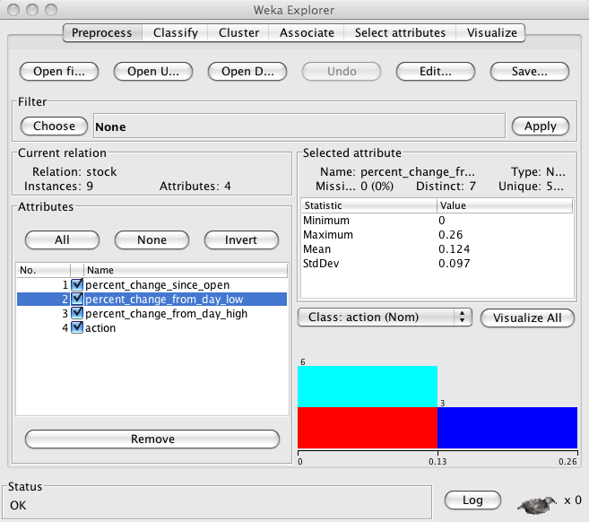
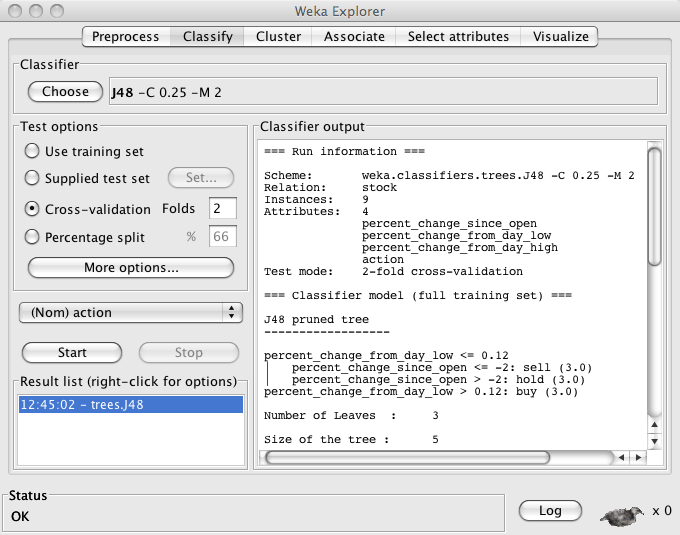

# Machine Learning with Weka {#ml-weka}

Weka is a standard Java tool for performing both machine learning experiments and for embedding trained models in Java applications. I have used Weka since 1999 and it is often my tool of choice on machine
learning projects that are compatible with Weka’s use of the GPL
license. In addition to the material in this chapter you should visit
the primary Weka web site www.cs.waikato.ac.nz/ml/weka for more examples
and tutorials. Good online documentation can also be found at
weka.sourceforge.net/wekadoc. Weka can be run both as a GUI application
and for using a command line interface for running experiments. While
the techniques of machine learning have many practical applications the
example used in this chapter is simple and is mostly intended to show
you the techniques for running Weka and techniques for embedding Weka in
your Java applications. Full documentation of the many machine learning
algorithms is outside the scope of this chapter.

In addition to data cleansing and preprocessing utilities (filters for
data normalization, resampling, transformations, etc.) Weka supports
most machine-learning techniques for automatically calculating
classification systems. I have used the following Weka learning modules
in my own work:

-   Naive Bayes – uses Bayes’s rule for probability of a hypothesis
    given evidence.

-   Instance-based learner – stores all training examples and use.

-   C4.5 – a learning scheme by J Ross Quinlan that calculates decision
    trees from training data. We will use the J48 algorithm in this
    chapter.

Weka can be used for both unsupervised and supervised learning. An
example of unsupervised learning is processing a set of unlabeled data
and automatically clustering the data into smaller sets containing
similar items. We will use supervised learning as the example in this
chapter: data on daily stock prices is labeled as buy, sell, or hold. We
will use the J48 algorithm to automatically build a decision tree for
deciding on how to process a stock, given its cost data. This example is
simplistic and should not be used to actually trade stocks.

It is also possible to induce rules from training data that are
equivalent to decision trees for the same training data. The learned
model uses linear combinations of attribute values for classification.

We are going to use a simple example to learn how to use Weka
interactively and embedded in applications in the next two sections.
Weka uses a data file format call ARFF. The following listing shows the
sample ARFF input file that we will use in the next two sections:

~~~~~~~~
    @relation stock

    @attribute percent_change_since_open real
    @attribute percent_change_from_day_low real
    @attribute percent_change_from_day_high real
    @attribute action {buy, sell, hold}

    @data
    -0.2,0.1,-0.22,hold
    -2.2,0.0,-2.5,sell
    0.2,0.21,-0.01,buy
    -0.22,0.12,-0.25,hold
    -2.0,0.0,-2.1,sell
    0.28,0.26,-0.04,buy
    -0.12,0.08,-0.14,hold
    -2.6,0.1,-2.6,sell
    0.24,0.25,-0.03,buy
~~~~~~~~

Here the concept of a relation is similar to a relation in PowerLoom as
we saw in [Chapter on Reasoning](#reasoning): a relation has a name and a list
of attributes, each with an allowed data type. Here the relation name is
“stock” and we have three attributes that have floating point
(numerical) values and a fourth attribute that has an enumeration of
discrete allowed values. The @data section defines data for initializing
nine stock relations.

Using Weka’s Interactive GUI Application
----------------------------------------

The Weka JAR file is included with the ZIP file for this book. To run
the Weka GUI application, change directory to test\_data and type:

~~~~~~~~
    java -cp ../lib -jar ../lib/weka.jar
~~~~~~~~

{#weka-explorer-1}

Once you have loaded (and possibly browsed) the data as seen in Figure
[fig:weka-explorer-1] you can then select the classifier tab, and
using the “Choose” Classifier option, find J48 under the trees submenu,
and click the “Start” button. The results can be seen in the
[Second Weka Explorer Screenshot](#weka-explorer-2).

{#weka-explorer-2}

The decision tree is displayed in the “Classifier output” window pane.
We will run this same problem from the command line in the next section
and then discuss the generated decision tree seen in the lower right
panel of the GUI display seen in the [Second Weka Explorer Screenshot](#weka-explorer-2).

## Interactive Command Line Use of Weka

We will run the same problem as in the previous section and discuss the
sections of the output report:

~~~~~~~~
    java -cp ../lib/weka.jar \\
         weka.classifiers.trees.J48 -t \\
         stock\_training_data.arff -x 2

    J48 pruned tree
    ------------------

    percent_change_from_day_low <= 0.12
    |  percent_change_since_open <= -2: sell (3.0)
    |  percent_change_since_open > -2: hold (3.0)
    percent_change_from_day_low > 0.12: buy (3.0)

    Number of Leaves  :     3

    Size of the tree :  5
~~~~~~~~

The generated decision tree can be described in English as “If the
percent change of a stock from the day low is less than or equal to 0.12
then if the percent change since the open is less than -2 then sell the
stock, otherwise keep it. If the percent change from the day low is
greater than 0.12 then purchase more shares.”

~~~~~~~~
    Time taken to build model: 0.01 seconds
    Time taken to test model on training data: 0 seconds

    === Error on training data ===

    Correctly Classified Instances    9     100  %
    Incorrectly Classified Instances  0       0  %
    Kappa statistic                   1     
    Mean absolute error               0     
    Root mean squared error           0     
    Relative absolute error           0  %
    Root relative squared error       0  %
    Total Number of Instances         9     
~~~~~~~~

This output shows results for testing on the original training data so
the classification is perfect. In practice, you will test on separate
data sets.

~~~~~~~~
    === Confusion Matrix ===

     a b c   <-- classified as
     3 0 0 | a = buy
     0 3 0 | b = sell
     0 0 3 | c = hold
~~~~~~~~

The confusion matrix shows the prediction (columns) for each data sample
(rows). Here we see the original data (three buy, three sell, and three
hold samples). The following output shows random sampling testing:

~~~~~~~~
    === Stratified cross-validation ===

    Correctly Classified Instances     4       44.4444 %
    Incorrectly Classified Instances   5       55.5556 %
    Kappa statistic                    0.1667
    Mean absolute error                0.3457
    Root mean squared error            0.4513
    Relative absolute error           75.5299 %
    Root relative squared error       92.2222 %
    Total Number of Instances          9     
~~~~~~~~

With random sampling, we see in the confusion matrix that the three buy
recommendations are still perfect, but that both of the sell
recommendations are wrong (with one buy and two holds) and that two of
what should have been hold recommendations are buy recommendations.

~~~~~~~~
    === Confusion Matrix ===

     a b c   <-- classified as
     3 0 0 | a = buy
     1 0 2 | b = sell
     2 0 1 | c = hold
~~~~~~~~

## Embedding Weka in a Java Application

The example in this section is partially derived from documentation at
the web site http://weka.sourceforge.net/wiki. This example loads the
training ARFF data file seen at the beginning of this chapter and loads
a similar ARFF file for testing that is equivalent to the original
training file except that small random changes have been made to the
numeric attribute values in all samples. A decision tree model is
trained and tested on the new test ARFF data.

~~~~~~~~
    import weka.classifiers.meta.FilteredClassifier;
    import weka.classifiers.trees.J48;
    import weka.core.Instances;
    import weka.filters.unsupervised.attribute.Remove;

    import java.io.BufferedReader;
    import java.io.FileNotFoundException;
    import java.io.FileReader;
    import java.io.IOException;

    public class WekaStocks {

      public static void main(String[] args) throws Exception {
~~~~~~~~

We start by creating a new training instance by supplying a reader for
the stock training ARFF file and setting the number of attributes to
use:

~~~~~~~~
        Instances training_data = new Instances(
          new BufferedReader(
            new FileReader(
              "test_data/stock_training_data.arff")));
        training_data.setClassIndex(
          training_data.numAttributes() - 1);
~~~~~~~~

We want to test with separate data so we open a separate examples ARFF
file to test against:

~~~~~~~~
        Instances testing_data = new Instances(
          new BufferedReader(
            new FileReader(
              "test_data/stock_testing_data.arff")));
        testing_data.setClassIndex(
          training_data.numAttributes() - 1);
~~~~~~~~

The method **toSummaryString** prints a summary of a set of training or
testing instances.

~~~~~~~~
        String summary = training_data.toSummaryString();
        int number_samples = training_data.numInstances();
        int number_attributes_per_sample =
          training_data.numAttributes();
        System.out.println(
          "Number of attributes in model = " +
          number_attributes_per_sample);
        System.out.println(
          "Number of samples = " + number_samples);
        System.out.println("Summary: " + summary);
        System.out.println();
~~~~~~~~

Now we create a new classifier (a J48 classifier in this case) and we
see how to optionally filter (remove) samples. We build a classifier
using the training data and then test it using the separate test data
set:

~~~~~~~~
        // a classifier for decision trees:
        J48 j48 = new J48();
            
        // filter for removing samples:
        Remove rm = new Remove();
        // remove first attribute
        rm.setAttributeIndices("1"); 

        // filtered classifier
        FilteredClassifier fc = new FilteredClassifier();
        fc.setFilter(rm);
        fc.setClassifier(j48);
        // train using stock_training_data.arff:
        fc.buildClassifier(training_data);
        // test using stock_testing_data.arff:
        for (int i = 0;
             i < testing_data.numInstances(); i++) {
          double pred =
                 fc.classifyInstance(testing_data.
                                     instance(i));
          System.out.print("given value: " +
            testing_data.classAttribute().
              value((int)testing_data.instance(i).
                         classValue()));
          System.out.println(". predicted value: " + 
           testing_data.classAttribute().value((int)pred));
        }
      }
    }
~~~~~~~~

This example program produces the following output (some output not
shown due to page width limits):

~~~~~~~~
    Number of attributes in model = 4
    Number of samples = 9
    Summary: Relation Name:  stock
    Num Instances:  9
    Num Attributes: 4

         Name                      Type  Nom  Int Real  ...
       1 percent_change_since_open  Num   0%  11%  89%  ... 
       2 percent_change_from_day_l  Num   0%  22%  78%  ... 
       3 percent_change_from_day_h  Num   0%   0% 100%  ... 
       4 action                     Nom 100%   0%   0%  ... 

    given value: hold. predicted value: hold
    given value: sell. predicted value: sell
    given value: buy. predicted value: buy
    given value: hold. predicted value: buy
    given value: sell. predicted value: sell
    given value: buy. predicted value: buy
    given value: hold. predicted value: hold
    given value: sell. predicted value: buy
    given value: buy. predicted value: buy
~~~~~~~~

## Suggestions for Further Study

Weka is well documented in the book *Data Mining: Practical Machine
Learning Tools and Techniques, Second Edition* [Ian H. Witten (Author),
Eibe Frank. 2005]. Additional documentation can be found at
weka.sourceforge.net/wiki/index.php.
