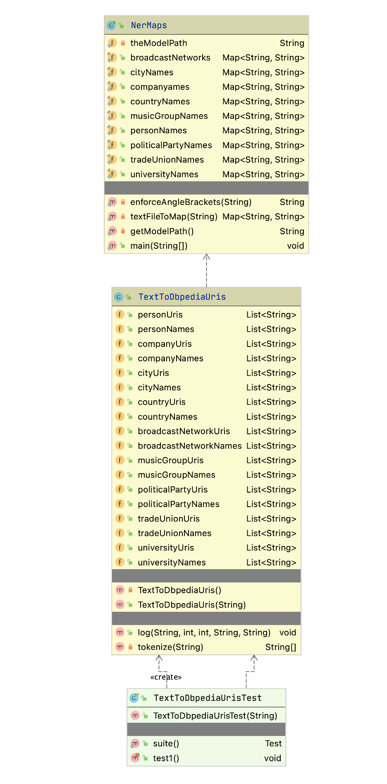
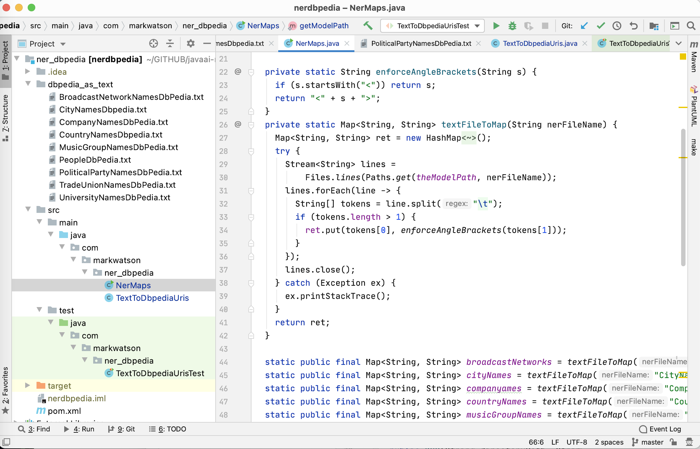

# Resolve Entity Names to DBPedia References {#ner}

As a personal research project I have collected a large data set that maps entity names (e.g., people's names, city names, names of music groups, company names, etc.) to the DBPedia URI for each entity. I have developed libraries to use this data in [Common Lisp](https://leanpub.com/lovinglisp), [Haskell](https://leanpub.com/haskell-cookbook), and Java. Here we use the Java version of this library.

The Java library is found in the directory **ner_dbpedia** in the GitHub repository. The raw data for these entity to URI mappings are found in the directory **ner_dbpedia/dbpedia_as_text**.

This example shows the use of a standard Java and Maven packaging technique: building a JAR file that contains resource files in addition to compiled Java code. The example code reads the required data resources from the JAR file (or the temporary **target** directory during development). This makes the JAR file self contained when we use this example library in later chapters.

## DBPedia Entities

DBPedia is the structured RDF database that is automatically created from WikiPedia info boxes. We will go into some detail on RDF data in the later chapter [Semantic Web](#semantic-web). The raw data for these entity to URI mappings is found in the directory **ner_dbpedia/dbpedia_as_text** files have the format (for people in this case):

{linenos=off}
~~~~~~~~
Al Stewart      <http://dbpedia.org/resource/Al_Stewart>
Alan Watts      <http://dbpedia.org/resource/Alan_Watts>
~~~~~~~~

If you visit any or these URIs using a web browser, for example [http://dbpedia.org/page/Al_Stewart](http://dbpedia.org/page/Al_Stewart) you will see the DBPedia data for the entity formatted for human reading but to be clear the primary purpose of information in DBPedia is for use by software, not humans.

There are 58953 entities defined with their DBPedia URI and the following listing shows the breakdown of number of entities by entity type by counting the number of lines in each resource file:

{linenos=off}
~~~~~~~~
ner_dbpedia: $ wc -l ./src/main/resources/*.txt
     108 ./src/main/resources/BroadcastNetworkNamesDbPedia.txt
    2580 ./src/main/resources/CityNamesDbpedia.txt
    1786 ./src/main/resources/CompanyNamesDbPedia.txt
     167 ./src/main/resources/CountryNamesDbpedia.txt
   14315 ./src/main/resources/MusicGroupNamesDbPedia.txt
   35606 ./src/main/resources/PeopleDbPedia.txt
     555 ./src/main/resources/PoliticalPartyNamesDbPedia.txt
     351 ./src/main/resources/TradeUnionNamesDbPedia.txt
    3485 ./src/main/resources/UniversityNamesDbPedia.txt
   58953 total
~~~~~~~~

The URI for each entity defines a unique identifier for real world entities as well as concepts. 

{width: "80%"}

## Library Implementation

The following UML class diagram shows the APIs and fields for the two classes in the package **com.markwatson.ner_dbpedia** for this example: **NerMaps** and **TextToDbpediaUris**:

{width: "80%"}

As you see in the following figure showing the IntelliJ Community Edition project for this example, there are nine text files, one for each entity type in the directory **src/main/resources**. Later we will look at the code required to read these files in two cases:

- During development these files are read from **target/classes**.
- During client application use of the JAR file (created using *mvn install*) these files are read as resources from the Java class loader.

{width: "80%"}

The class **com.markwatson.ner_dbpedia.NerMaps** is a utility for reading the raw entity mapping data files and creating hash tables for these mappings:

{lang="java",linenos=off}
~~~~~~~~
package com.markwatson.ner_dbpedia;

import java.io.BufferedReader;
import java.io.IOException;
import java.io.InputStream;
import java.io.InputStreamReader;
import java.io.UncheckedIOException;
import java.nio.charset.StandardCharsets;
import java.util.HashMap;
import java.util.Map;

/**
 * Copyright Mark Watson 2020. Apache 2 license,
 */
public class NerMaps {

  private static String enforceAngleBrackets(String s) {
    if (s.startsWith("<")) return s;
    return "<" + s + ">";
  }

  private static Map<String, String> textFileToMap(String nerFileName) {
    var ret = new HashMap<String, String>();
    try (InputStream in = ClassLoader.getSystemResourceAsStream(nerFileName);
         BufferedReader reader = new BufferedReader(
             new InputStreamReader(in, StandardCharsets.UTF_8))) {
      reader.lines().forEach(line -> {
        String[] tokens = line.split("\t");
        if (tokens.length > 1) {
          ret.put(tokens[0], enforceAngleBrackets(tokens[1]));
        }
      });
    } catch (IOException ex) {
      throw new UncheckedIOException(
          "Failed to load NER resource file: " + nerFileName, ex);
    }
    return Map.copyOf(ret);
  }

  static public final Map<String, String> broadcastNetworks = textFileToMap("BroadcastNetworkNamesDbPedia.txt");
  static public final Map<String, String> cityNames = textFileToMap("CityNamesDbpedia.txt");
  static public final Map<String, String> companyNames = textFileToMap("CompanyNamesDbPedia.txt");
  static public final Map<String, String> countryNames = textFileToMap("CountryNamesDbpedia.txt");
  static public final Map<String, String> musicGroupNames = textFileToMap("MusicGroupNamesDbPedia.txt");
  static public final Map<String, String> personNames = textFileToMap("PeopleDbPedia.txt");
  static public final Map<String, String> politicalPartyNames = textFileToMap("PoliticalPartyNamesDbPedia.txt");
  static public final Map<String, String> tradeUnionNames = textFileToMap("TradeUnionNamesDbPedia.txt");
  static public final Map<String, String> universityNames = textFileToMap("UniversityNamesDbPedia.txt");

  /**
   * Keep legacy field name as an alias so downstream code that references
   * {@code NerMaps.companyames} (the original typo) still compiles.
   */
  @Deprecated(forRemoval = true)
  static public final Map<String, String> companyames = companyNames;

  public static void main(String[] args) {
    System.out.println(
        textFileToMap("CityNamesDbpedia.txt"));
  }
}
~~~~~~~~

The class **com.markwatson.ner_dbpedia.TextToDbpediaUris** processes an input string and uses public fields to output found entity names and matching DBPedia URIs. We will use this code later in the chapter *Automatically Generating Data for Knowledge Graphs*.

The code in the class **TextToDbpediaUris** is simple and repeats two common patterns for each entity type. We will look at some of the code here.

{lang="java",linenos=off}
~~~~~~~~
package com.markwatson.ner_dbpedia;

import java.util.ArrayList;
import java.util.LinkedHashSet;
import java.util.List;
import java.util.Map;
import java.util.Set;
import java.util.regex.Pattern;

public class TextToDbpediaUris {

  /**
   * Represents a named-entity category with its lookup map and matched results.
   */
  private record EntityCategory(String name, Map<String, String> lookupMap,
                                Set<String> uriSet, List<String> uris, List<String> names) {
    void addIfAbsent(String uri, String ngram) {
      if (uriSet.add(uri)) {
        uris.add(uri);
        names.add(ngram);
      }
    }
  }

  // Precompiled patterns for tokenization
  private static final Pattern DOT   = Pattern.compile("\\.");
  private static final Pattern COMMA = Pattern.compile(",");
  private static final Pattern QMARK = Pattern.compile("\\?");
  private static final Pattern SEMI  = Pattern.compile(";");
  private static final Pattern NL    = Pattern.compile("\n");
  private static final Pattern MULTI_SPACE = Pattern.compile(" +");

  // Entity categories — order matters for priority
  private final List<EntityCategory> categories;

  // Public accessors preserving the original API
  public final List<String> personUris;
  public final List<String> personNames;
  public final List<String> companyUris;
  public final List<String> companyNames;
  public final List<String> cityUris;
  public final List<String> cityNames;
  public final List<String> countryUris;
  public final List<String> countryNames;
  public final List<String> broadcastNetworkUris;
  public final List<String> broadcastNetworkNames;
  public final List<String> musicGroupUris;
  public final List<String> musicGroupNames;
  public final List<String> politicalPartyUris;
  public final List<String> politicalPartyNames;
  public final List<String> tradeUnionUris;
  public final List<String> tradeUnionNames;
  public final List<String> universityUris;
  public final List<String> universityNames;

  @SuppressWarnings("unused")
  private TextToDbpediaUris() {
    this("");
  }

  public TextToDbpediaUris(String text) {
    // Initialize entity categories with their lookup maps
    var person           = makeCat("person",           NerMaps.personNames);
    var city             = makeCat("city",             NerMaps.cityNames);
    var company          = makeCat("company",          NerMaps.companyNames);
    var country          = makeCat("country",          NerMaps.countryNames);
    var broadcastNetwork = makeCat("broadcastNetwork", NerMaps.broadcastNetworks);
    var musicGroup       = makeCat("musicGroup",       NerMaps.musicGroupNames);
    var politicalParty   = makeCat("politicalParty",   NerMaps.politicalPartyNames);
    var tradeUnion       = makeCat("tradeUnion",       NerMaps.tradeUnionNames);
    var university       = makeCat("university",       NerMaps.universityNames);

    categories = List.of(person, city, company, country,
        broadcastNetwork, musicGroup, politicalParty, tradeUnion, university);

    // Wire public fields to category lists for backward compatibility
    personUris              = person.uris();
    personNames             = person.names();
    companyUris             = company.uris();
    companyNames            = company.names();
    cityUris                = city.uris();
    cityNames               = city.names();
    countryUris             = country.uris();
    countryNames            = country.names();
    broadcastNetworkUris    = broadcastNetwork.uris();
    broadcastNetworkNames   = broadcastNetwork.names();
    musicGroupUris          = musicGroup.uris();
    musicGroupNames         = musicGroup.names();
    politicalPartyUris      = politicalParty.uris();
    politicalPartyNames     = politicalParty.names();
    tradeUnionUris          = tradeUnion.uris();
    tradeUnionNames         = tradeUnion.names();
    universityUris          = university.uris();
    universityNames         = university.names();

    processText(text);
  }

  private static EntityCategory makeCat(String name, Map<String, String> lookupMap) {
    return new EntityCategory(name, lookupMap,
        new LinkedHashSet<>(), new ArrayList<>(), new ArrayList<>());
  }

  private void processText(String text) {
    String[] tokens = tokenize(text + " . . .");
    for (int i = 0, size = tokens.length - 2; i < size; i++) {
      String n3gram = tokens[i] + " " + tokens[i + 1] + " " + tokens[i + 2];
      String n2gram = tokens[i] + " " + tokens[i + 1];

      // Check 3-grams first (longest match wins)
      int skip = tryMatch(n3gram, 3, i);
      if (skip > 0) { i += skip - 1; continue; }

      // Check 2-grams
      skip = tryMatch(n2gram, 2, i);
      if (skip > 0) { i += skip - 1; continue; }

      // Check 1-grams
      tryMatch(tokens[i], 1, i);
    }
  }

  /**
   * Try to match an n-gram against all entity categories.
   * @return the number of extra tokens to skip (n-1), or 0 if no match.
   */
  private int tryMatch(String ngram, int n, int startIndex) {
    for (var cat : categories) {
      String uri = cat.lookupMap().get(ngram);
      if (uri != null) {
        if (!uri.startsWith("<")) uri = "<" + uri + ">";
        System.out.println(cat.name() + "\t" + startIndex + "\t" + (startIndex + n - 1) + "\t" + ngram + "\t" + uri);
        cat.addIfAbsent(uri, ngram);
        return n;
      }
    }
    return 0;
  }

  private String[] tokenize(String s) {
    String result = DOT.matcher(s).replaceAll(" . ");
    result = COMMA.matcher(result).replaceAll(" , ");
    result = QMARK.matcher(result).replaceAll(" ? ");
    result = NL.matcher(result).replaceAll(" ");
    result = SEMI.matcher(result).replaceAll(" ; ");
    return MULTI_SPACE.matcher(result).replaceAll(" ").split(" ");
  }

  @Override
  public String toString() {
    var sb = new StringBuilder("TextToDbpediaUris {\n");
    for (var cat : categories) {
      if (!cat.names().isEmpty()) {
        sb.append("  ").append(cat.name()).append(": ")
            .append(cat.names()).append(" -> ").append(cat.uris())
            .append('\n');
      }
    }
    sb.append('}');
    return sb.toString();
  }
}
~~~~~~~~

The empty constructor is private since it makes no sense to create an instance of **TextToDbpediaUris** without text input. The code supports nine entity types. Here we show the definition of public output fields for just two entity types (people and companies).

As a matter of programming style I generally no longer use getter and setter methods, preferring a more concise coding style. I usually make output fields package default visibility (i.e., no **private** or **public** specification so the fields are public within a package and private from other packages). Here I make them public because the package **nerdbpedia** developed here is meant to be used by other packages. If you prefer using getter and setter methods, modern IDEs like IntelliJ and Eclipse can generate those for you for the example code in this book.We will handle entity names comprised of one, two, and three word sequences (n-grams). We check for longer word sequences before shorter sequences (longest-match-first priority) across all categories:

{lang="java",linenos=off}
~~~~~~~~
  private void processText(String text) {
    String[] tokens = tokenize(text + " . . .");
    for (int i = 0, size = tokens.length - 2; i < size; i++) {
      String n3gram = tokens[i] + " " + tokens[i + 1] + " " + tokens[i + 2];
      String n2gram = tokens[i] + " " + tokens[i + 1];

      // Check 3-grams first (longest match wins)
      int skip = tryMatch(n3gram, 3, i);
      if (skip > 0) { i += skip - 1; continue; }

      // Check 2-grams
      skip = tryMatch(n2gram, 2, i);
      if (skip > 0) { i += skip - 1; continue; }

      // Check 1-grams
      tryMatch(tokens[i], 1, i);
    }
  }
 ~~~~~~~~

To clean up the code and avoid repeating lookup logic for each of the nine entity categories, we use a helper method `tryMatch` that iterates through all registered `EntityCategory` instances and records matching entities:

{lang="java",linenos=off}
~~~~~~~~
  private int tryMatch(String ngram, int n, int startIndex) {
    for (var cat : categories) {
      String uri = cat.lookupMap().get(ngram);
      if (uri != null) {
        if (!uri.startsWith("<")) uri = "<" + uri + ">";
        System.out.println(cat.name() + "\t" + startIndex + "\t" + (startIndex + n - 1) + "\t" + ngram + "\t" + uri);
        cat.addIfAbsent(uri, ngram);
        return n;
      }
    }
    return 0;
  }
 ~~~~~~~~

For tokenization, we use precompiled regular expression `Pattern` instances (like `DOT`, `COMMA`, `QMARK`, `SEMI`, and `NL`) for performance efficiency:

{lang="java",linenos=off}
~~~~~~~~
  // Precompiled patterns for tokenization
  private static final Pattern DOT   = Pattern.compile("\\.");
  private static final Pattern COMMA = Pattern.compile(",");
  private static final Pattern QMARK = Pattern.compile("\\?");
  private static final Pattern SEMI  = Pattern.compile(";");
  private static final Pattern NL    = Pattern.compile("\n");
  private static final Pattern MULTI_SPACE = Pattern.compile(" +");

  private String[] tokenize(String s) {
    String result = DOT.matcher(s).replaceAll(" . ");
    result = COMMA.matcher(result).replaceAll(" , ");
    result = QMARK.matcher(result).replaceAll(" ? ");
    result = NL.matcher(result).replaceAll(" ");
    result = SEMI.matcher(result).replaceAll(" ; ");
    return MULTI_SPACE.matcher(result).replaceAll(" ").split(" ");
  }
 ~~~~~~~~

The following listing shows the code snippet from the unit test code in the class **TextToDbpediaUrisTest** that calls the **TextToDbpediaUris** constructor with a text sample (**junit** boilerplate code is not shown):

{lang="java",linenos=on}
  @Test
  @DisplayName("Recognises known entities in a sentence")
  void recognisesKnownEntities() {
    String s = "PTL Satellite Network covered President Bill Clinton going to Guatemala and visiting the Coca Cola Company.";
    TextToDbpediaUris result = new TextToDbpediaUris(s);
    System.out.println(result);
  }
~~~~~~~~

The object **result** contains public fields for accessing the entity names and corresponding URIs. We will use these fields in the later chapters [Automatically Generating Data for Knowledge Graphs](#kgcreator) and [Knowledge Graph Navigator](#kgn).

Here is the output from running the unit test code:

{linenos=off}
~~~~~~~~
broadcastNetwork 0 2 PTL Satellite Network <http://dbpedia.org/resource/PTL_Satellite_Network>
person	 5	 6	 Bill Clinton	<http://dbpedia.org/resource/Bill_Clinton>
country	 9 10  Guatemala	 <http://dbpedia.org/resource/Guatemala>
company	13	 14  Coca Cola	<http://dbpedia.org/resource/Coca-Cola>
~~~~~~~~

## Wrap-up for Resolving Entity Names to DBPedia References

The idea behind this example is simple but useful for information processing applications using raw text input. We will use this library later in two semantic web examples.
