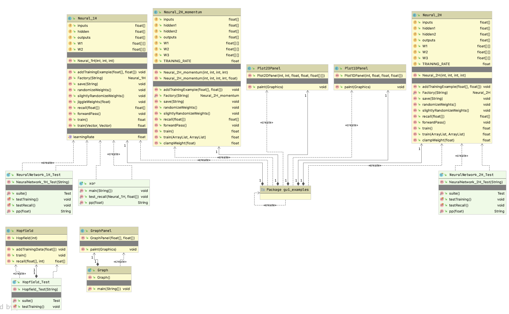
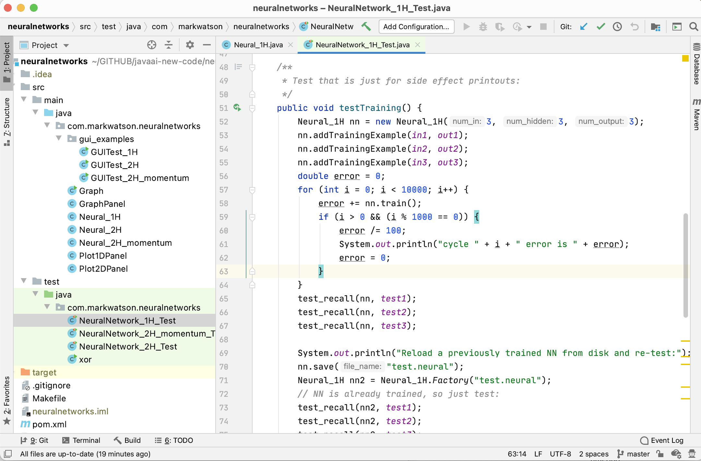

# Neural Networks {#neural-networks}

In a sense training neural networks is a search problem. Given training data and using gradient descent we search for a set of parameters (the weights in a neural network) that model the training data. A dataset is defined by the features in the dataset and the data samples. If we consider our search space to have a number of dimensions equal to the number of features then we can at least imagine that the training samples are an extremely sparse scattering of points in this high-dimensional space. These training data are a distribution of the possible points in this space. Since input features are often correlated we would not expect an even distribution of samples over this space. We refer to the training samples as being "in distribution" and new data that we later process with our trained model to be "out of distribution." New "out of distribution" data may sometimes represent areas of the space with no training examples nearby and we would expect our model to sometimes perform poorly on this data.

Neural networks can be used to efficiently solve many problems that are intractable or difficult using other AI programming techniques. In the late 1980s I spent almost two years on a DARPA neural network tools advisory panel, wrote the ANSim neural network product, and have used neural networks for a wide range of application problems (radar interpretation, bomb detection, and as controllers in computer games). Mastering the use of neural networks will allow you to solve many types of problems that are very difficult to solve using other methods.

Gradient descent is a general term for moving in a direction in a space that is "down hill" towards a local minimum. Here I write an implementation for a backpropagation neural network from scratch (pure Java code, no libraries). The material in this chapter is meant to provide you with an intuition of how backpropagation works while the next chapter covers a robust deep learning library that you should use in for modeling large datasets. Backpropagation is a type of gradient descent that works by changing weight values (the parameters in a neural network model) in the direction of reducing the error between what our model predicts for a set of input values and what the target output is in training data.

In the next chapter [Deep Learning Using Deeplearning4j](#dl4j) we will use a popular Java deep learning library that can efficiently process neural networks with more complex architectures and larger numbers of simulated neurons. These  "Deep Learning" neural networks use computational tricks to efficiently train more complex Backpropagation networks.

Although most of this book is intended to provide practical advice (with some theoretical background) on using AI programming techniques, I cannot imagine being interested in practical AI programming without also thinking about the philosophy and mechanics of how the human mind works. I hope that my readers share this interest.

The physical structure and dynamics of the human brain are inherently parallel and distributed [*Parallel Distributed Processing: Explorations in the
Microstructure of Cognition*, Rumelhart, McClelland, etc. 1986]. We are experts at doing many things at once. For example, I simultaneously can walk, talk with my wife, keep our puppy out of cactus, and enjoy the scenery behind our house in Sedona, Arizona. AI software systems struggle to perform even narrowly defined tasks well, so how is it that we are able to simultaneously perform several complex tasks? There is no clear or certain answer to this question at this time, but certainly the distributed neural architecture of our brains is a requirement for our abilities. Classical artificial neural network simulations (like the ones we study in this chapter) do not address “multi-tasking” (other techniques that do address this issue are multi-agent systems with some form or mediation between agents). Deep learning models can have multiple types of inputs, different types of outputs, and complex internal structure - basically connected models that are trained jointly. While deep learning models trained jointly on different types of input data break through the limitations of simple backpropagation models, the simple backpropagation models we look at now are still very practical today for a range of problems.

Also interesting is the distinction between instinctual behavior and learned behavior. Our knowledge of GAs from the chapter on [Genetic Algorithms](#ga) provides a clue to how the brains of lower order animals can be hardwired to provide efficient instinctual behavior under the pressures of evolutionary forces (i.e., likely survival of more fit individuals). This works by using genetic algorithms to design specific neural wiring. I have used genetic algorithms to evolve recurrent neural networks for control applications (I wrote about this in *C++ Power Paradigms*, 1995, McGraw-Hill). This work had only partial success but did convince me that biological genetic pressure is probably adequate to “pre-wire” some forms of behavior in natural (biological) neural networks.

While we will study supervised learning techniques in this chapter, it is possible to evolve both structure and attributes of neural networks using other types of neural network models like Adaptive Resonance Theory (ART) to autonomously learn to classify learning examples without
intervention.

We will start this chapter by discussing human neuron cells and which features of real neurons that we will model. Unfortunately, we do not yet understand all of the biochemical processes that occur in neurons, but there are fairly accurate models available (web search “neuron biochemical”). Neurons are surrounded by thin hair-like structures called dendrites which serve to accept activation from other neurons. Neurons sum up activation from their dendrites and each neuron has a threshold value; if the activation summed over all incoming dendrites exceeds this threshold, then the neuron fires, spreading its activation to other neurons. Dendrites are very localized around a neuron. Output from a neuron is carried by an axon, which is thicker than dendrites and potentially much longer than dendrites in order to affect remote neurons. The following figure shows the physical structure of a neuron; in general, the neuron’s axon would be much longer than is seen in this figure. The axon terminal buttons transfer activation to the dendrites of neurons that are close to the individual button. An individual neuron is connected to up to ten thousand other neurons in this way.

{#nn-neuron}

The activation absorbed through dendrites is summed together, but the firing of a neuron only occurs when a threshold is passed. In neural network simulations there are several common ways to model neurons and connections between neurons that we will see in both this and the next chapter.

## Road Map for the Neural Network Example Code

The following UML class diagram will give you an overview all of the neural network library classes in this chapter before we dive into the code:

There are three parts to the code base: main backpropagation library, GUI examples, and text-only tests. The following screen show of the project open in an IDE is useful to see the file layout for the project:

## Backpropagation Neural Networks  {#backprop}

The neural network model that we use is called backpropagation, also known as back-prop or delta rule learning. In this model, neurons are organized into data structures that we call layers. The figure [Backpropagation network with No Hidden Layer](#nn-backprop-no-hidden) shows a simple neural network with two layers; this network is shown in two different views: just the neurons organized as two one-dimensional arrays, and as two one-dimensional arrays with the connections between the neurons. In our model, there is a connection between two neurons that is characterized by a single floating-point number that we will call the connection’s weight. A
weight **W_{i,j}** connects input neuron **i** to output neuron **j**. In the back propagation model, we always assume that a neuron is connected to every neuron in the previous layer.

A key feature of back-prop neural networks is that they can be efficiently trained. Training is performed by calculating sets of weights for connecting each layer. As we will see, we will train networks by applying input values to the input layer, allowing these values to propagate through the network using the current weight values, and calculating the errors between desired output values and the output values from propagation of input values through the network.

The errors at the output layer are used to calculate gradients (or corrections) to the weights feeding into the output layer. Gradients are back propagated through the network allowing all weights in the network to be updated to reduce errors visible at the output layer.

One limitation of early back propagation neural networks is that they are limited to the number of neuron layers that can be efficiently trained. More recent advances in deep learning have mostly solved this problem: as error gradients are back propagated through the network toward the input layer, the gradients get smaller and smaller. If these gradients *vanish* because they can't be represented as a floating point number then weight updates will be zero and the model is not trained. Another effect of many hidden layers is that it can take a lot of time to train back propagation networks. This problem has also mostly been solved with modern deep learning libraries as seen in the next chapter **Deep Learning**.

Initially, weights are set to small random values. You will get a general idea for how this is done in this section and then we will look at Java implementation code in the section for a [Java Class Library for Backpropagation](#nn-bp-lib).

In the figure showing a [Backpropagation network with No Hidden Layer](#nn-backprop-no-hidden), we have only two neuron layers, one for the input neurons and one for the output neurons. Networks with no hidden layers are not generally useful - I am using the network in  the figure showing a [Backpropagation network with No Hidden Layer](#nn-backprop-no-hidden) just to demonstrate layer to layer connections through a weights array.

{#nn-backprop-no-hidden}

To calculate the activation of the first output neuron **O1**, we evaluate the sum of the products of the input neurons times the appropriate weight values; this sum is input to a **Sigmoid** activation function (see the figure showing the [Sigmoid Function](#nn-sigmoid)) and the result is the new activation value for **O1**. Here is the formula for the simple network in the figure showing a [Backpropagation network with No Hidden Layer](#nn-backprop-no-hidden):

{lang="java",linenos=off}
~~~~~~~~
O1 = Sigmoid (I1 * W[1,1] + I2 * W[2,1])
O2 = Sigmoid (I2 * W[1,2] + I2 * W[2,2])
~~~~~~~~

The figure showing the [Sigmoid Function](#nn-sigmoid) shows a plot of the **Sigmoid** function and the derivative of the sigmoid function (**SigmoidP**). We will use the derivative of the **Sigmoid** function when training a neural network (with at least one hidden neuron layer) with classified data examples.

{#nn-sigmoid}

A neural network like the one seen in the figure showing a [Backpropagation network with No Hidden Layer](#nn-backprop-no-hidden) is trained by using a set of training data. For back propagation networks, training data consists of matched sets of input with matching desired output values. We want to train a network to not only produce similar outputs for training data inputs as appear in the training data, but also to generalize its pattern matching ability based on the training data to be able to match test patterns that are similar to training input patterns. A key here is to balance the size of the network against how much information it must hold. A common mistake when using back-prop networks is to use too large a network: a network that contains too many neurons and connections will simply memorize the training examples, including any noise in the training data. However, if we use a smaller number of neurons with a very large number of training data examples, then we force the network to generalize, ignoring noise in the training
data and learning to recognize important traits in input data while ignoring statistical noise.

How do we train a back propagation neural network given that we have a good training data set? The algorithm is quite easy; we will now walk through the simple case of a two-layer network like the one in the figure showing a [Backpropagation network with No Hidden Layer](#nn-backprop-no-hidden). Later in the section for a [Java Class Library for Back Propagation](#nn-bp-lib) we will review the algorithm in more detail when we have either one or two hidden neuron layers between the input and output layers.

In order to train the network in the figure for a [Backpropagation network with No Hidden Layer](#nn-backprop-no-hidden), we repeat the following learning cycle several times:

1.  Zero out temporary arrays for holding the error at each neuron. The
    error, starting at the output layer, is the difference between the
    output value for a specific output layer neuron and the calculated
    value from setting the input layer neuron’s activation values to the
    input values in the current training example, and letting activation
    spread through the network.
2.  Update the weight **W\_{i,j}** (where **i** is the index of an input
    neuron, and **j** is the index of an output neuron) using the formula
    **W\_{i,j} += learning\_rate * output\_error_j*I_i** (**learning\_rate**
    is a tunable parameter) and **output\_error\_j** was calculated in step
    1, and **I\_i** is the activation of input neuron at index **i**.

This process is continued to either a maximum number of learning cycles or until the calculated output errors get very small. We will see later that the algorithm is similar but slightly more complicated when we have hidden neuron layers; the difference is that we will “back propagate” output errors to the hidden layers in order to estimate errors for hidden neurons. We will cover more on this later. This type of neural network is too simple to solve very many interesting problems, and in practical applications we almost always use either one additional hidden neuron layer or two additional hidden neuron layers. The figure showing [mappings supported by zero hidden layer, one hidden layer, and two hidden hidden layer networks](#nn-mapping) shows the types of problems that can be solved by networks with different numbers of hidden layers.

{#nn-mapping}

## A Java Class Library for Back Propagation {#nn-bp-lib}

The back propagation neural network library used in this chapter was written to be easily understood and is useful for many problems. However, one thing that is not in the implementation in this section (it is added in the section [Using Momentum to speed up training](#nn-bprop-momentum)) is something usually called “momentum” to speed up the training process at a cost of doubling the storage requirements for weights. Adding a “momentum” term not only makes learning faster but also increases the chances of successfully learning more difficult problems.

We will concentrate in this section on implementing a back-prop learning algorithm that works for both one and two hidden layer networks. As we saw in the [Figure
showing mappings supported by zero hidden layer, one hidden layer, and two hidden layer networks](#nn-mapping), a network with two hidden layers is capable of arbitrary mappings of input to output values. It used to be a common (and incorrect) opinion that there was no theoretical reason for using networks with three hidden layers. With recent projects using Deep Learning as I mentioned at the beginning of this chapter, neural networks with many hidden layers are now common practice. Here is one of the example programs that helps visualize a 1\one hidden layer network:

{#example-1-hidden-layer-1}

With each layer having three neurons, the weight matrices are **3 x 3** arrays and are easy to display. When you run the examples you can see the weight matches changing in time. Here is another example program that adds an additional hidden layer:

{#example-2-hidden-layer1-1}

Please note, dear reader, that simple networks like these examples are *explainable* in the sense that you can understand how they work after they are trained because they have so few parameters. We can characterize the complexity of models as the number of layers and the total number of connection weights. We might say that the one hidden layer model has 9 parameters and the two hidden layer model has 18 parameters (i.e., the total number of weights that we must learn effective values for). In general large neural models, especially deep learning models, are *not explainable*. There are some applications that are required by law to be explainable for which neural networks are not appropriate to use. Another issue is fairness of models if they are trained on biased data.

The relevant files for the back propagation examples are:

-   Neural\_1H.java - contains a class for simulating a neural network with one hidden neuron layer
-   Test\_1H.java - a text-based test program for the class Neural\_1H
-   GUITest\_1H.java - a GUI-based test program for the class Neural\_1H
-   Neural\_2H.java - contains a class for simulating a neural network with two hidden neuron layers
-   Neural\_2H\_momentum.java - contains a class for simulating a neural network with two hidden neuron layers and implements momentum learning (implemented in the section [Using Momentum to speed up training](#nn-bprop-momentum)
-   Test\_2H.java - a text-based test program for the class Neural\_2H
-   GUITest\_2H.java - a GUI-based test program for the class Neural\_2H
-   GUITest\_2H\_momentum.java - a GUI-based test program for the class Neural\_2H\_momentum that uses momentum learning (implemented in the section [Using Momentum to speed up training](#nn-bprop-momentum)
-   Plot1DPanel - a Java JFC graphics panel for the values of a one-dimensional array of floating point values
-   Plot2DPanel - a Java JFC graphics panel for the values of a two-dimensional array of floating point values

The GUI files are for demonstration purposes only, and we will not discuss the code for these classes; if you are interested in the demo graphics code and do not know JFC Java programming, there are a few good JFC tutorials at the web.

It is common to implement back-prop libraries to handle either zero, one, or two hidden layers in the same code base. At the risk of having to repeat similar code in two different classes, I decided to make the **Neural\_1H** and **Neural\_2H** classes distinct. I think that this makes the code a little easier to understand. As a practical point, you will almost always start solving a neural network problem using only one hidden layer and only progress to trying two hidden layers if you can't train a one hidden layer network to solve the problem at-hand with sufficiently small error when tested with data that is different from the original training data. Networks with only one hidden layer require less storage space and run faster in simulation than two hidden layer networks.

In this section we will look only at the implementation of the class **Neural\_2H** (class **Neural\_1H** is simpler and when you understand how **Neural\_2H** works, the simpler class is also easy to understand). This class implements the **Serializable** interface and contains a utility method **save** to write a trained network to a disk file:

{lang="java",linenos=off}
~~~~~~~~
     class Neural_2H implements Serializable { 
~~~~~~~~

There is a static factory method that reads a saved network file from disk and builds an instance of **Neural\_2H** and there is a class constructor that builds a new untrained network in memory, given the number of neurons in each layer:

{lang="java",linenos=off}
~~~~~~~~
     public static Neural_2H Factory(String serialized_file_name)
     public Neural_2H(int num_in,
                      int num_hidden1,
                      int num_hidden2, int num_output) 
~~~~~~~~

An instance of **Neural\_2H** contains training data as transient data that is not saved by method **save**.

{lang="java",linenos=off}
~~~~~~~~
     transient protected ArrayList inputTraining = new Vector();
     transient protected ArrayList outputTraining = new Vector(); 
~~~~~~~~

I want the training examples to be native float arrays so I used generic **ArrayList** containers. You will usually need to experiment with training parameters in order to solve difficult problems. The learning rate not only controls how large the weight corrections we make each
learning cycle but this parameter also affects whether we can break out of local minimum. Other parameters that affect learning are the ranges of initial random weight values that are hardwired in the method **randomizeWeights()** and the small random values that we add to weights during the training cycles; these values are set in in **slightlyRandomizeWeights()**. I usually only need to adjust the learning rate when training back-prop networks:

{lang="java",linenos=off}
~~~~~~~~
     public float TRAINING_RATE = 0.5f; 
~~~~~~~~

I often decrease the learning rate during training - that is, I start with a large learning rate and gradually reduce it during training. The calculation for output neuron values given a set of inputs and the current weight values is simple. I placed the code for calculating a
forward pass through the network in a separate method **forwardPass()** because it is also used later in the method **training**:

{lang="java",linenos=off}
~~~~~~~~
     public float[] recall(float[] in) {
       for (int i = 0; i < numInputs; i++) inputs[i] = in[i];
       forwardPass();
       float[] ret = new float[numOutputs];
       for (int i = 0; i < numOutputs; i++) ret[i] = outputs[i];
       return ret;
     }

     public void forwardPass() {
       for (int h = 0; h < numHidden1; h++) {
         hidden1[h] = 0.0f;
       }
       for (int h = 0; h < numHidden2; h++) {
         hidden2[h] = 0.0f;
       }
       for (int i = 0; i < numInputs; i++) {
         for (int h = 0; h < numHidden1; h++) {
           hidden1[h] += inputs[i] * W1[i][h];
         }
       }
       for (int i = 0; i < numHidden1; i++) {
         for (int h = 0; h < numHidden2; h++) {
           hidden2[h] += hidden1[i] * W2[i][h];
         }
       }
       for (int o = 0; o < numOutputs; o++) outputs[o] = 0.0f;
       for (int h = 0; h < numHidden2; h++) {
         for (int o = 0; o < numOutputs; o++) {
           outputs[o] += sigmoid(hidden2[h]) * W3[h][o];
         }
       }
     } 
~~~~~~~~

While the code for **recall** and **forwardPass** is almost trivial, the training code in method **train** is more complex and we will go through it in some detail. Before we get to the code, I want to mention that there are two primary techniques for training back-prop networks. The technique that I use is to update the weight arrays after each individual training example. The other technique is to sum all output errors over the entire training set (or part of the training set) and then calculate weight updates. In the following discussion, I am going to weave my comments on the code into the listing. The private member variable **current\_example** is used to cycle through the training examples: one training example is processed each time that the **train**
method is called:

{lang="java",linenos=off}
~~~~~~~~
     private int current_example = 0;

     public float train(ArrayList ins, ArrayList v_outs) {
~~~~~~~~

Before starting a training cycle for one example, we zero out the arrays used to hold the output layer errors and the errors that are back propagated to the hidden layers. We also need to copy the training example input values and output values:

{lang="java",linenos=off}
~~~~~~~~
     int i, h, o; float error = 0.0f;
     int num_cases = ins.size(); 
     for (int example=0; example<num_cases; example++) {
       // zero out error arrays:
       for (h = 0; h < numHidden1; h++) hidden1_errors[h] = 0.0f;
       for (h = 0; h < numHidden2; h++) hidden2_errors[h] = 0.0f;
       for (o = 0; o < numOutputs; o++) output_errors[o] = 0.0f;
       // copy the input values:
       for (i = 0; i < numInputs; i++) {
         inputs[i] = ((float[]) ins.get(current_example))[i];
       }
       // copy the output values:
       float[] outs = (float[]) v_outs.get(current_example);
~~~~~~~~

We need to propagate the training example input values through the hidden layers to the output layers. We use the current values of the weights:

{lang="java",linenos=off}
~~~~~~~~
     forwardPass(); 
~~~~~~~~

After propagating the input values to the output layer, we need to calculate the output error for each output neuron. This error is the difference between the desired output and the calculated output; this difference is multiplied by the value of the calculated output neuron value that is first modified by the **Sigmoid** function that we saw in the figure showing the [Sigmoid Function](#nn-sigmoid). The **Sigmoid** function is to clamp the calculated output value to a reasonable range.

{lang="java",linenos=off}
~~~~~~~~
     for (o = 0; o < numOutputs; o++) {
       output_errors[o] = (outs[o] - outputs[o]) * sigmoidP(outputs[o]);
     } 
~~~~~~~~

The errors for the neuron activation values in the second hidden layer (the hidden layer connected to the output layer) are estimated by summing for each hidden neuron its contribution to the errors of the output layer neurons. The thing to notice is that if the connection weight value between hidden neuron **h** and output neuron **o** is large, then hidden neuron **h** is contributing more to the error of output neuron **o** than other neurons with smaller connecting weight values:

{lang="java",linenos=off}
~~~~~~~~
     for (h = 0; h < numHidden2; h++) {
       hidden2_errors[h] = 0.0f; for (o = 0; o < numOutputs; o++) {
         hidden2_errors[h] += output_errors[o] * W3[h][o];
       }
     } 
~~~~~~~~

We estimate the errors in activation energy for the first hidden layer neurons by using the estimated errors for the second hidden layers that we calculated in the last code snippet:

{lang="java",linenos=off}
~~~~~~~~
     for (h = 0; h < numHidden1; h++) {
       hidden1_errors[h] = 0.0f; for (o = 0; o < numHidden2; o++) {
         hidden1_errors[h] += hidden2_errors[o] * W2[h][o];
       }
     }
~~~~~~~~

After we have scaled estimates for the activation energy errors for both hidden layers we then want to scale the error estimates using the derivative of the sigmoid function’s value of each hidden neuron’s activation energy:

{lang="java",linenos=off}
~~~~~~~~
     for (h = 0; h < numHidden2; h++) {
       hidden2_errors[h] = hidden2_errors[h] * sigmoidP(hidden2[h]);
     }
     for (h = 0; h < numHidden1; h++) {
       hidden1_errors[h] = hidden1_errors[h] * sigmoidP(hidden1[h]);
     } 
~~~~~~~~

Now that we have estimates for the hidden layer neuron errors, we update the weights connecting to the output layer and each hidden layer by adding the product of the current learning rate, the estimated error of each weight’s target neuron, and the value of the weight’s source neuron:

{lang="java",linenos=off}
~~~~~~~~
     // update the hidden2 to output weights:
     for (o = 0; o < numOutputs; o++) {
       for (h = 0; h < numHidden2; h++) {
         W3[h][o] += TRAINING_RATE * output_errors[o] * hidden2[h];
         W3[h][o] = clampWeight(W3[h][o]);
       }
     }
     // update the hidden1 to hidden2 weights:
     for (o = 0; o < numHidden2; o++) {
       for (h = 0; h < numHidden1; h++) {
         W2[h][o] += TRAINING_RATE * hidden2_errors[o] * hidden1[h];
         W2[h][o] = clampWeight(W2[h][o]);
       }
     }
     // update the input to hidden1 weights:
     for (h = 0; h < numHidden1; h++) {
       for (i = 0; i < numInputs; i++) {
         W1[i][h] += TRAINING_RATE * hidden1_errors[h] * inputs[i];
         W1[i][h] = clampWeight(W1[i][h]);
       }
     }
     for (o = 0; o < numOutputs; o++) {
       error += Math.abs(outs[o] - outputs[o]);
     } 
~~~~~~~~

The last step in this code snippet was to calculate an average error over all output neurons for this training example. This is important so that we can track the training status in real time. For very long running back-prop training experiments I like to be able to see this error graphed in real time to help decide when to stop a training run. This allows me to experiment with the learning rate initial value and see how fast it decays. The last thing that method **train** needs to do
is to update the training example counter so that the next example is used the next time that **train** is called:

{lang="java",linenos=off}
~~~~~~~~
     current_example++;
     if (current_example >= num_cases)
       current_example = 0;
     return error;
   } 
~~~~~~~~

You can look at the implementation of the Swing GUI test class **GUTest\_2H** to see how I decrease the training rate during training. I also monitor the summed error rate over all output neurons and occasionally randomize the weights if the network is not converging to a solution to the current problem.

## Adding Momentum to Speed Up Back-Prop Training  {#nn-bprop-momentum}

We did not use a momentum term in the Java code in the section for a [Java Class Library for Back Propagation](#nn-bp-lib). For difficult to train problems, adding a momentum term can drastically reduce the training time at a cost of doubling the weight storage requirements. To implement momentum, we remember how much each weight was changed in the previous learning cycle and make the weight change larger if the current change in “direction” is the same as the last learning cycle. For example, if the change to weight **W\_{i,j}** had a large positive value in the last learning cycle and the calculated weight change for **W\_{i,j}** is also a large positive value in the current learning cycle, then make the current weight change even larger. Adding a “momentum” term not only makes learning faster but also increases the chances of successfully learning more difficult problems.

I modified two of the classes from the section for a [Java Class Library for Back Propagation](#nn-bp-lib) to use
momentum:

-   Neural\_2H\_momentum.java - training and recall for two hidden layer
    back-prop networks. The constructor has an extra argument “alpha”
    that is a scaling factor for how much of the previous cycle’s weight
    change to add to the new calculated delta weight values.
-   GUITest\_2H\_momentum.java - a GUI test application that tests the
    new class **Neural\_2H\_momentum**.

The code for class **Neural\_2H\_momentum** is similar to the code for **Neural\_2H** that we saw in the last section so here we will just look at the differences. The class constructor now takes another parameter
**alpha** that determines how strong the momentum correction is when we modify weight values:

{lang="java",linenos=off}
~~~~~~~~
     // momentum scaling term that is applied
     // to last delta weight:
     private float alpha = 0.2f; 
~~~~~~~~

While this **alpha** term is used three times in the training code, it suffices to just look at one of these uses in detail. When we allocated the three weight arrays **W1**, **W2**, and **W3** we also now allocate three
additional arrays of corresponding same size: **W1\_last\_delta**,
**W2\_last\_delta**, and **W3\_last\_delta**. These three new arrays are used to store the weight changes for use in the next training cycle. Here is the original code to update **W3** from the last section:

{lang="java",linenos=off}
~~~~~~~~
     W3[h][o] += TRAINING_RATE * output_errors[o] * hidden2[h]; 
~~~~~~~~

The following code snippet shows the additions required to use momentum:

{lang="java",linenos=off}
~~~~~~~~
     W3[h][o] += TRAINING_RATE * output_errors[o] * hidden2[h] +
       // apply the momentum term:
       alpha * W3_last_delta[h][o]; 
     W3_last_delta[h][o] = TRAINING_RATE * output_errors[o] * hidden2[h]; 
~~~~~~~~

I mentioned in the last section that there are at least two techniques for training back-prop networks: updating the weights after processing each training example or waiting to update weights until all training examples are processed. I always use the first method when I don’t use momentum. In many cases it is best to use the second method when using momentum. In the next chapter on Deep Learning we use a third method for using training data: we choose randomly selected small batches of training examples for each weight update cycle.

## Wrap-up for Neural Networks

I hope that the material in this chapter has given you some low-level understanding of the implementation of backpropagation neural networks. We will use a popular deep learning library in the next chapter that in practice you should prefer to the pedantic code here. That said, I used very similar C++ code to that developed here for several practical engineering problems in the 1980s and early 1990s including the prediction code for a bomb detector my company made for the FAA.