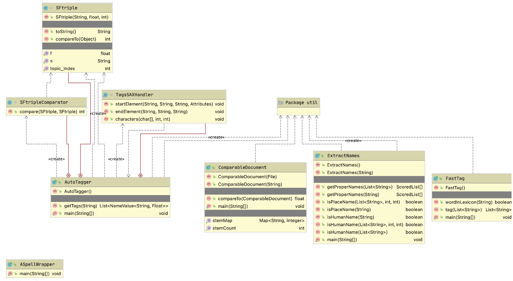
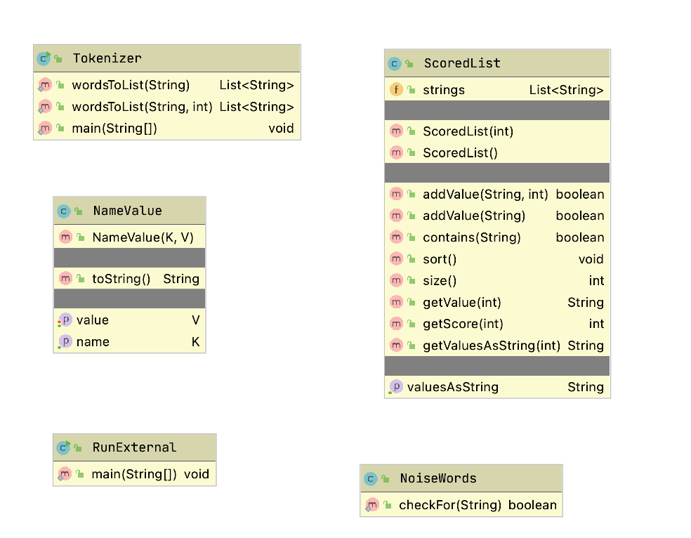

# Natural Language Processing

I have been working in the field of Natural Language Processing (NLP) since 1982. In this chapter we will use a few of my open source NLP project. In the next chapter I have selected the open source NLP project [OpenNLP](https://opennlp.apache.org/) to provide more examples of using NLP to get you started using NLP in your own projects. For my current work I usually use a combination of my own library discussed in this chapter, OpenNLP (covered in the next chapter), and two deep learning NLP libraries for the Python language ([spaCy](https://spacy.io/) and [Hugging Face](https://huggingface.co/) pre-trained deep learning models). Wile I don't cover these Python libraries in this book, I do have examples of using spaCy in my [Hy Language book](https://leanpub.com/hy-lisp-python/). Hy is a Lisp language that is implemented in Python. For difficult NLP problems like coreference resolution (or anaphora resolution) I use deep learning models like BERT.

Deep learning is apparently "eating" the AI world but I firmly believe that hybrid systems stand the best chance of getting us to real artificial general intelligence (AGI) - time will tell as more NLP, knowledge representation, reasoning, etc., tasks are implemented in hybrid systems. Many experts in AI believe that deep learning only takes us so far, and in order to reach general artificial intelligence we will use some form of hybrid deep learning, symbolic AI, and probabalistic systems. That said, there are deep learning specialists who predict their favored technology will probably be sufficient to get to AGI.

## Overview of the NLP  Library and Running the Examples

We will cover a wide variety of techniques for processing text in this chapter. The part of speech tagger (POS), text categorization, and entity extraction examples are all derived from either my open source projects or my commercial projects that I developed in the 1990-2010 time frame.

The following UML class diagrams will give you an overview of my NLP library code:

The XML parsing code is for reading the file **test_data/classification_tags.xml** that contains ranked word terms for various categories we cover (e.g., politics, economy, etc.), often referred to as term frequency–inverse document frequency ([tf-idf](https://en.wikipedia.org/wiki/Tf%E2%80%93idf)).

{width=50%}

Each main class in this library has a **main** method that provides a short demonstration of using the class. The *Makefile* has targets for running the **main** method for each of the top level classes:

{linenos=on}
~~~~~~~~
names:
  mvn install -DskipTests
  mvn exec:java -Dexec.mainClass="com.markwatson.nlp.ExtractNames"

autotagger:
  mvn install -DskipTests
  mvn exec:java -Dexec.mainClass="com.markwatson.nlp.AutoTagger"

fasttag:
  mvn install -DskipTests
  mvn exec:java -Dexec.mainClass="com.markwatson.nlp.FastTag"
~~~~~~~~

You might find it useful to run the examples before we look at the code.

## Tokenizing, Stemming, and Part of Speech Tagging Text  {#tokenizing-and-tagging}

Tokenizing text is the process of splitting a string containing text into individual tokens. Stemming is the reduction of words to abbreviated word roots that allow for easy comparison for equality of similar words. Tagging is identifying what part of speech each word is in input text. Tagging is complicated by many words having different parts of speech depending on context (examples: “*bank* the airplane,” “the river *bank*,” etc.) You can find the code in this section in the
GitHub repository in the files **src/com/markwatson/nlp/fasttag/FastTag.java** and **src/com/markwatson/nlp/util/Tokenizer.java**. The required data files are in the directory **test\_data** in the files **lexicon.txt** (for processing English text) and **lexicon\_medpost.txt** (for processing medical text).

We will also look at a public domain word stemmer that I frequently use in this section.

Before we can process any text we need to break text into individual tokens. Tokens can be words, numbers and punctuation symbols. The class **Tokenizer** has two static methods, both take an input string to tokenize and return a list of token strings. The second method has an extra argument to specify the maximum number of tokens that you want returned:

{lang="java",linenos=on}
~~~~~~~~
      static public List<String> wordsToList(String s)
      static public List<String> wordsToList(String s, int maxR)
~~~~~~~~

In line 2, **maxR** is maximum number of tokens to return and is useful when you want to sample the first part of a very long text.

The following listing shows a fragment of example code using this class with the output:

{lang="java",linenos=off}
~~~~~~~~
       String text =
         "The ball, rolling quickly, went down the hill.";
       List<String> tokens = Tokenizer.wordsToList(text);
       System.out.println(text);
       for (String token : tokens)
          System.out.print("\""+token+"\" ");
       System.out.println();
~~~~~~~~

This code fragment produces the following output:

{linenos=off}
~~~~~~~~
    The ball, rolling quickly, went down the hill.
    "The" "ball" "," "rolling" "quickly" "," "went"
    "down" "the" "hill" "." 
~~~~~~~~

For many applications, it is better to “stem” word tokens to simplify comparison of similar words. For example “run,” “runs,” and “running” all stem to “run.” The stemmer that we will use, which I believe to be in the public domain, is in the file **src/public\_domain/Stemmer.java**. There are two convenient APIs defined at the end of the class, one to stem a string of multiple words and one to stem a single word token:

{linenos=off}
~~~~~~~~
        public List<String> stemString(String str)
        public String stemOneWord(String word)
~~~~~~~~

My FastTag part of speech (POS) tagger project resulted from my using in the early 1990s the excellent tagger written by Eric Brill while he was at the University of Pennsylvania. He used machine learning techniques to learn transition rules for tagging text using manually tagged text as training examples. In reading through his doctoral thesis I noticed that there were a few transition rules that covered most of the cases and I implemented a simple “fast tagger” in Common Lisp, Ruby, Scheme and Java. The Java version is in the file **src/com/markwatson/nlp/fasttag/FastTag.java**.

The file **src/com/markwatson/nlp/fasttag/README.txt** contains information on where to obtain Eric Brill’s original tagging system and also defines the tags for both his English language lexicon and the Medpost lexicon. The following table shows the most commonly used tags (see the README.txt file for a complete description).

{linenos=off}
~~~~~~~~
NN   singular noun          dog
NNS  plural noun            dogs
NNP  singular proper noun   California
CC   conjunction            and, but, or
DT   determiner             the, some
IN   preposition            of, in, by
JJ   adjective              large, small, green
PP   proper pronoun         I, he, you
RB   adverb                 slowly
RBR  comparative adverb     slowest
VB   verb                   eat
VBN  past participle verb   eaten
VBG  gerund verb            eating
WP   wh\* pronoun           who, what
WDT  wh\* determiner        which, that
~~~~~~~~

Brill’s system worked by processing manually tagged text and then creating a list of words followed by the tags found for each word. Here are a few random lines selected from the **test\_data/lexicon.txt** file:

{linenos=off}
~~~~~~~~
    Arco NNP
    Arctic NNP JJ
    fair JJ NN RB
~~~~~~~~

Here “Arco” is a proper noun because it is the name of a corporation. The word “Arctic” can be either a proper noun or an adjective; it is used most frequently as a proper noun so the tag “NNP” is listed before “JJ.” The word “fair” can be an adjective, singular noun, or an adverb.

The class **Tagger** reads the file lexicon either as a resource stream (if, for example, you put **lexicon.txt **in the same JAR file as the compiled **Tagger** and **Tokenizer** class files) or as a local file. Each line in the **lexicon.txt** file is passed through the utility method **parseLine** that processes an input string using the first token in the line as a hash key and places the remaining tokens in an array that is the hash value. So, we would process the line “fair JJ NN RB” as a hash key of “fair” and the hash value would be the array of strings (only the first value is currently used but I keep the other values for future use).

When the tagger is processing a list of word tokens, it looks each token up in the hash table and stores the first possible tag type for the word. In our example, the word “fair” would be assigned (possibly temporarily) the tag “JJ.” We now have a list of word tokens and an associated list of possible tag types. We now loop through all of the word tokens applying eight transition rules that Eric Brill’s system learned. We will look at the first rule in some detail; **i** is the loop variable in the range [0, number of word tokens - 1] and **word** is the current word at index **i**:

{lang="java",linenos=off}
~~~~~~~~
      //  rule 1: DT, {VBD | VBP} --> DT, NN
      if (i > 0 && ret.get(i - 1).equals("DT")) {
          if (word.equals("VBD") ||
              word.equals("VBP") ||
              word.equals("VB")) {
                         ret.set(i, "NN");
          }
      }
~~~~~~~~

In English, this rule states that if a determiner (DT) at word token index **i - 1** is followed by either a past tense verb (VBD) or a present tense verb (VBP) then replace the tag type at index **i** with “NN.”

I list the remaining seven rules in a short syntax here and you can look at the Java source code to see how they are implemented:

{linenos=off}
~~~~~~~~
      rule 2: convert a noun to a number (CD) if "."
              appears in the word
      rule 3: convert a noun to a past participle if
              words.get(i) ends with "ed"
      rule 4: convert any type to adverb if it ends in "ly"
      rule 5: convert a common noun (NN or NNS) to an
              adjective if it ends with "al"
      rule 6: convert a noun to a verb if the preceding
              work is "would"
      rule 7: if a word has been categorized as a common
              anoun nd it ends with "s", then set its type
              to plural common noun (NNS)
      rule 8: convert a common noun to a present participle
              verb (i.e., a gerund)
~~~~~~~~

My FastTag tagger is not quite as accurate as Brill’s original tagger so you might want to use his system written in C but which can be executed from Java as an external process or with a JNI interface.

In the next section we will use the tokenizer, stemmer, and tagger from this section to develop a system for identifying named entities in text.

## Named Entity Extraction From Text  {#named-entity-extraction}

In this section we will look at identifying names of people and places in text. This can be useful for automatically tagging news articles with the people and place names that occur in the articles. The “secret sauce” for identifying names and places in text is the data in the file **test\_data/propername.ser** – a serialized Java data file containing hash tables for human and place names. This data is read in the constructor for the class **Names**; it is worthwhile looking at the code if you have not used the Java serialization APIs before:

{lang="java",linenos=off}
~~~~~~~~
      ObjectInputStream p = new ObjectInputStream(ins);
      Hashtable lastNameHash = (Hashtable) p.readObject();
      Hashtable firstNameHash = (Hashtable) p.readObject();
      Hashtable placeNameHash = (Hashtable) p.readObject();
      Hashtable prefixHash = (Hashtable) p.readObject();
~~~~~~~~

If you want to see these data values, use code like

{lang="java",linenos=off}
~~~~~~~~
      Enumeration keysE = placeNameHash.keys();
      while (keysE.hasMoreElements()) {
        Object key = keysE.nextElement();
        System.out.println(key + " : " +
                           placeNameHash.get(key));
      }
~~~~~~~~

The small part of the output from running this code snippet is:

{linenos=off}
~~~~~~~~
    Mauritius : country
    Port-Vila : country_capital
    Hutchinson : us_city
    Mississippi : us_state
    Lithuania : country
~~~~~~~~

Before we look at the entity extraction code and how it works, we will first look at an example of using the main APIs for the **Names** class. The following example uses the methods **isPlaceName**, **isHumanName**, and
**getProperNames**:

{lang="java",linenos=off}
~~~~~~~~
      System.out.println("Los Angeles: " +
                  names.isPlaceName("Los Angeles"));
      System.out.println("President Bush: " +
                  names.isHumanName("President Bush"));           
      System.out.println("President George Bush: " +
           names.isHumanName("President George Bush"));
      System.out.println("President George W. Bush: " +
           names.isHumanName("President George W. Bush"));
      ScoredList[] ret = names.getProperNames(
            "George Bush played golf. President     \
             George W. Bush went to London England, \
             and Mexico to see Mary    \
             Smith in Moscow. President Bush will   \
             return home Monday.");
      System.out.println("Human names: " +
                         ret[0].getValuesAsString());
      System.out.println("Place names: " +
                         ret[1].getValuesAsString());
~~~~~~~~

The output from running this example is:

{linenos=off}
~~~~~~~~
    Los Angeles: true
    President Bush: true
    President George Bush: true
    President George W. Bush: true
    * place name: London,
            placeNameHash.get(name): country_capital
    * place name: Mexico,
            placeNameHash.get(name): country_capital
    * place name: Moscow, 
            placeNameHash.get(name): country_capital
    Human names: George Bush:1,
                 President George W . Bush:1,
                 Mary Smith:1,
                 President Bush:1
    Place names: London:1, Mexico:1, Moscow:1
~~~~~~~~

The complete implementation that you can read through in the source file
**ExtractNames.java** is reasonably simple. The methods **isHumanName** and
**isPlaceName** simply look up a string in either of the human or place name hash tables. For testing a single word this is very easy; for example:

{lang="java",linenos=off}
~~~~~~~~
      public boolean isPlaceName(String name) {
        return placeNameHash.get(name) != null;
      }
~~~~~~~~

The versions of these APIs that handle names containing multiple words are just a little more complicated; we need to construct a string from the words between the starting and ending indices and test to see if this new string value is a valid key in the human names or place names hash tables. Here is the code for finding multi-word place names:

{lang="java",linenos=off}
~~~~~~~~
      public boolean isPlaceName(List<String> words,
                                 int startIndex,
                                 int numWords) {
        if ((startIndex + numWords) > words.size()) {
          return false;
        }
        if (numWords == 1) {
          return isPlaceName(words.get(startIndex));
        }
        String s = "";
        for (int i=startIndex;
             i<(startIndex + numWords); i++) {
          if (i < (startIndex + numWords - 1)) {
            s = s + words.get(startIndex) + " ";
          } else {
            s = s + words.get(startIndex);
          }
        }
        return isPlaceName(s);
      }
~~~~~~~~

This same scheme is used to test for multi-word human names. The top-level utility method **getProperNames** is used to find human and place names in text. The code in **getProperNames** is intentionally easy to understand but not very efficient because of all of the temporary test strings that need to be constructed.

## Automatically Assigning Categories to Text

Here we will assign zero or more categories like “politics”, “economy”, etc. to text based on the words contained in the text. While the code for doing this is simple there is usually much work to do to build a word count database for different classifications. The approach we use here is often called "bag of words" because the words in input text matter but not the order of words in text or proximity to other words.

I have been working on open source products for automatic tagging and semantic extraction since the 1990s (see my old web site www.knowledgebooks.com if you are interested). In this section I will show you some simple techniques for automatically assigning tags or categories to text. We will use a set of category tags for which I have collected word frequency statistics. For example, a category of “Java” might be associated with the use of the words “Java,” “JVM,” “Sun,” etc. You can find my pre-trained tag data in the file:

{line-numbers=off}
~~~~~~~~
    test_data/classification_tags.xml
~~~~~~~~

The Java source code for the class **AutoTagger** is in the file:

{line-numbers=off}
~~~~~~~~
    src-statistical-nlp/com/markwatson/nlp/AutoTagger.java
~~~~~~~~

The **AutoTagger** class uses a few data structures to keep track of both the names of categories (tags) and the word count statistics for words associated with each tag name. I use a temporary hash table for processing the XML input data:

{lang="java",linenos=off}
~~~~~~~~
  private static Hashtable<String, Hashtable<String, Float>> tagClasses;
~~~~~~~~

The names of categories (tags) used are defined in the XML tag data file: change this file, and you alter both the tags and behavior of this utility class. Please note that the data in this XML file is from a small set of hand-labeled text found on the Web (i.e., my wife and I labelled articles as being about "religion", "politics", etc.). 

This approach is called "bag of words." The following listing shows a snippet of data defined in the XML tag data file describing some words (and their scores) associated with the tag “religion\_buddhism”:

{lang="xml",linenos=off}
~~~~~~~~
    <tags>
      <topic name="religion_buddhism">
        <term name="buddhism" score="52" />
        <term name="buddhist" score="50" />
        <term name="mind" score="50" />
        <term name="buddha" score="37" />
        <term name="practic" score="31" />
        <term name="teach" score="15" />
        <term name="path" score="14" />
        <term name="mantra" score="14" />
        <term name="thought" score="14" />
        <term name="school" score="13" />
        <term name="zen" score="13" />
        <term name="mahayana" score="13" />
        <term name="suffer" score="12" />
        <term name="dharma" score="12" />
        <term name="tibetan" score="11" />
        . . .
      </topic>
      . . .
    </tags>
~~~~~~~~

Notice that the term names are stemmed words and all lower case. There are 28 categories (tags) defined in the input XML file included in the [GitHub repository for this book](https://github.com/mark-watson/Java-AI-Book-Code).

For data access, I also maintain an array of tag names and an associated list of the word frequency hash tables for each tag name:

{lang="java",linenos=off}
~~~~~~~~
      private static String[] tagClassNames;
      private static
        List<Hashtable<String, Float>> hashes =
           new ArrayList<Hashtable<String, Float>>();
~~~~~~~~

The XML data is read and these data structures are filled during static class load time so creating multiple instances of the class **AutoTagger** has no performance penalty in memory use. Except for an empty default class constructor, there is only one public API for this class, the method **getTags** gets the categories for input text:

{lang="java",linenos=off}
~~~~~~~~
      public List<NameValue<String, Float>>
                     getTags(String text) {
~~~~~~~~

To be clear, the tags returned are classification tags like "politics," "economy," etc. The utility class **NameValue** is defined in the file:

{linenos=off}
~~~~~~~~
src-statistical-nlp/com/markwatson/nlp/util/NameValue.java
~~~~~~~~

To determine the tags for input text, we keep a running score for each defined tag type. I use the internal class **SFtriple** to hold triple values of word, score, and tag index. I choose the tags with the highest scores as the automatically assigned tags for the input text. Scores for each tag are calculated by taking each word in the input text, stemming it, and if the stem is in the word frequency hash table for the tag then add the score value in the hash table to the running sum for the tag. You can refer to the AutoTagger.java source code for details. Here is an example use of class **AutoTagger**:

{lang="java",linenos=off}
~~~~~~~~
      AutoTagger test = new AutoTagger();
      String s = "The President went to Congress to argue
                  for his tax bill before leaving on a
                  vacation to Las Vegas to see some shows
                  and gamble.";
      List<NameValue<String, Float>> results =
                                        test.getTags(s);
      for (NameValue<String, Float> result : results) {
        System.out.println(result);
      }
~~~~~~~~

The output looks like:

{linenos=off}
~~~~~~~~
    [NameValue: news_economy : 1.0]
    [NameValue: news_politics : 0.84]
~~~~~~~~

## Text Clustering  {#text-clustering}

Clustering text documents refers to associating similar text documents with each other. The text clustering system that I have written for my own projects is simple and effective but it inefficient for large numbers of documents. The example code in this section is inherently inefficient for clustering a large number of text documents because I perform significant semantic processing on each text document and then compare all combinations of documents. The runtime performance is **O(N^2^)** where **N** is the number of text documents. If you need to cluster or compare a very large number of documents you will probably want to use a K-Mean clustering algorithm instead.

I use a few different algorithms to rate the similarity of any two text documents and I will combine these depending on the requirements of the project that I am working on:

-  Calculate the intersection of common words in the two documents.
-  Calculate the intersection of common word stems in the two documents.
-  Calculate the intersection of tags assigned to the two documents.
-  Calculate the intersection of human and place names in the two documents.

In this section we will implement the second option: calculate the intersection of word stems in two documents. Without showing the package and import statements, it takes just a few lines of code to implement this algorithm when we use the **Stemmer** class.

The following listing shows the implementation of class
**ComparableDocument** with comments. We start by defining constructors for documents defined by a **File** object and a **String** object:

{lang="java",linenos=off}
~~~~~~~~
    public class ComparableDocument {
        // disable default constructor calls:
        private ComparableDocument() { }
        public ComparableDocument(File document)
                     throws FileNotFoundException {
            this(new Scanner(document).
                       useDelimiter("\\Z").next());
        }
        public ComparableDocument(String text) {
            List<String> stems =
                   new Stemmer().stemString(text);
            for (String stem : stems) {
                stem_count++;
                if (stemCountMap.containsKey(stem)) {
                    Integer count = stemCountMap.get(stem);
                    stemCountMap.put(stem, 1 + count);
                } else {
                    stemCountMap.put(stem, 1);
                }
            }
        }
~~~~~~~~

In the last constructor, I simply create a count of how many times each stem occurs in the document.

The public API allows us to get the stem count hash table, the number of stems in the original document, and a numeric comparison value for comparing this document with another (this is the first version – we will add an improvement later):

{lang="java",linenos=off}
~~~~~~~~
      public Map<String, Integer> getStemMap() {
        return stemCountMap;
      }
      public int getStemCount() {
        return stem_count;
      }
      public float
             compareTo(ComparableDocument otherDocument) {
        long count = 0;
        Map<String,Integer> map2 = otherDocument.getStemMap();
        Iterator iter = stemCountMap.keySet().iterator();
        while (iter.hasNext()) {
          Object key = iter.next();
          Integer count1 = stemCountMap.get(key);
          Integer count2 = map2.get(key);
          if (count1!=null && count2!=null) {
            count += count1 * count2;
          }
        }
        return (float) Math.sqrt(
                 ((float)(count*count) /
                  (double)(stem_count *
                           otherDocument.getStemCount())))
                / 2f;
      }
      private Map<String, Integer> stemCountMap =
                        new HashMap<String, Integer>();
      private int stem_count = 0;
    }
~~~~~~~~

I normalize the return value for the method **compareTo** to return a value of 1.0 if compared documents are identical (after stemming) and 0.0 if they contain no common stems. There are four test text documents
in the test\_data directory and the following test code compares various combinations. Note that I am careful to test the case of comparing identical documents:

{lang="java",linenos=off}
~~~~~~~~
      ComparableDocument news1 = 
         new ComparableDocument("testdata/news_1.txt");
      ComparableDocument news2 =
         new ComparableDocument("testdata/news_2.txt");
      ComparableDocument econ1 =
         new ComparableDocument("testdata/economy_1.txt");
      ComparableDocument econ2 =
         new ComparableDocument("testdata/economy_2.txt");
      System.out.println("news 1 - news1: " +
                         news1.compareTo(news1));
      System.out.println("news 1 - news2: " +
                         news1.compareTo(news2));
      System.out.println("news 2 - news2: " +
                         news2.compareTo(news2));
      System.out.println("news 1 - econ1: " +
                         news1.compareTo(econ1));
      System.out.println("econ 1 - econ1: " +
                         econ1.compareTo(econ1));
      System.out.println("news 1 - econ2: " +
                         news1.compareTo(econ2));
      System.out.println("econ 1 - econ2: " +
                         econ1.compareTo(econ2));
      System.out.println("econ 2 - econ2: " +
                         econ2.compareTo(econ2));
~~~~~~~~

The following listing shows output that indicates mediocre results; we will soon make an improvement that makes the results better. The output for this test code is:

{linenos=off}
~~~~~~~~
    news 1 - news1: 1.0
    news 1 - news2: 0.4457711
    news 2 - news2: 1.0
    news 1 - econ1: 0.3649214
    econ 1 - econ1: 1.0
    news 1 - econ2: 0.32748842
    econ 1 - econ2: 0.42922822
    econ 2 - econ2: 1.0
~~~~~~~~

There is not as much differentiation in comparison scores between political news stories and economic news stories. What is up here? The problem is that I did not remove common words (and therefore common word stems) when creating stem counts for each document. I wrote a utility class **NoiseWords** for identifying both common words and their stems; you can see the implementation in the file NoiseWords.java. Removing noise words improves the comparison results (I added a few tests since the last printout):

{linenos=off}
~~~~~~~~
    news 1 - news1: 1.0
    news 1 - news2: 0.1681978
    news 1 - econ1: 0.04279895
    news 1 - econ2: 0.034234844
    econ 1 - econ2: 0.26178515
    news 2 - econ2: 0.106673114
    econ 1 - econ2: 0.26178515
~~~~~~~~

Much better results! The API for **com.markwatson.nlp.util.NoiseWords** is a single static method:

{lang="java",linenos=off}
~~~~~~~~
public static boolean checkFor(String stem)
~~~~~~~~

You can add additional noise words to the data section in the file **NoiseWords.java**, depending on your application.

## Wrapup

This chapter contains my own experiments with ad-hoc NLP that I often find useful for my work.

In the next chapter [Natural Language Processing Using OpenNLP](#opennlp) we use the Apache OpenNLP library that I also often use in my work.
