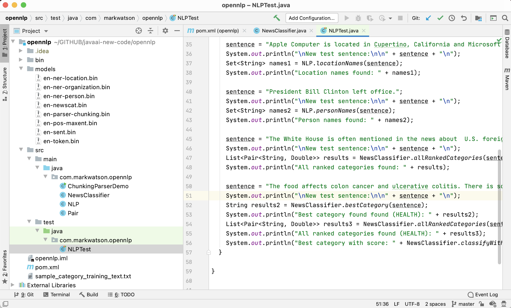
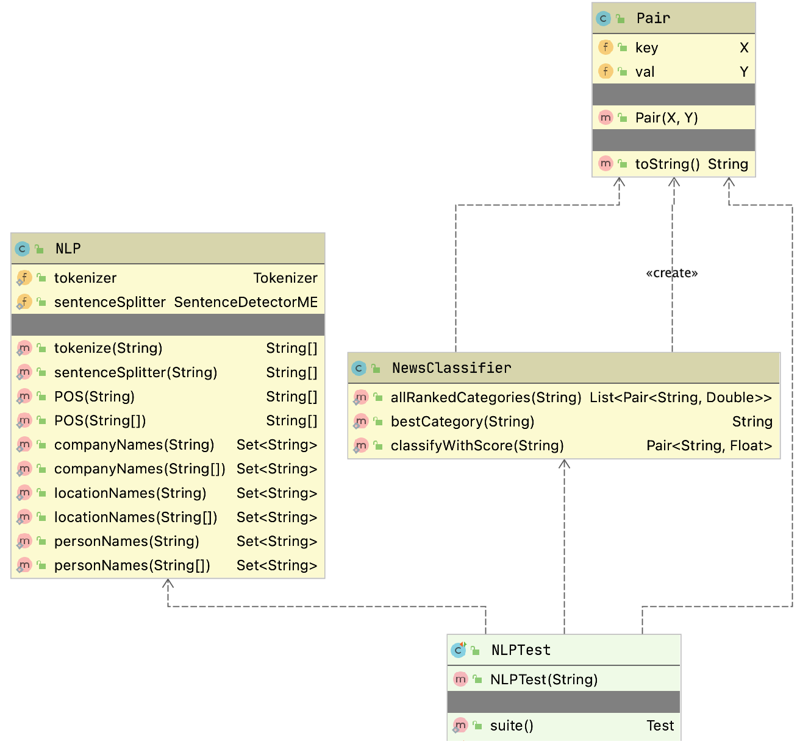

# Natural Language Processing Using OpenNLP {#opennlp}

Here we use the [Apache OpenNLP project](https://opennlp.apache.org). OpenNLP has pre-trained models for tokenization, sentence segmentation, part-of-speech tagging, named entity extraction, chunking, parsing, and coreference resolution. As we see later OpenNLP has tools to also build our own models.

I have worked in the field of Natural Language Processing (NLP) since the early 1980s. Many more people are now interested in the field of NLP and the techniques have changed drastically in the last decade.

Currently, OpenNLP has support for Danish, German, English, Spanish, Portuguese, and Swedish. I include in the github repository some trained models for English that are used in the examples in this chapter. You can download models for other languages at the [web page for OpenNLP 1.5 models](http://opennlp.sourceforge.net/models-1.5/) (we are using version 1..6.0 of OpenNLP in this book which uses the version 1.5 models).

The following figure shows the project for this chapter in the Community Edition of IntelliJ:

We will use pre-trained models for tokenizing text, recognizing the names of organizations, people, locations, and parts of speech for words in input text. We will also train a new model (the file **opennlp/models/en-newscat.bin** in the github repository) for recognizing the category of input text. The section on training new maximum entropy classification models using your own training data may be the material in this chapter that you will use the most in your own projects. We will train one model to recognize the categories of **COMPUTERS**, **ECONOMY**, **HEALTH**, and **POLITICS**. You should then have the knowledge for training your own models using your own training texts for the categories that you need for your applications. The [OpenNLP documentation](https://opennlp.apache.org/docs/1.9.2/manual/opennlp.html#opennlp) has additional detail on custom models. We will also use both some pre-trained models that are included with the OpenNLP distribution in the next chapter when we combine using OpenNLP with the WordNet lexical database developed at Princeton University.

After building a classification model we finish up this chapter with an interesting topic: statistically parsing sentences to discover the most probable linguistic structure of each sentence in input text. We will not use parsing in the rest of this book so you may skip the last section of this chapter if you are not currently interested in understanding sentence parse tree structure of components like noun and verb phrases, proper nouns, nouns, and adjectives, etc.

The following UML class diagrams will give you an overview of my wrapper for the OpenNLP library and for the unit test class:

## Using OpenNLP Pre-Trained Models

Assuming that you have cloned the github repository for this book, you can fetch the maven dependencies, compile the code, install the generated library locally, and run the unit tests using the command:

{linenos=off}
~~~~~~~~
mvn install
~~~~~~~~

The model files, including the categorization model you will learn to build later in this chapter, are found in the subdirectory **models**. The unit tests in **src/test/java/com/markwatson/opennlp/NLPTest.java** provide examples for using the code we develop in this chapter. As for many examples in this book, I use unit tests as examples for using a library and not as tests that check computed values.

The Java example code for tokenization (splitting text into individual words), splitting sentences, and recognizing organizations, locations, and people in text is all in the Java class **NLP**. You can look at the source code in the repository for this book. Here I will just show a few snippets of the code to make clear how to load and use pre-trained models.

I use static class initialization to load the model files:

{lang="java",linenos=off}
~~~~~~~~
  static public Tokenizer tokenizer = null;
  static public SentenceDetectorME sentenceSplitter = null;
  static POSTaggerME tagger = null;
  static NameFinderME organizationFinder = null;
  static NameFinderME locationFinder = null;
  static NameFinderME personNameFinder = null;

  static {

    try {
      InputStream organizationInputStream =
	    new FileInputStream("models/en-ner-organization.bin");
      TokenNameFinderModel model =
	    new TokenNameFinderModel(organizationInputStream);
      organizationFinder = new NameFinderME(model);
      organizationInputStream.close();

      InputStream locationInputStream =
	    new FileInputStream("models/en-ner-location.bin");
      model = new TokenNameFinderModel(locationInputStream);
      locationFinder = new NameFinderME(model);
      locationInputStream.close();

      InputStream personNameInputStream =
	    new FileInputStream("models/en-ner-person.bin");
      model = new TokenNameFinderModel(personNameInputStream);
      personNameFinder = new NameFinderME(model);
      personNameInputStream.close();

      InputStream tokienizerInputStream =
	    new FileInputStream("models/en-token.bin");
      TokenizerModel modelTokenizer = new TokenizerModel(tokienizerInputStream);
      tokenizer = new TokenizerME(modelTokenizer);
      tokienizerInputStream.close();

      InputStream sentenceInputStream =
	    new FileInputStream("models/en-sent.bin");
      SentenceModel sentenceTokenizer = new SentenceModel(sentenceInputStream);
      sentenceSplitter = new SentenceDetectorME(sentenceTokenizer);
      tokienizerInputStream.close();

      organizationInputStream = new FileInputStream("models/en-pos-maxent.bin");
      POSModel posModel = new POSModel(organizationInputStream);
      tagger = new POSTaggerME(posModel);

    } catch (IOException e) {
      e.printStackTrace();
    }
  }
~~~~~~~~

The first operation that you will usually start with for processing natural language text is breaking input text into individual words and sentences. Here is the code for using the tokenizing code that separates text stored as a Java String into individual words:

{lang="java",linenos=off}
~~~~~~~~
  public static String[] tokenize(String s) {
    return tokenizer.tokenize(s);
  }
~~~~~~~~

Here is the similar code for breaking text into individual sentences:

{lang="java",linenos=off}
~~~~~~~~
  public static String[] sentenceSplitter(String s) {
    return sentenceSplitter.sentDetect(s);
  }
~~~~~~~~

Here is some sample code to use **sentenceSplitter**:

~~~~~~~~
    String sentence =
      "Apple Computer, Microsoft, and Google are in the " +
      " tech sector. Each is very profitable.";
    String [] sentences = NLP.sentenceSplitter(sentence);
    System.out.println("Sentences found:\n" + Arrays.toString(sentences));
~~~~~~~~

In line 4 the static method **NLP.sentenceSplitter** returns an array of strings. In line 5 I use a common Java idiom for printing arrays by using the static method **Arrays.toString** to convert the array of strings into a **List\<String\>** object. The trick is that the **List** class has a **toString** method that formats list nicely for printing.

Here is the output of this code snippet (edited for page width and clarity):

{line-numbers=off}
~~~~~~~~
Sentences found:
  ["Apple Computer, Microsoft, and Google are in the tech sector.",
   "Each is very profitable."]
~~~~~~~~

The code for finding organizations, locations, and people's names is almost identical so I will only show the code in the next listing for recognizing locations. Please look at the methods **companyNames** and **personNames**  in the class **com.markwatson.opennlp.NLP** to see the implementations for finding the names of companies and people.

{lang="java",linenos=on}
~~~~~~~~
  public static Set<String> locationNames(String text) {
    return locationNames(tokenizer.tokenize(text));
  }

  public static Set<String> locationNames(String tokens[]) {
    Set<String> ret = new HashSet<String>();
    Span[] nameSpans = locationFinder.find(tokens);
    if (nameSpans.length == 0) return ret;
    for (int i = 0; i < nameSpans.length; i++) {
      Span span = nameSpans[i];
      StringBuilder sb = new StringBuilder();
      for (int j = span.getStart(); j < span.getEnd(); j++)
        sb.append(tokens[j] + " ");
      ret.add(sb.toString().trim().replaceAll(" ,", ","));
    }
    return ret;
  }
~~~~~~~~

The public methods in the class **com.markwatson.opennlp.NLP** are overriden to take either a single string value which gets tokenized inside of the method and also a method that takes as input text that has already been tokenized into a **String tokens[]** object. In the last example the method starting on line 1 accepts an input string and the overriden method starting on line 5 accepts an array of strings. Often you will want to tokenize text stored in a single input string into tokens and reuse the tokens for calling several of the public methods in **com.markwatson.opennlp.NLP** that can take input that is already tokenized. In line 2 we simply tokenize the input text and call the method that accepts tokenized input text.

In line 6 we create a **HashSet\<String\>** object that will hold the return value of a set of location names. The **NameFinderME** object **locationFinder** returns an array of **Span** objects. The **Span** class is used to represent a sequence of adjacent words. The **Span** class has a public static attribute **length** and instance methods **getstart** and **getEnd** that return the indices of the beginning and ending (plus one) index of a span in the original input text.

Here is some sample code to use **locationNames** along with the output (edited for page width and clarity):

{lang="java",line-numbers=off}
~~~~~~~~
   String sentence =
     "Apple Computer is located in Cupertino, California and Microsoft " +
     "is located in Seattle, Washington. He went to Oregon";
   Set<String> names = NLP.locationNames(sentence);
   System.out.println("Location names found: " + names);
~~~~~~~~

{line-numbers=off}
~~~~~~~~
Location names found: [Oregon, Cupertino, Seattle, California, Washington]
~~~~~~~~

Note that the pre-trained model does not provide information when city and state names are associated with each other in the original sentence. The maximum entropy models used in OpenNLP do use information on the context or a word in a sentence, for example, the preceeding and following word. This combination of available contextual information makes maximum entropy models more accurate than the "bag of words" technique we used in the last chapter.

## Training a New Categorization Model for OpenNLP

The OpenNLP class **DoccatTrainer** can process specially formatted input text files and produce categorization models using maximum entropy which is a technique that handles data with many features. Features that are automatically extracted from text and used in a model are things like words in a document and word adjacency. Maximum entropy models can recognize multiple classes. In testing a model on new text data the probablilities of all possible classes add up to the value 1 (this is often refered to as "softmax"). For example we will be training a classifier on four categories and the probablilities of these categories for some test input text add up to the value of one:

{linenos=off}
~~~~~~~~
[[COMPUTERS, 0.1578880260493374], [ECONOMY, 0.2163099374638936],
 [HEALTH, 0.35546925520388845], [POLITICS, 0.27033278128288035]]
~~~~~~~~

The format of the input file for training a maximum entropy classifier is simple but has to be correct: each line starts with a category name, followed by sample text for each category which must be **all** **on** **one** **line**. Please note that I have already trained the model producing the model file **models/en-newscat.bin** so you don't need to run the example in this section unless you want to regenerate this model file.

The file **sample_category_training_text.txt** contains four lines, defining four categories. Here are two lines from this file (I edited the following to look better on the printed page, but these are just two lines in the file):

{line-numbers=off}
~~~~~~~~
COMPUTERS Computers are often used to access the Internet to meet business functions.
ECONOMY The Austrian School (also known as the Vienna School or the Psychological School ) is a Schools of economic thought|school of economic thought that emphasizes the spontaneous organizing power of the price mechanism.
~~~~~~~~

Here is one training example each for the categories COMPUTERS and ECONOMY.

You must format the training file perfectly. As an example, if you have empty (or blank) lines in your input training file then you will get an error like:

{line-numbers=off}
~~~~~~~~
Computing event counts...  java.io.IOException: Empty lines, or lines with
                           only a category string are not allowed!
~~~~~~~~

The OpenNLP documentation has examples for writing custom Java code to build models but I usually just use the command line tool; for example:

{line-numbers=off}
~~~~~~~~
bin/opennlp DoccatTrainer -model models/en-newscat.bin -lang en \
                          -data sample_category_training_text.txt \
                          -encoding UTF-8
~~~~~~~~

The model is written to the relative file path **models/en-newscat.bin**. The training file I am using is tiny so the model is trained in a few seconds. For serious applications, the more training text the better! By default the **DoccatTrainer** tool uses the default text feature generator which uses word frequencies in documents but ignores word ordering. As I mention in the next section, I sometimes like to mix word frequency feature generation with 2gram (that is, frequencies of two adjacent words). In this case you cannot simply use the **DoccatTrainer**  command line tool. You need to write a little Java code yourself that you can plug another feature generator into using the alternative API:

{lang="java",line-numbers=off}
~~~~~~~~
public static DoccatModel train(String languageCode,
                                ObjectStream<DocumentSample> samples,
                                int cutoff, int iterations,
                                FeatureGenerator... featureGenerators)
~~~~~~~~

In the next section, you will note that the last argument would look like the case where we combine two feature generators, one that uses "bag of words" and the other that uses adjacent word sequences:

{lang="java",line-numbers=off}
~~~~~~~~
public DocumentCategorizerME(DoccatModel model,
           new FeatureGenerator[]{new BagOfWordsFeatureGenerator(),
                                  new NGramFeatureGenerator()});
~~~~~~~~

For some purposes the default word frequency (or bag of words) feature generator is probably OK so using the command line tool is a good place to start because models are smaller and training time is minimal. Adding the **NGramFeatureGenerator** increases both training time and model size but should produce better results. Here is the output from running the **DoccatTrainer** command line tool:

{line-numbers=off}
~~~~~~~~
> bin/opennlp DoccatTrainer -model models/en-newscat.bin -lang en \
                            -data sample_category_training_text.txt \
                            -encoding UTF-8
Indexing events using cutoff of 5

	Computing event counts...  done. 4 events
	Indexing...  done.
Sorting and merging events... done. Reduced 4 events to 4.
Done indexing.
Incorporating indexed data for training...  
done.
	Number of Event Tokens: 4
	    Number of Outcomes: 4
	  Number of Predicates: 153
...done.
Computing model parameters ...
Performing 100 iterations.
  1:  ... loglikelihood=-5.545177444479562	0.25
  2:  ... loglikelihood=-4.730232204542369	0.5
  3:  ... loglikelihood=-4.232192673282495	0.75
   ...
 98:  ... loglikelihood=-0.23411803835475453	1.0
 99:  ... loglikelihood=-0.23150121909902377	1.0
100:  ... loglikelihood=-0.22894028845170055	1.0
Writing document categorizer model ... done (0.041s)

Wrote document categorizer model to
path: /Users/mark/power-java/opennlp/models/en-newscat.bin
~~~~~~~~

We will use our new trained model file **en-newscat.bin** in the next section.

**Please** **note** that in this simple example I used very little data, just a few hundred words for each training category. I have used the OpenNLP maximum entropy library on various projects, mostly to good effect, but I used many thousands of words for each category. The more data, the better.

## Using Our New Trained Classification Model

The code that uses the model we trained in the last section is short enough to list in its entirety:

{lang="java",linenos=on}
~~~~~~~~
package com.markwatson.opennlp;

import opennlp.tools.doccat.DoccatModel;
import opennlp.tools.doccat.DocumentCategorizerME;

import java.io.*;
import java.util.*;

/**
 * This program uses the maximum entropy model we trained
 * using the instructions in the chapter on OpenNLP in the book.
 */

public class NewsClassifier {

  public static List<Pair<String,Double>> allRankedCategories(String text) {
    DocumentCategorizerME aCategorizer = new DocumentCategorizerME(docCatModel);
    double[] outcomes = aCategorizer.categorize(text);
    List<Pair<String,Double>> results = new ArrayList<Pair<String, Double>>();
    for (int i=0; i<outcomes.length; i++) {
      results.add(new Pair<String, Double>(aCategorizer.getCategory(i), outcomes[i]));
    }
    return results;
  }

  public static String bestCategory(String text) {
    DocumentCategorizerME aCategorizer = new DocumentCategorizerME(docCatModel);
    double[] outcomes = aCategorizer.categorize(text);
    return aCategorizer.getBestCategory(outcomes);
  }

  public static Pair<String,Float> classifyWithScore(String text) {
    DocumentCategorizerME classifier = new DocumentCategorizerME(docCatModel);
    double [] scores = classifier.categorize(text);
    int num_categories = classifier.getNumberOfCategories();
    if (num_categories > 0) {
      String bestString =  classifier.getBestCategory(scores);
      for (int i=0; i<num_categories; i++) {
        if (classifier.getCategory(i).equals(bestString)) {
          return new Pair<String,Float>(bestString, (float)scores[i]);
        }
      }
    }
    return new Pair<String,Float>("<no category>", 0f);
  }
  
  static DoccatModel docCatModel = null;

  static {

    try {
      InputStream modelIn = new FileInputStream("models/en-newscat.bin");
      docCatModel = new DoccatModel(modelIn);
    } catch (IOException e) {
      e.printStackTrace();
    }
  }
}
~~~~~~~~

In lines 48-57 we initialize the static data for an instance of the class **DoccatModel** that loads the model file created in the last section.

A new instance of the class **DocumentCategorizerME** is created in line 28 each time we want to classify input text. I called the one argument constructor for this class that uses the default feature detector. An alternative constructor is:

{lang="java",line-numbers=off}
~~~~~~~~
public DocumentCategorizerME(DoccatModel model,
                             FeatureGenerator... featureGenerators)
~~~~~~~~

The default feature generator is **BagOfWordsFeatureGenerator** which just uses word frequencies for classification. This is reasonable for smaller training sets as we used in the last section but when I have a large amount of training data available I prefer to combine **BagOfWordsFeatureGenerator** with **NGramFeatureGenerator**. You would use the constructor call:

{lang="java",line-numbers=off}
~~~~~~~~
public DocumentCategorizerME(DoccatModel model,
           new FeatureGenerator[]{new BagOfWordsFeatureGenerator(),
                                  new NGramFeatureGenerator()});
~~~~~~~~

The following listings show interspersed both example code snippets for using the **NewsClassifier** class followed by the output printed by each code snippet:

{line-numbers=off}
~~~~~~~~
    String sentence = "Apple Computer, Microsoft, and Google are in the tech sector. Each is very profitable.";
    System.out.println("\nNew test sentence:\n\n" + sentence + "\n");
    String [] sentences = NLP.sentenceSplitter(sentence);
    System.out.println("Sentences found: " + Arrays.toString(sentences));

New test sentence:

Apple Computer, Microsoft, and Google are in the tech sector.
Each is very profitable.

Sentences found: [Apple Computer, Microsoft, and Google are in the tech sector.,
                  Each is very profitable.]
~~~~~~~~

{line-numbers=off}
~~~~~~~~
    sentence = "Apple Computer, Microsoft, and Google are in the tech sector.";
    Set<String> names = NLP.companyNames(sentence);
    System.out.println("Company names found: " + names);

Company names found: [Apple Computer, Microsoft]

    sentence = "Apple Computer is located in Cupertino, California and Microsoft is located in Seattle, Washington. He went to Oregon";
    System.out.println("\nNew test sentence:\n\n" + sentence + "\n");
    Set<String> names1 = NLP.locationNames(sentence);
    System.out.println("Location names found: " + names1);

New test sentence:

Apple Computer is located in Cupertino, California and Microsoft is located in Seattle, Washington. He went to Oregon

Location names found: [Oregon, Cupertino, Seattle, California, Washington]
~~~~~~~~

{line-numbers=off}
~~~~~~~~
    sentence = "President Bill Clinton left office.";
    System.out.println("\nNew test sentence:\n\n" + sentence + "\n");
    Set<String> names2 = NLP.personNames(sentence);
    System.out.println("Person names found: " + names2);

New test sentence:

President Bill Clinton left office.

Person names found: [Bill Clinton]

    sentence = "The White House is often mentioned in the news about U.S. foreign policy. Members of Congress and the President are worried about the next election and may pander to voters by promising tax breaks. Diplomacy with Iran, Iraq, and North Korea is non existent in spite of a worry about nuclear weapons. A uni-polar world refers to the hegemony of one country, often a militaristic empire. War started with a single military strike. The voting public wants peace not war. Democrats and Republicans argue about policy.";
    System.out.println("\nNew test sentence:\n\n" + sentence + "\n");
    List<Pair<String, Double>> results = NewsClassifier.allRankedCategories(sentence);
    System.out.println("All ranked categories found: " + results);

New test sentence:

The White House is often mentioned in the news about  U.S. foreign policy. Members of Congress and the President are worried about the next election and may pander to voters by promising tax breaks. Diplomacy with Iran, Iraq, and North Korea is non existent in spite of a worry about nuclear weapons. A uni-polar world refers to the hegemony of one country, often a militaristic empire. War started with a single military strike. The voting public wants peace not war. Democrats and Republicans argue about policy.

All ranked categories found: [[COMPUTERS, 0.07257665117660535], [ECONOMY, 0.23559821969425127], [HEALTH, 0.29907267186308945], [POLITICS, 0.39275245726605396]]
~~~~~~~~

{line-numbers=off}
~~~~~~~~
    sentence = "The food affects colon cancer and ulcerative colitis. There is some evidence that sex helps keep us healthy. Eating antioxidant rich foods may prevent desease. Smoking may raise estrogen levels in men and lead to heart failure.";
    System.out.println("\nNew test sentence:\n\n" + sentence + "\n");
    String results2 = NewsClassifier.bestCategory(sentence);
    System.out.println("Best category found found (HEALTH): " + results2);
    List<Pair<String, Double>> results3 = NewsClassifier.allRankedCategories(sentence);
    System.out.println("All ranked categories found (HEALTH): " + results3);
    System.out.println("Best category with score: " + NewsClassifier.classifyWithScore(sentence));

New test sentence:

The food affects colon cancer and ulcerative colitis. There is some evidence that sex helps keep us healthy. Eating antioxidant rich foods may prevent desease. Smoking may raise estrogen levels in men and lead to heart failure.

Best category found found (HEALTH): HEALTH
All ranked categories found (HEALTH): [[COMPUTERS, 0.1578880260493374], [ECONOMY, 0.2163099374638936], [HEALTH, 0.35546925520388845], [POLITICS, 0.27033278128288035]]
Best category with score: [HEALTH, 0.35546926]
~~~~~~~~

As this example shows it is simple to train new classifier models once you have prepared training data. In my work I have often needed to train models customized for specific topics.

## Using the OpenNLP Parsing Model

We will use the parsing model that is included in the OpenNLP distribution to parse English language input text into syntax trees. You are unlikely to use a statistical parsing model in your work but I think you will enjoy the material in the section.

The following example code listing is long (68 lines) but I will explain the interesting parts after the listing:

{lang="java",linenos=on}
~~~~~~~~
package com.markwatson.opennlp;

import opennlp.tools.cmdline.parser.ParserTool;
import opennlp.tools.parser.Parse;
import opennlp.tools.parser.ParserModel;
import opennlp.tools.parser.chunking.Parser;

import java.io.FileInputStream;
import java.io.IOException;
import java.io.InputStream;

/**
 * Experiments with the chunking parser model
 */
public class ChunkingParserDemo {
  public Parse[] parse(String text) {
    Parser parser = new Parser(parserModel);
    return ParserTool.parseLine(text, parser, 5);
  }

  public void prettyPrint(Parse p) {
    StringBuffer sb = new StringBuffer();
    p.show(sb);
    String s = sb.toString() + " ";
    int depth = 0;
    for (int i = 0, size = s.length() - 1; i < size; i++) {
      if (s.charAt(i) == ' ' && s.charAt(i + 1) == '(') {
        System.out.print("\n");
        for (int j = 0; j < depth; j++) System.out.print("  ");
      } else if (s.charAt(i) == '(') System.out.print(s.charAt(i));
      else if (s.charAt(i) != ')' || s.charAt(i + 1) == ')')
        System.out.print(s.charAt(i));
      else {
        System.out.print(s.charAt(i));
        for (int j = 0; j < depth; j++) System.out.print("  ");
      }
      if (s.charAt(i) == '(') depth++;
      if (s.charAt(i) == ')') depth--;
    }
    System.out.println();
  }

  static ParserModel parserModel = null;

  static {

    try {
      InputStream modelIn = new FileInputStream("models/en-parser-chunking.bin");
      parserModel = new ParserModel(modelIn);
    } catch (IOException e) {
      e.printStackTrace();
    }
  }

  public static void main(String[] args) {
    ChunkingParserDemo cpd = new ChunkingParserDemo();
    Parse[] possibleParses =
      cpd.parse("John Smith went to the store on his way home from work ");
    for (Parse p : possibleParses) {
      System.out.println("parse:\n");
      p.show();
      //p.showCodeTree();
      System.out.println("\npretty printed parse:\n");
      cpd.prettyPrint(p);
      System.out.println("\n");
    }
  }
}
~~~~~~~~

The OpenNLP parsing model is read from a file in lines 45 through 53. The static variable **parserModel** (instance of class **ParserModel**) if created in line 49 and used in lines 17 and 18 to parse input text. It is instructive to look at the intermediate calculation results. The value for variable parser defined in line 17 has a value of:

Note that the parser returned 5 different results because we specified this number in line 18. For a long sentence the parser generates a very large number of possible parses for the sentence and returns, in order of probability of being correct, the number of results we requested.

The OpenNLP chunking parser code prints out results in a flat list, one result on a line. This is difficult to read which is why I wrote the method **prettyPrint** (lines 21 through 41) to print the parse results indented. Here is the output from the last code example (the first parse shown is all on one line but line wraps in the following listing):

{line-numbers=off}
~~~~~~~~
parse:

(TOP (S (NP (NNP John) (NNP Smith)) (VP (VBD went) (PP (TO to) (NP (DT the) (NN store))) (PP (IN on) (NP (NP (NP (PRP$ his) (NN way)) (ADVP (NN home))) (PP (IN from) (NP (NN work))))))))

pretty printed parse:

(TOP
  (S
    (NP
      (NNP John)        
      (NNP Smith))      
    (VP
      (VBD went)        
      (PP
        (TO to)          
        (NP
          (DT the)            
          (NN store)))        
      (PP
        (IN on)          
        (NP
          (NP
            (NP
              (PRP$ his)                
              (NN way))              
            (ADVP
              (NN home)))            
          (PP
            (IN from)              
            (NP
              (NN work))))))))
~~~~~~~~

In the 1980s I spent much time on syntax level parsing. I no longer find these models very relevant to my own work.

OpenNLP is a good resource for Java programmers and its Apache 2 license is "business friendly." If you can use software with a GPL license then please also look at the [Stanford NLP libraries](https://nlp.stanford.edu/software/).
 
