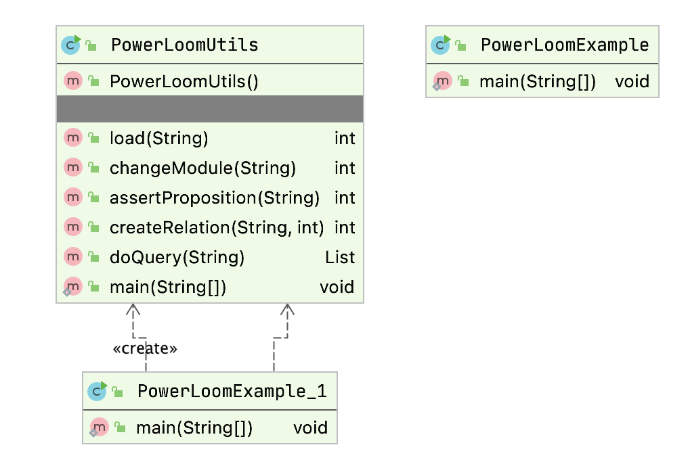

# Reasoning {#reasoning}

While the topic of reasoning may not be as immediately useful for your work as for example deep learning, reasoning is a broad and sometimes useful topic. You might want to just quickly review this chapter and revisit it when and if you need to use any reasoning system. That said, the introductory discussion of logic and reasoning is good background information to know.

In this chapter we will concentrate on the use of the PowerLoom descriptive logic reasoning system. PowerLoom is available with a Java runtime and Java API - this is what I will use for the examples in this chapter. PowerLoom can also be used with other JVM languages like JRuby and Clojure. PowerLoom is also available in Common Lisp and C++ versions.

The PowerLoom system has not been an active project since 2010. As I update this chapter in July 2020, I still consider PowerLoom to be a useful tool for learning about logic based systems and I have attempted to package PowerLoom in a way that will be easy for you to run interactively and I provide a few simple Java examples in the package **com.markwatson.powerloom** that demonstrate how to embed PowerLoom in your own Java programs. The complete Java source for PowerLoom is in the directory **powerloom/src/main/java/edi/isi/powerloom**.

Additionally, we will look at different kinds of reasoning systems (the OWL language) in the chapter on the [Semantic Web](#semantic-web) and use this reasoning in the later chapters [Automatically Generating Data for Knowledge Graphs](#kgcreator) and [Knowledge Graph Navigator](#kgn).

While the material in this chapter will get you started with development using a powerful reasoning system and embedding this reasoning system in Java applications, you may want to dig deeper and I suggest sources for further study at the end of this chapter.

PowerLoom is a newer version of the classic Loom Descriptive Logic reasoning system written at ISI although as I mentioned earlier it has not been developed past 2010. At some point you may want to download the entire PowerLoom distribution to get more examples and access to documentation; the [PowerLoom web site](http://www.isi.edu/isd/LOOM/PowerLoom/).

While we will look at an example of embedding the PowerLoom runtime and a PowerLoom model in a Java example program, I want to make a general comment on PowerLoom development: you will spend most of your time interactively running PowerLoom in an interactive shell that lets you type in concepts, relations, rules, and queries and immediately see the results. If you have ever programmed in Lisp, then this mode of interactive programming will be familiar to you. As seen in the next figure, after interactive development you can deploy in a Java application. This style of development supports entering facts and trying rules and relations interactively and as you get things working you can paste what works into a PowerLoom source file. If you have only worked with compiled languages like Java and C++ this development style may take a while to get used to and appreciate. As seen in the next figure the PowerLoom runtime system, with relations and rules, can be embedded in Java applications that typically clear PowerLoom data memory, assert facts from other live data sources, and then use PowerLoom for inferencing.

{#reasoning~overview}

## Logic

We will look at different types of logic and reasoning systems in this section and then later we will get into PowerLoom specific examples. Logic is the basis for both Knowledge Representation and for reasoning about knowledge. We will encode knowledge using logic and see that we can then infer new facts that are not explicitly asserted. In AI literature you often see discussions of implicit vs. explicit knowledge. Implicit knowledge is inferred from explicitly stated information by using a reasoning system.

First Order Logic was invented by the philosophers Frege and Peirce and is the most widely studied logic system. Unfortunately, full First Order Logic is not computationally tractable for most non-trivial problems so we use more restricted logics. We will use two reasoning systems in this book that support more limited logics:

-   We use PowerLoom in this chapter. PowerLoom supports a combination of limited first order predicate logic and features of description logic. PowerLoom is able to classify objects, use rules to infer facts from existing facts and to perform subsumption (determining class membership of instances).

-   We will use RDF Schema (RDFS) reasoning in the
    [Chapter on Semantic Web](#semantic-web). RDFS supports more limited reasoning than descriptive logic reasoners like PowerLoom and OWL Description Logic
    reasoners.

### History of Logic

The Greek philosopher Aristotle studied forms of logic as part of his desire to improve the representation of knowledge. He started a study of logic and the definition of both terms (e.g., subjects, predicates, nouns, verbs) and types of logical deduction. Much later the philosopher
Frege defined predicate logic (for example: All birds have feathers. Brady is a bird, therefore Brady has feathers) that forms the basis for the modern Prolog programming language.

### Examples of Different Logic Types

Propositional logic is limited to atomic statements that can be either
true or false:

{linenos=off}
~~~~~~~~
    Brady-is-a-bird
    Brady-has-feathers
~~~~~~~~

First Order Predicate Logic allows access to the structure of logic statements dealing with predicates that operate on atoms. To use a Prolog notation:

{linenos=off}
~~~~~~~~
    feathers(X) :- bird(X).
    bird(brady).
~~~~~~~~

In this example, “feathers” and “bird” are predicates and “brady” is an atom. The first example states that for all X, if X is a bird, then X has
feathers. In the second example we state that Brady is a bird. Notice that in the Prolog notation that we are using, variables are capitalized and predicate names and literal atoms are lower case.

Here is a query that asks who has feathers:

{lang="prolog",linenos=off}
~~~~~~~~
    ?- feathers(X).
    X = brady
~~~~~~~~

In this example through inference we have determined a new fact, that Brady has feathers because we know that Brady is a bird and we have the rule (or predicate) stating that all birds have feathers. Prolog is not strictly a pure logic programming language since the order in which rules (predicates) are defined changes the inference results. Prolog is a great language for some types of projects (I have used Prolog in both natural language processing and in planning systems). We will see that PowerLoom is considerably more flexible than Prolog but does have a steep learning curve.

Description Logic deals with descriptions of concepts and how these descriptions define the domain of concepts. In terms used in object oriented programming languages: membership in a class is determined implicitly by the description of the object and not by explicitly stating something like “Brady is a member of the bird class.”
Description logics divide statements into relations (historically referred to as TBox) and concepts (historically called ABox). We would say that a statement like “All birds have feathers” is stored in the TBox while a specific assertion like “Brady is a bird” is stored in the ABox.

## PowerLoom Overview {#powerloom-overview}

PowerLoom is designed to be an expressive language for knowledge representation and reasoning. As a result, PowerLoom is not a complete reasoning system but makes tradeoffs for completeness of inferences and expressivity vs. computational efficiency. It is interesting to note that Loom and PowerLoom were designed and implemented to solve real world problems and the tradeoffs to make these problems computationally tractable have informed the design and implementation of these systems. PowerLoom does not make all possible inferences from concepts that it operates on.

The PowerLoom distribution contains two very detailed examples for representing relationships between companies and for information dealing with airplanes. These examples are more detailed than the simpler examples in this chapter. We will look at just one of these examples (business rules and relations) and after working through this chapter, I encourage you to interactively experiment with the two examples that ship with PowerLoom.

We will start by defining some terms used in PowerLoom:

-   concept - the Java equivalent would be an instance of a class.
-   relation - specifies a link between two concepts.
-   function - functional mapping of one concept to another.
-   rule - allows new concepts to be deduced without explicitly asserting them.

A relation can specify the types of concepts that a relation connects. An example will make this clear and introduce the Lisp-like syntax of PowerLoom statements:

{linenos=on}
~~~~~~~~
    ;;; Concepts: 
    (defconcept person) 
    (defconcept parent (?p person)) 
     
    ;;; Relation: 
    (defrelation parent-of ((?p1 parent) (?p2 person)))
~~~~~~~~

Here I have defined two concepts: person and parent. Note that we have a hierarchy of concept types: the parent is a more specific concept type than the person concept. I loose metaphor is that in object oriented programming a parent is a subclass of a person and this hierarchy is stated in line 3 of the last listing. All instances that are parents are also of type person. The relation parent-of links a parent concept to a person
concept.

We will learn more about basic PowerLoom functionality in the next two sections as we use PowerLoom in an interactive session and when we embed PowerLoom in a Java example program.

## Running PowerLoom Interactively  {#running-powerloom}

We will experiment with PowerLoom concepts, relations, and rules in this section in an interactive command shell. I will introduce more examples of PowerLoom functionality for asserting instances of concepts, performing queries, loading PowerLoom source files, defining relations, using separate modules, and asking PowerLoom to explain the inference process that it used for query processing.

You can run PowerLoom using the command line interface using:

{linenos=off}
~~~~~~~~
cd powerloom
mvn install
mvn exec:java -Dexec.mainClass="edu.isi.powerloom.PowerLoom"
~~~~~~~~

This starts the PowerLoom standalone system and prints a prompt that includes the name of the current module. The default module name is “PL-USER”. In the first example, when I enter the person concept at the interactive prompt then PowerLoom prints the result of the expression that just entered. You can enter **(demo)** to have access to all of the demo scripts from the PowerLoom distribution. These demo files are in the subdirectory **powerloom/sources/logic/demos** in the GitHub repository for this book.

Please note that depending on which terminal you are running in, the prompt “PL-USER” does not occur until after entering an "extra" return or enter key.

{linenos=off}
~~~~~~~~
    PL-USER |= (defconcept person)
    |c|PERSON
    PL-USER |= (defconcept parent (?p person))
    |c|PARENT
    PL-USER |= (defrelation parent-of
                  ((?p1 parent) (?p2 person)))
    |r|PARENT-OF
    PL-USER |= (assert (person Ken))
    |P|(PERSON KEN)
    PL-USER |= (assert (person Mark))
    |P|(PERSON MARK)
    PL-USER |= (assert (parent-of Ken Mark))
    |P|(PARENT-OF KEN MARK)
~~~~~~~~

Now that we have entered two concepts, a test relation, and asserted a few facts, we can look at an example of PowerLoom’s query language:

{linenos=off}
~~~~~~~~
    PL-USER |= (retrieve all ?p (person ?p))
    There are 2 solutions:
      #1: ?P=MARK
      #2: ?P=KEN
    PL-USER |= (retrieve all ?p (parent ?p))
    There is 1 solution:
      #1: ?P=KEN
    PL-USER |= 
~~~~~~~~

The obvious point to note from this example is that we never specified that Ken was a parent; rather, PowerLoom deduced this from the parent-of relation. The asserted data is explicit data while the inferred data is implicit and only exists when required to reason over a query.

PowerLoom’s command line system prompts you with the string \`\`PL-USER
|=\`\` and you can type any definition or query. Like Lisp, PowerLoom
uses a prefix notation and expressions are contained in parenthesis.
PowerLoom supports a module system for partitioning concepts, relations,
functions, and rules into different sets and as previously mentioned
“PL-USER” is the default module. PowerLoom modules can form a hierarchy,
inheriting concepts, relations, and rules from parent modules.

The subdirectory **test\_data** contains the demo file **business.plm** written by Robert MacGregor that is supplied with the full PowerLoom distribution. You can load his complete example using:

{linenos=off}
~~~~~~~~
    PL-USER |= (load "test_data/business.plm")
~~~~~~~~

This is a good example because it demonstrates most of the available functionality of PowerLoom in a short 200 lines. When you are finished reading this chapter, please take a few minutes to read through this example file since I do not list all of it it here. There are a few things to notice in this example. Here we see a rule used to make the relation “contains” transitive:

{linenos=off}
~~~~~~~~
    (defrelation contains (
           (?l1 geographic-location)
           (?l2 geographic-location)))

    (defrule transitive-contains
      (=> (and (contains ?l1 ?l2)
               (contains ?l2 ?l3))
          (contains ?l1 ?l3)))
~~~~~~~~

The operator =\> means that if the first clause is true then so is the second. In English, this rule could be stated "if an instance **i1** contains **i2** and if instance **i2** contains **i3** then we can infer that **i1** also contains **i3**." To see how this rule works in practice, we can switch to the example module “BUSINESS” and find all locations contained inside another location:

{linenos=off}
~~~~~~~~
    PL-USER |= (in-module "BUSINESS")
    BUSINESS |= (retrieve all
                  (?location1 ?location2)
                  (contains ?location1 ?location2))
    There are 15 solutions:
      #1: ?LOCATION1=SOUTHERN-US, ?LOCATION2=TEXAS
      #2: ?LOCATION1=TEXAS, ?LOCATION2=AUSTIN
      #3: ?LOCATION1=TEXAS, ?LOCATION2=DALLAS
      #4: ?LOCATION1=UNITED-STATES, ?LOCATION2=SOUTHERN-US
      #5: ?LOCATION1=GEORGIA, ?LOCATION2=ATLANTA
      #6: ?LOCATION1=EASTERN-US, ?LOCATION2=GEORGIA
      #7: ?LOCATION1=UNITED-STATES, ?LOCATION2=EASTERN-US
      #8: ?LOCATION1=SOUTHERN-US, ?LOCATION2=DALLAS
      #9: ?LOCATION1=SOUTHERN-US, ?LOCATION2=AUSTIN
      #10: ?LOCATION1=UNITED-STATES, ?LOCATION2=DALLAS
      #11: ?LOCATION1=UNITED-STATES, ?LOCATION2=TEXAS
      #12: ?LOCATION1=UNITED-STATES, ?LOCATION2=AUSTIN
      #13: ?LOCATION1=EASTERN-US, ?LOCATION2=ATLANTA
      #14: ?LOCATION1=UNITED-STATES, ?LOCATION2=GEORGIA
      #15: ?LOCATION1=UNITED-STATES, ?LOCATION2=ATLANTA
    BUSINESS |= 
~~~~~~~~

Here we have fifteen solutions even though there are only seven **contains** relations asserted in the business.plm file, the other eight solutions were inferred. In addition to the **retrieve** function that finds solutions matching a query you can also use the **ask** function to determine if a specified relation is true; for example:

{linenos=off}
~~~~~~~~
    BUSINESS |= (ask (contains UNITED-STATES DALLAS))
    TRUE
    BUSINESS |= 
~~~~~~~~

For complex queries you can use the “why” function to see how PowerLoom solved the last query:

{linenos=off}
~~~~~~~~
    BUSINESS |= (ask (contains southern-us dallas))
    TRUE
    BUSINESS |= (why)
    1 (CONTAINS ?location1 ?location2)
        follows by Modus Ponens
        with substitution {?l1/SOUTHERN-US, ?l3/DALLAS,
                           ?l2/TEXAS}
        since 1.1 ! (FORALL (?l1 ?l3)
                       (<= (CONTAINS ?l1 ?l3)
                           (EXISTS (?l2)
                              (AND (CONTAINS ?l1 ?l2)
                                   (CONTAINS ?l2 ?l3)))))
        and   1.2 ! (CONTAINS SOUTHERN-US TEXAS)
        and   1.3 ! (CONTAINS TEXAS DALLAS)
    BUSINESS |= 
~~~~~~~~

By default the explanation facility is turned off because it causes PowerLoom to run more slowly; it was turned on in the file business.plm using the statement:

{linenos=off}
~~~~~~~~
    (set-feature justifications)
~~~~~~~~

## Using the PowerLoom APIs in Java Programs

Once you interactively develop concepts, rules and relations then it is likely that you may want to use them with PowerLoom in an embedded mode, making PowerLoom a part of your application. I will get you started with a few Java example programs. The source code for this chapter divide into two packages:

- edu.isi.powerloom - source code from the PowerLoom web site.
- com.markwatson.powerloom - book example code for utilities and two embedded examples.

These packages can be seen in this screen shot:

If you download the PowerLoom manual (a PDF file) from the PowerLoom web site, you will have the complete Java API documentation for the Java version of PowerLoom (there are also C++ and Common Lisp versions with separate documentation). I have found that I generally use just a small subset of the Java PowerLoom APIs and I have “wrapped” this subset in a wrapper class in the file PowerLoomUtils.java. We will use my wrapper class for the examples in the rest of this chapter.

The following UML class diagram will give you an overview before we dive into the code:

My wrapper class has the follow public methods:

-   PowerLoomUtils() - constructor initializes the Java PowerLoom runtime system.
-   load(String fpath) - load a source \*.plm file.
-   changeModule(String workingModule) - set the current PowerLoom working module (“PL-USER” is the default module).
-   assertProposition(String proposition) - asserts a new proposition; for example: "(and (company c3) (company-name c3 \\"Moms Grocery\\"))". Note that quotation marks are escaped with a backslash character. You can also use single quote characters like:
    "(and (company c3) (company-name c3 ’Moms Grocery’))" because I convert single quotes in my wrapper code.
-   createRelation(String relation, int arity) - create a new relation with a specified arity (number of “arguments”). For example you could create a relation “owns” with arity 2 and then assert “(owns Elaine ’Moms Grocery’)” - I usually do not use this API since I prefer to place relations (with rules) in a source code file ending in the extension \*.plm.
-   doQuery(String query) - returns a list of results from a query. Each result in the list is itself a list.

You will always want to work in an interactive PowerLoom console for writing and debugging PowerLoom models. I copied the model in business.plm from the PowerLoom distribution to the subdirectory test\_data. Here we use it in an embedded Java example in the file **PowerLoomExample_1.java**:

{lang="java",linenos=off}
~~~~~~~~
    PowerLoomUtils plu = new PowerLoomUtils();
    plu.load("test_data/business.plm");
    plu.changeModule("BUSINESS");
    plu.assertProposition(
         "(and (company c1)" +
         "     (company-name c1 \"Moms Grocery\"))");
    plu.assertProposition(
         "(and (company c2)" +
          "     (company-name c2 \"IBM\"))");
    plu.assertProposition(
         "(and (company c3)" +
         "     (company-name c3 \"Apple\"))");
    List answers = plu.doQuery("all ?x (company ?x)");
    System.out.println(answers);
    // answers: [[C3], [C2], [C1]]
    answers = plu.doQuery(
         "all (?x ?name)" +
         "    (and" +
         "      (company ?x)" +
         "      (company-name ?x ?name))");
    System.out.println(answers);
    // answers:
    //   [[C3, "Apple"],
    //    [C2, "IBM"],
    //    [C1, "Moms Grocery"]]
    plu.createRelation("CEO", 2);
    plu.assertProposition(
         "(CEO \"Apple\" \"SteveJobs\")");
    answers = plu.doQuery(
         "all (?x ?name ?ceo)" +
         "    (and" +
         "      (company-name ?x ?name)" +
         "      (CEO ?name ?ceo))");
    System.out.println(answers);
    // answers: [[C3, "Apple", "SteveJobs"]]
~~~~~~~~

I have added the program output produced by printing the value of the list variable “answers” as comments after each **System.out.println** call. In the wrapper API calls that take a string argument, I broke long strings over several lines for formatting to the width of a page; you would not do this in your own programs because of the cost of the extra string concatenation.

We will not look at the implementation of the **PowerLoomUtils** class, you can read the code if you are interested. That said, I will make a few comments on the Java PowerLoom APIs. The class **PLI** contains
static methods for initializing the system, loading PowerLoom source files. Here are a few examples:

{lang="java",linenos=off}
~~~~~~~~
      PLI.initialize();
      PLI.load("business.plm", null);
      PLI.changeModule("BUSINESS", null);
~~~~~~~~

## Suggestions for Further Study

This chapter has provided a brief introduction to PowerLoom. I also showed you how to go about embedding
PowerLoom in your Java programs to add capabilities for knowledge representation and reasoning. Assuming that you see benefit to further study I recommend reading through the PowerLoom manual and the presentations (PDF files) on the PowerLoom web site. As you read through this material it is best to have an interactive PowerLoom session open to try the examples as you read them.

Knowledge Representation and Logic are huge subjects and I will close out this chapter by recommending a few books that have been the most helpful to me:

-   *Knowledge Representation* by John Sowa. This has always been my favorite reference for knowledge representation, logic, and
    ontologies.
-   *Artificial Intelligence, A Modern Approach* by Stuart Russell and Peter Norvig. A very good theoretical treatment of logic and knowledge representation.
-   *The Art of Prolog* by Leon Sterling and Ehud Shapiro. Prolog implements a form of predicate logic that is less expressive than the descriptive logics supported by PowerLoom and OWL (Chapter on [Semantic Web](#semantic-web)). That said, Prolog is very efficient and fairly easy to learn and so is sometimes a better choice. This book is one of my favorite general Prolog references.

The Prolog language is a powerful AI development tool. Both open source, the SWI-Prolog and Amzi Prolog systems have good Java interfaces. I don’t cover Prolog in this book but there are several very good tutorials on the web if you decide to experiment with Prolog.

We will continue in the chapter on the [Semantic Web](#semantic-web) with our study of logic-based reasoning systems in the context of the Semantic Web.
