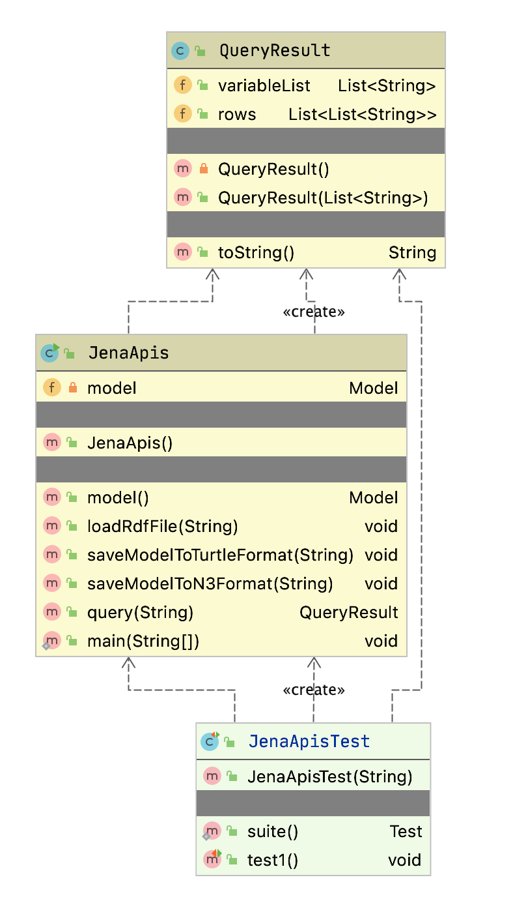
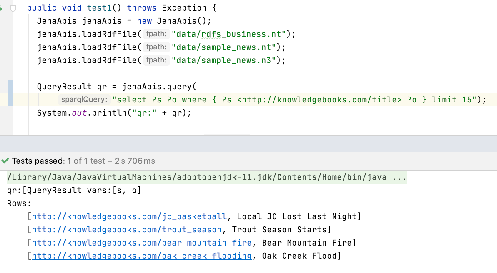

# Semantic Web {#semantic-web}

We will start with a tutorial on semantic web data standards like RDF, RDFS, and OWL, then implement a wrapper for the Apache Jena library, and finally take a deeper dive into some examples. You will learn how to do the following:

- Understand RDF data formats.
- Understand SPARQL queries for RDF data stores (both local and remote).
- Use the Apache Jena library to use local RDF data and perform SPARQL queries that return pure Java data structures.
- Use the Apache Jena library to query remote SPARQL endpoints like DBPedia and WikiData.
- Use the Apache Derby relational database to cache SPARQL remote queries for both efficiency and for building systems that may have intermittent access to the Internet.
- Take a deeper dive into RDF, RDFS, and OWL reasoners.

The semantic web is intended to provide a massive linked set of data for use by software systems just as the World Wide Web provides a massive collection of linked web pages for human reading and browsing. The semantic web is like the web in that anyone can generate any content that they want. This freedom to publish anything works for the web because we use our ability to understand natural language to interpret what we read – and often to dismiss material that based upon our own knowledge we consider to be incorrect.

Semantic web and linked data technologies are also useful for smaller amounts of data, an example being a Knowledge Graph containing information for a business. We will further explore Knowledge Graphs in the next two chapters.

The core concept for the semantic web is data integration and use from different sources. As we will soon see, the tools for implementing the semantic web are designed for encoding data and sharing data from many different sources.

I cover the semantic web in this book because I believe that semantic web technologies are complementary to AI systems for gathering and processing data on the web. As more web pages are generated by applications (as opposed to simply showing static HTML files) it becomes easier to produce both HTML for human readers and semantic data for software agents.

There are several very good semantic web toolkits for the Java language and platform. Here we use Apache Jena because it is what I often use in my own work and I believe that it is a good starting technology for your first experiments with semantic web technologies. This chapter provides an incomplete coverage of semantic web technologies and is intended as a gentle introduction to a few useful techniques and how to implement those techniques in Java. This chapter is the start of a journey in the technology that I think is as important as technologies like deep learning that get more public mindshare.

The following figure shows a layered hierarchy of data models that are used to implement semantic web applications. To design and implement these applications we need to think in terms of physical models (storage and access of RDF, RDFS, and perhaps OWL data), logical models (how we use RDF and RDFS to define relationships between data represented as unique URIs and string literals and how we logically combine data from different sources) and conceptual modeling (higher level knowledge representation and reasoning using OWL). Originally RDF data was serialized as XML data but other formats have become much more popular because they are easier to read and manually create. The top three layers in the figure might be represented as XML, or as LD-JSON (linked data JSON) or formats like N-Triples and N3 that we will use later.

{#semantic-web-data-models}

This chapter is meant to get you interested in this technology but is not intended as a complete guide. RDF data is the bedrock of the semantic web. I am also lightly covering RDFS/OWL modeling, and Descriptive Logic Reasoners which are important topics for more advanced semantic web projects.

## Available Tools

In the previous edition of this book I used the open source Sesame library for the material on RDF. Sesame is now called RDF4J and is part of the Eclipse organization's projects.

I decided to use the Apache Jena project in this new edition because I think Jena is slightly easier to set up a light weight development environment. If you need to set up an RDF server I recommend using the [Fuseki](https://jena.apache.org/documentation/fuseki2/) server which is part of the Apache Jena project. For client applications we will use the Jena library for working with RDF and performing SPARQL queries using the example classss **JenaApis** that we implement later and also for querying remote SPARQL endpoints (i.e., public RDF data sources with SPARQL query interfaces) like DBPedia and WikiData.

## Relational Database Model Has Problems Dealing with Rapidly Changing Data Requirements  {#rdms-problems}

When people are first introduced to semantic web technologies their first reaction is often something like, “I can just do that with a database.” The relational database model is an efficient way to express and work with slowly changing data schemas. There are some clever tools for dealing with data change requirements in the database world (ActiveRecord and migrations being a good example) but it is awkward to have end users and even developers tagging on new data attributes to relational database tables.

This same limitation also applies to object oriented programming and object modeling. Even with dynamic languages that facilitate modifying classes at runtime, the options for adding attributes to existing models are just too limiting. The same argument can be made against the use of XML constrained by conformance to either DTDs or XML Schemas. It is true that RDF and RDFS can be serialized to XML using many pre existing XML namespaces for different knowledge sources and schemas but it turns out that this is done in a way that does not reduce the flexibility for extending data models. XML storage is really only a serialization of RDF and many developers who are just starting to use semantic web technologies initially get confused trying to read XML serialization of RDF – almost like trying to read a PDF file with a plain text editor and something to be avoided. We will use the N-Triple and N3 formats that are simpler to read and understand.

One goal for the rest of this chapter is convincing you that modeling data with RDF and RDFS facilitates freely extending data models and also allows fairly easy integration of data from different sources using different schemas without explicitly converting data from one schema to another for reuse. You are free to add new data properties and add information to existing graphs (which we refer to a *models*).

## RDF: The Universal Data Format

The Resource Description Framework (RDF) is used to encode information and the RDF Schema (RDFS) facilitates using data with different RDF encodings without the need to convert one set of schemas to another. Later, using OWL we can simply declare that one predicate is the same as another, that is, one predicate is a sub-predicate of another (e.g., a property **containsCity** can be declared to be a sub-property of **containsPlace** so if something contains a city then it also contains a place), etc. The predicate part of an RDF statement often refers to a property.

RDF data was originally encoded as XML and intended for automated processing. In this chapter we will use two simple to read formats called "N-Triples" and "N3." Apache Jena can be used to convert between all RDF formats so we might as well use formats that are easier to read and understand. RDF data consists of a set of triple values:

-   subject
-   predicate
-   object

Some of my work with semantic web technologies deals with processing news stories, extracting semantic information from the text, and storing it in RDF. I will use this application domain for the examples in this chapter and the next chapter when we implement code to automatically generate RDF for Knowledge Graphs. I deal with triples like:

-   subject: a URL (or URI) of a news article.
-   predicate: a relation like "containsPerson".
-   object: a literal value like "Bill Clinton" or a URI representing Bill Clinton.

In the next chapter we will use the entity recognition library we developed in an earlier chapter to create RDF from text input.

We will use either URIs or string literals as values for objects. We will always use URIs for representing subjects and predicates. In any case URIs are usually preferred to string literals. We will see an example of this preferred use but first we need to learn the N-Triple and N3 RDF formats.

I proposed the idea that RDF was more flexible than Object Modeling in programming languages, relational databases, and XML with schemas. If we can tag new attributes on the fly to existing data, how do we prevent what I might call “data chaos” as we modify existing data sources? It turns out that the solution to this problem is also the solution for encoding real semantics (or meaning) with data: we usually use unique URIs for RDF subjects, predicates, and objects, and usually with a preference for not using string literals. The definitions of predicates are tied to a namespace and later with OWL we will state the equivalence of predicates in different namespaces with the same semantic meaning. I will try to make this idea more clear with some examples and [Wikipedia has a good writeup on RDF](https://en.wikipedia.org/wiki/Resource_Description_Framework).

Any part of a triple (subject, predicate, or object) is either a URI or a string literal. URIs encode namespaces. For example, the containsPerson predicate in the last example could be written as:

{lang="sparql",linenos=off}
~~~~~~~~
http://knowledgebooks.com/ontology/#containsPerson
~~~~~~~~

The first part of this URI is considered to be the namespace for this predicate “containsPerson.” When different RDF triples use this same predicate, this is some assurance to us that all users of this predicate understand to the same meaning. Furthermore, we will see later that we can use RDFS to state equivalency between this predicate (in the namespace http://knowledgebooks.com/ontology/) with predicates represented by different URIs used in other data sources. In an “artificial intelligence” sense, software that we write does not understand predicates like "containsCity",  "containsPerson", or "isLocation" in the way that a human reader can by combining understood common meanings for the words "contains", "city", "is", "person", and "location" but for many interesting and useful types of applications that is fine as long as the predicate is used consistently. We will see shortly that we can define abbreviation prefixes for namespaces which makes RDF and RDFS files shorter and easier to read.

The Jena library supports most serialization formats for RDF:

- Turtle
- N3
- N-Triples
- NQuads
- TriG
- JSON-LD
- RDF/XML
- RDF/JSON
- TriX
- RDF Binary

A statement in N-Triple format consists of three URIs (two URIs and a string literals for the object) followed by a period to end the statement. While statements are often written one per line in a source file they can be broken across lines; it is the ending period which marks the end of a statement. The standard file extension for N-Triple format files is \*.nt and the standard format for N3 format files is \*.n3.

My preference is to use N-Triple format files as output from programs that I write to save data as RDF. N-Triple files don't use any abbreviations and each RDF statement is self-contained. I often use tools like the command line commands in Jena or RDF4J to convert N-Triple files to N3 or other formats if I will be reading them or even hand editing them. Here is an example using the N3 syntax:

{lang="sparql",linenos=off}
~~~~~~~~
@prefix kb:  <http://knowledgebooks.com/ontology#>

<http://news.com/201234/> kb:containsCountry "China" .
~~~~~~~~

The N3 format adds prefixes (abbreviations) to the N-Triple format. In practice it would be better to use the URI **<http://dbpedia.org/resource/China>** instead of the literal value "China."

Here we see the use of an abbreviation prefix “kb:” for the namespace for my company KnowledgeBooks.com ontologies. The first term in the RDF statement (the subject) is the URI of a news article. The second term (the predicate) is “containsCountry” in the “kb:” namespace. The last item in the statement (the object) is a string literal “China.” I would describe this RDF statement in English as, “The news article at URI http://news.com/201234 mentions the country China.”

This was a very simple N3 example which we will expand to show additional features of the N3 notation. As another example, let's look at the case if this news article also mentions the USA. Instead of adding a whole new statement like this we can combine them using N3 notation. Here we have two separate RDF statements:

{lang="sparql",linenos=off}
~~~~~~~~
@prefix kb:  <http://knowledgebooks.com/ontology#> .

<http://news.com/201234/>
  kb:containsCountry
  <http://dbpedia.org/resource/China>  .
  
<http://news.com/201234/>
  kb:containsCountry
  <http://dbpedia.org/resource/United_States>  .
~~~~~~~~

We can collapse multiple RDF statements that share the same subject and optionally the same predicate:

{lang="sparql",linenos=off}
~~~~~~~~
@prefix kb:  <http://knowledgebooks.com/ontology#> .

<http://news.com/201234/>
  kb:containsCountry
    <http://dbpedia.org/resource/China> ,
    <http://dbpedia.org/resource/United_States>  .
~~~~~~~~

The indentation and placement on separate lines is arbitrary - use whatever style you like that is readable. We can also add in additional predicates that use the same subject (I am going to use string literals here instead of URIs for objects to make the following example more concise but in practice prefer using URIs):

{lang="sparql",linenos=off}
~~~~~~~~
@prefix kb:  <http://knowledgebooks.com/ontology#> .

<http://news.com/201234/>
        kb:containsCountry "China" ,
                           "USA" .
        kb:containsOrganization "United Nations" ;
        kb:containsPerson "Ban Ki-moon" , "Gordon Brown" ,
                          "Hu Jintao" , "George W. Bush" ,
                          "Pervez Musharraf" ,
                          "Vladimir Putin" , 
                          "Mahmoud Ahmadinejad" .
~~~~~~~~

This single N3 statement represents ten individual RDF triples. Each section defining triples with the same subject and predicate have objects separated by commas and ending with a period. Please note that whatever RDF storage system you use (we will be using Jena) it makes no difference if we load RDF as XML, N-Triple, of N3 format files: internally subject, predicate, and object triples are stored in the same way and are used in the same way. RDF triples in a data store represent directed graphs that may not all be connected.

I promised you that the data in RDF data stores was easy to extend. As an example, let us assume that we have written software that is able to read online news articles and create RDF data that captures some of the semantics in the articles. If we extend our program to also recognize dates when the articles are published, we can simply reprocess articles and for each article add a triple to our RDF data store using a form like:

{lang="sparql",linenos=off}
~~~~~~~~
@prefix kb:  <http://knowledgebooks.com/ontology#> .

<http://news.com/201234/> kb:datePublished "2008-05-11" .
~~~~~~~~

Here we just represent the date as a string. We can add a type to the object representing a specific date:

{lang="sparql",linenos=off}
~~~~~~~~
@prefix xsd: <http://www.w3.org/2001/XMLSchema#> .
@prefix kb:  <http://knowledgebooks.com/ontology#> .
 
 <http://news.com/201234/> kb:datePublished "2008-05-11"^^xsd:date .
~~~~~~~~

Furthermore, if we do not have dates for all news articles that is often acceptable because when constructing SPARQL queries you can match optional patterns. If for example you are looking up articles on a specific subject then some results may have a publication date attached to the results for that article and some might not. In practice RDF supports types and we would use a date type as seen in the last example, not a string. However, in designing the example programs for this chapter I decided to simplify our representation of URIs and often use string literals as simple Java strings. For many applications this isn't a real limitation.

## Extending RDF with RDF Schema {#rdfs}

RDF Schema (RDFS) supports the definition of classes and properties based on set inclusion. In RDFS classes and properties are orthogonal. Let's start with looking at an example using additional namespaces:

{lang="sparql",linenos=off}
~~~~~~~~
@prefix kb:  <http://knowledgebooks.com/ontology#> .
@prefix rdf: <http://www.w3.org/1999/02/22-rdf-syntax-ns#>
@prefix rdfs:   <http://www.w3.org/2000/01/rdf-schema#>
@prefix dbo: <http://dbpedia.org/ontology/>

<http://news.com/201234/>
  kb:containsCountry
  <http://dbpedia.org/resource/China>  .
  
<http://news.com/201234/>
  kb:containsCountry
  <http://dbpedia.org/resource/United_States>  .
  
<http://dbpedia.org/resource/China>
  rdfs:label "China"@en,
  rdf:type dbo:Place ,
  rdf:type dbo:Country .
~~~~~~~~

Because the semantic web is intended to be processed automatically by software systems it is encoded as RDF. There is a problem that must be solved in implementing and using the semantic web: everyone who publishes semantic web data is free to create their own RDF schemas for storing data; for example, there is usually no single standard RDF schema definition for topics like news stories and stock market data. The [SKOS](https://www.w3.org/2009/08/skos-reference/skos.html) is a namespace containing standard schemas and the most widely used standard is [schema.org](https://schema.org/docs/schemas.html). Understanding the ways of integrating different data sources using different schemas helps to understand the design decisions behind the semantic web applications. In this chapter I often use my own schemas in the knowledgebooks.com namespace for the simple examples you see here. When you build your own production systems part of the work is searching through **schema.org** and **SKOS** to use standard name spaces and schemas when possible. The use of standard schemas helps when you link internal proprietary Knowledge Graphs used in organization with public open data from sources like [WikiData](https://www.wikidata.org/wiki/Wikidata:Main_Page) and [DBPedia](https://wiki.dbpedia.org/about).

We will start with an example that is an extension of the example in the last section that also uses RDFS. We add a few additional RDF statements:

{lang="sparql",linenos=off}
~~~~~~~~
@prefix kb:  <http://knowledgebooks.com/ontology#> .
@prefix rdfs:  <http://www.w3.org/2000/01/rdf-schema#> .

kb:containsCity rdfs:subPropertyOf kb:containsPlace .
kb:containsCountry rdfs:subPropertyOf kb:containsPlace .
kb:containsState rdfs:subPropertyOf kb:containsPlace .
~~~~~~~~

The last three lines declare that:

-   The property containsCity is a sub-property of containsPlace.
-   The property containsCountry is a sub-property of containsPlace.
-   The property containsState is a sub-property of containsPlace.

Why is this useful? For at least two reasons:

-   You can query an RDF data store for all triples that use property containsPlace and also match triples with properties equal to containsCity, containsCountry, or containsState. There may not even be any triples that explicitly use the property containsPlace.
-   Consider a hypothetical case where you are using two different RDF data stores that use different properties for naming cities: **cityName** and **city**. You can define **cityName** to be a sub-property of **city** and then write all queries against the single property name **city**. This removes the necessity to convert data from different sources to use the same Schema. You can also use OWL to state property and class equivalency.

In addition to providing a vocabulary for describing properties and class membership by properties, RDFS is also used for logical inference to infer new triples, combine data from different RDF data sources, and to allow effective querying of RDF data stores. We will see examples of all of these features of RDFS when we later start using the Jena libraries to perform SPARQL queries.

## The SPARQL Query Language

SPARQL is a query language used to query RDF data stores. While SPARQL may initially look like SQL, we will see that there are some important differences like support for RDFS and OWL inferencing and graph-based instead of relational matching operations. We will cover the basics of SPARQL in this section and then see more examples later when we learn how to embed Jena in Java applications, and see more examples in the last chapter [Knowledge Graph Navigator](#kgn).

We will use the N3 format RDF file test\_data/news.n3 for the examples. I created this file automatically by spidering Reuters news stories on the news.yahoo.com web site and automatically extracting named entities from the text of the articles. We saw techniques for extracting named entities from text in earlier chapters. In this chapter we use these sample RDF files.

You have already seen snippets of this file and I list the entire file here for reference, edited to fit line width: you may find the file news.n3 easier to read if you are at your computer and open the file in a text editor so you will not be limited to what fits on a book page:

{lang="sparql",linenos=off}
~~~~~~~~
@prefix kb:  <http://knowledgebooks.com/ontology#> .
@prefix rdfs:  <http://www.w3.org/2000/01/rdf-schema#> .

kb:containsCity rdfs:subPropertyOf kb:containsPlace .

kb:containsCountry rdfs:subPropertyOf kb:containsPlace .

kb:containsState rdfs:subPropertyOf kb:containsPlace .

<http://yahoo.com/20080616/usa_flooding_dc_16/>
        kb:containsCity "Burlington" , "Denver" ,
                        "St. Paul" ," Chicago" ,
                        "Quincy" , "CHICAGO" ,
                        "Iowa City" ;
        kb:containsRegion "U.S. Midwest" , "Midwest" ;
        kb:containsCountry "United States" , "Japan" ;
        kb:containsState "Minnesota" , "Illinois" , 
                         "Mississippi" , "Iowa" ;
        kb:containsOrganization "National Guard" ,
                         "U.S. Department of Agriculture" ,
                         "White House" ,
                         "Chicago Board of Trade" ,
                         "Department of Transportation" ;
        kb:containsPerson "Dena Gray-Fisher" ,
                          "Donald Miller" ,
                          "Glenn Hollander" ,
                          "Rich Feltes" ,
                          "George W. Bush" ;
        kb:containsIndustryTerm "food inflation" , "food" ,
                                "finance ministers" ,
                                "oil" .

<http://yahoo.com/78325/ts_nm/usa_politics_dc_2/>
        kb:containsCity "Washington" , "Baghdad" ,
                        "Arlington" , "Flint" ;
        kb:containsCountry "United States" ,
                           "Afghanistan" ,
                           "Iraq" ;
        kb:containsState "Illinois" , "Virginia" ,
                         "Arizona" , "Michigan" ;
        kb:containsOrganization "White House" ,
                                "Obama administration" ,
                                "Iraqi government" ;
        kb:containsPerson "David Petraeus" ,
                          "John McCain" ,
                          "Hoshiyar Zebari" ,
                          "Barack Obama" ,
                          "George W. Bush" ,
                          "Carly Fiorina" ;
        kb:containsIndustryTerm "oil prices" .

<http://yahoo.com/10944/ts_nm/worldleaders_dc_1/>
        kb:containsCity "WASHINGTON" ;
        kb:containsCountry "United States" , "Pakistan" ,
                           "Islamic Republic of Iran" ;
        kb:containsState "Maryland" ;
        kb:containsOrganization "University of Maryland" ,
                                "United Nations" ;
        kb:containsPerson "Ban Ki-moon" , "Gordon Brown" ,
                          "Hu Jintao" , "George W. Bush" ,
                          "Pervez Musharraf" ,
                          "Vladimir Putin" ,
                          "Steven Kull" ,
                          "Mahmoud Ahmadinejad" .

<http://yahoo.com/10622/global_economy_dc_4/>
        kb:containsCity "Sao Paulo" , "Kuala Lumpur" ;
        kb:containsRegion "Midwest" ;
        kb:containsCountry "United States" , "Britain" ,
                           "Saudi Arabia" , "Spain" ,
                           "Italy" , India" , 
                           ""France" , "Canada" ,
                           "Russia" , "Germany" , "China" ,
                           "Japan" , "South Korea" ;
        kb:containsOrganization "Federal Reserve Bank" ,
                                "European Union" ,
                                "European Central Bank" ,
                                "European Commission" ;
        kb:containsPerson "Lee Myung-bak" , "Rajat Nag" ,
                          "Luiz Inacio Lula da Silva" ,
                          "Jeffrey Lacker" ;
        kb:containsCompany "Development Bank Managing" ,
                           "Reuters" ,
                           "Richmond Federal Reserve Bank" ;
        kb:containsIndustryTerm "central bank" , "food" ,
                                "energy costs" ,
                                "finance ministers" ,
                                "crude oil prices" ,
                                "oil prices" ,
                                "oil shock" ,
                                "food prices" ,
                                "Finance ministers" ,
                                "Oil prices" , "oil" .
~~~~~~~~

In the following examples, we will use the main method in the class **JenaApi** (developed in the next section) that allows us to load multiple RDF input files and then to interactively enter SPARQL queries.

We will start with a simple SPARQL query for subjects (news article URLs) and objects (matching countries) with the value for the predicate equal to **containsCountry**. Variables in queries start with a question mark character and can have any names:

{lang="sparql",linenos=off}
~~~~~~~~
SELECT ?subject ?object
      WHERE {
        ?subject
        <http://knowledgebooks.com/ontology#containsCountry>
        ?object .
}
~~~~~~~~

It is important for you to understand what is happening when we apply the last SPARQL query to our sample data. Conceptually, all the triples in the sample data are scanned, keeping the ones where the predicate part of a triple is equal to **<http://knowledgebooks.com/ontology#containsCountry>**. In practice RDF data stores supporting SPARQL queries index RDF data so a complete scan of the sample data is not required. This is analogous to relational databases where indices are created to avoid needing to perform complete scans of database tables.

In practice, when you are exploring a Knowledge Graph like DBPedia or WikiData (that are just very large collections of RDF triples), you might run a query and discover a useful or interesting entity URI in the triple store, then drill down to find out more about the entity. In a later chapter [Knowledge Graph Navigator](#kgn) we attempt to automate this exploration process using the DBPedia data as a Knowledge Graph.

We will be using the same code to access the small example of RDF statements in our sample data as we will for accessing DBPedia or WikiData.

We can make this last query easier to read and reduce the chance of misspelling errors by using a namespace prefix:

{lang="sparql",linenos=off}
~~~~~~~~
PREFIX kb:  <http://knowledgebooks.com/ontology#>
SELECT ?subject ?object
  WHERE {
      ?subject kb:containsCountry ?object .
  }
~~~~~~~~

**Using the command line option in the Jena wrapper example**

We will later implement the Java class **JenaApis**. You can run the method **main** in the Java class **JenaApis** using the following to load RDF input files and interactively make SPARQL queries against the RDF data in the input files:

{lang="bash",linenos=on}
~~~~~~~~
$ mvn exec:java -Dexec.mainClass="com.markwatson.semanticweb.JenaApis" \
               -Dexec.args="data/news.n3 data/sample_news.nt"
~~~~~~~~

The command line argument in line 3 starting with **-Dexec.args=** is one way to pass command line arguments to the method **main**. The backslash character at the end of line 2 is the way to continue a long command line request in bash or zsh.

Here is an interactive example of the last SPARQL example:

{lang="bash",linenos=off}
~~~~~~~~
$ mvn exec:java -Dexec.mainClass="com.markwatson.semanticweb.JenaApis" \
               -Dexec.args="data/news.n3"

Multi-line queries are OK but don't use blank lines.
Enter a blank line to process query.
Enter a SPARQL query:
PREFIX kb:  <http://knowledgebooks.com/ontology#>
SELECT ?subject ?object
  WHERE {
      ?subject kb:containsCountry ?object .
  }

[QueryResult vars:[subject, object]
Rows:
	[http://news.yahoo.com/s/nm/20080616/bs_nm/global_economy_dc_4/, Russia]
	[http://news.yahoo.com/s/nm/20080616/ts_nm/usa_flooding_dc_16/, Japan]
	[http://news.yahoo.com/s/nm/20080616/bs_nm/global_economy_dc_4/, India]
	[http://news.yahoo.com/s/nm/20080616/ts_nm/worldleaders_trust_dc_1/, United States]
	[http://news.yahoo.com/s/nm/20080616/ts_nm/usa_politics_dc_2/, Afghanistan]
	[http://news.yahoo.com/s/nm/20080616/bs_nm/global_economy_dc_4/, Saudi Arabia]
	[http://news.yahoo.com/s/nm/20080616/bs_nm/global_economy_dc_4/, United States]
	[http://news.yahoo.com/s/nm/20080616/bs_nm/global_economy_dc_4/, France]
	[http://news.yahoo.com/s/nm/20080616/ts_nm/usa_politics_dc_2/, Iraq]
	[http://news.yahoo.com/s/nm/20080616/ts_nm/worldleaders_trust_dc_1/, Pakistan]
	[http://news.yahoo.com/s/nm/20080616/bs_nm/global_economy_dc_4/, Spain]
	[http://news.yahoo.com/s/nm/20080616/bs_nm/global_economy_dc_4/, Italy]
	[http://news.yahoo.com/s/nm/20080616/ts_nm/worldleaders_trust_dc_1/,
	 Islamic Republic of Iran]
	[http://news.yahoo.com/s/nm/20080616/bs_nm/global_economy_dc_4/, Canada]
	[http://news.yahoo.com/s/nm/20080616/bs_nm/global_economy_dc_4/, Britain]
	[http://news.yahoo.com/s/nm/20080616/ts_nm/usa_politics_dc_2/, United States]
	[http://news.yahoo.com/s/nm/20080616/bs_nm/global_economy_dc_4/, South Korea]
	[http://news.yahoo.com/s/nm/20080616/bs_nm/global_economy_dc_4/, Germany]
	[http://news.yahoo.com/s/nm/20080616/ts_nm/usa_flooding_dc_16/, United States]
	[http://news.yahoo.com/s/nm/20080616/bs_nm/global_economy_dc_4/, China]
	[http://news.yahoo.com/s/nm/20080616/bs_nm/global_economy_dc_4/, Japan]

Enter a SPARQL query:
~~~~~~~~

We could have filtered on any other predicate, for instance **containsPlace**. Here is another example using a match against a string literal to find all articles exactly matching the text “Maryland.”

{lang="sparql",linenos=off}
~~~~~~~~
PREFIX kb:  <http://knowledgebooks.com/ontology#>
SELECT ?subject WHERE { ?subject kb:containsState "Maryland" . }
~~~~~~~~

The output is:

{lang="bash",linenos=off}
~~~~~~~~
Enter a SPARQL query:
PREFIX kb:  <http://knowledgebooks.com/ontology#>
SELECT ?subject WHERE { ?subject kb:containsState "Maryland" . }

[QueryResult vars:[subject]
Rows:
	[http://news.yahoo.com/s/nm/20080616/ts_nm/worldleaders_trust_dc_1/]
~~~~~~~~

We can also match partial string literals against regular expressions:

{lang="sparql",linenos=off}
~~~~~~~~
PREFIX kb: <http://knowledgebooks.com/ontology#>
SELECT ?subject ?object
       WHERE {
         ?subject
         kb:containsOrganization
         ?object FILTER regex(?object, "University") .
       }
~~~~~~~~

The output is:

{lang="bash",linenos=off}
~~~~~~~~
Enter a SPARQL query:
PREFIX kb: <http://knowledgebooks.com/ontology#>
SELECT ?subject ?object
       WHERE {
         ?subject
         kb:containsOrganization
         ?object FILTER regex(?object, "University") .
       }

[QueryResult vars:[subject, object]
Rows:
	[http://news.yahoo.com/s/nm/20080616/ts_nm/worldleaders_trust_dc_1/, 
	 University of Maryland]
~~~~~~~~

Prior to this last example query we only requested that the query return values for subject and predicate for triples that matched the query.
However, we might want to return all triples whose subject (in this case a news article URI) is in one of the matched triples. Note that there are two matching triples, each terminated with a period:

{lang="sparql",linenos=off}
~~~~~~~~
PREFIX kb: <http://knowledgebooks.com/ontology#>
SELECT DISTINCT ?subject ?a_predicate ?an_object
 WHERE {
    ?subject kb:containsOrganization ?object FILTER regex(?object,"University") .
    ?subject ?a_predicate ?an_object .
}
ORDER BY ?a_predicate ?an_object
LIMIT 10
OFFSET 5
~~~~~~~~

When WHERE clauses contain more than one triple pattern to match, this is equivalent to a Boolean “and” operation. The DISTINCT clause removes duplicate results. The ORDER BY clause sorts the output in alphabetical order: in this case first by predicate (containsCity, containsCountry, etc.) and then by object. The LIMIT modifier limits the number of results returned and the OFFSET modifier sets the number of matching results to skip.

The output is:

{lang="bash",linenos=off}
~~~~~~~~
Enter a SPARQL query:
PREFIX kb: <http://knowledgebooks.com/ontology#>
SELECT DISTINCT ?subject ?a_predicate ?an_object
 WHERE {
    ?subject kb:containsOrganization ?object FILTER regex(?object,"University") .
    ?subject ?a_predicate ?an_object .
}
ORDER BY ?a_predicate ?an_object
LIMIT 10
OFFSET 5

[QueryResult vars:[subject, a_predicate, an_object]
Rows:
	[http://news.yahoo.com/s/nm/20080616/ts_nm/worldleaders_trust_dc_1/,
	 http://knowledgebooks.com/ontology#containsOrganization,
	  University of Maryland]
	[http://news.yahoo.com/s/nm/20080616/ts_nm/worldleaders_trust_dc_1/,
	 http://knowledgebooks.com/ontology#containsPerson, Ban Ki-moon]
	[http://news.yahoo.com/s/nm/20080616/ts_nm/worldleaders_trust_dc_1/,
	 http://knowledgebooks.com/ontology#containsPerson, George W. Bush]
	[http://news.yahoo.com/s/nm/20080616/ts_nm/worldleaders_trust_dc_1/,
	 http://knowledgebooks.com/ontology#containsPerson, Gordon Brown]
	[http://news.yahoo.com/s/nm/20080616/ts_nm/worldleaders_trust_dc_1/,
	 http://knowledgebooks.com/ontology#containsPerson, Hu Jintao]
	[http://news.yahoo.com/s/nm/20080616/ts_nm/worldleaders_trust_dc_1/,
	 http://knowledgebooks.com/ontology#containsPerson, Mahmoud Ahmadinejad]
	[http://news.yahoo.com/s/nm/20080616/ts_nm/worldleaders_trust_dc_1/,
	 http://knowledgebooks.com/ontology#containsPerson, Pervez Musharraf]
	[http://news.yahoo.com/s/nm/20080616/ts_nm/worldleaders_trust_dc_1/,
	 http://knowledgebooks.com/ontology#containsPerson, Steven Kull]
	[http://news.yahoo.com/s/nm/20080616/ts_nm/worldleaders_trust_dc_1/,
	 http://knowledgebooks.com/ontology#containsPerson, Vladimir Putin]
	[http://news.yahoo.com/s/nm/20080616/ts_nm/worldleaders_trust_dc_1/,
	 http://knowledgebooks.com/ontology#containsState, Maryland]
~~~~~~~~

We are finished with our quick tutorial on using the SELECT query form. There are three other query forms that I am not covering in this chapter:

-   [CONSTRUCT](https://www.w3.org/TR/rdf-sparql-query/#construct) – returns a new RDF graph of query results
-   [ASK](https://www.w3.org/TR/rdf-sparql-query/#ask) – returns Boolean true or false indicating if a query matches
    any triples
-   [DESCRIBE](https://www.w3.org/TR/rdf-sparql-query/#describe) – returns a new RDF graph containing matched resources

A common matching pattern that I don't cover in this chapter is [optional](https://www.w3.org/TR/rdf-sparql-query/#optionals) but the **optional** matching pattern is used in the examples in the later chapter [Knowledge Graph Navigator](#kgn).

## Using Jena

Apache Jena is a complete Java library for developing RDF/RDFS/OWL applications and we will use it in this chapter. Other available libraries that we don't use here include RDF4J (used to be Sesame), OWLAPI, AllegroGraph, Protege library, etc.

The following figure shows a UML diagram for the wrapper classes and interface that I wrote for Jena to make it easier for you to get started. My wrapper uses an in-memory RDF repository that supports inference, loading RDF/RDFS/OWL files, and performing both local and remote SPARQL queries. If you decide to use semantic web technologies in your development you will eventually want to use the full Jena APIs for programmatically creating new RDF triples, finer control of the type of repository (options are in-memory, disk based, and database), [type definitions](https://www.w3.org/TR/swbp-xsch-datatypes/) and inferencing, and programmatically using query results. That said, using my wrapper library is a good place for you to start experimenting.

Referring to the following figure, the class constructor **JenaApis** opens a new in-memory RDF triple store and supplies the public APIs we will use later. The data class **QueryResults** has public class variables for variable names used in a query and a list or rows, one row for each query result. The class **Cache** is used internally to cache SPARQL query results for later to improve performance and use without having online access a remote SPARQL endpoint like DBPedia or WikiData.

We will look in some detail at the code in this UML Class Diagram. To improve portability to alternative RDF libraries, I wrote two wrapper classes for Jena, one class to represent query results and the other to wrap the Jena APIs that I use.

The following screen shot shows the free IntelliJ Community Edition IDE used to edit one of the unit tests and run it:

We will now look at the Java implementation of the examples for this chapter.

### Java Wrapper for Jena APIs and an Example

For portability to other RDF and semantic web libraries, when we wrap the Jena APIs we want the results to be in standard Java data classes. The following listing shows the class **QueryResult** that contains the variables used in a SPARQL query and a list or rows containing matched value bindings for these variables:

{lang="java",linenos=off}
~~~~~~~~
package com.markwatson.semanticweb;

import java.io.Serializable;
import java.util.ArrayList;
import java.util.List;

public class QueryResult implements Serializable {
  private QueryResult() { }
  public QueryResult(List<String> variableList) {
    this.variableList = variableList;
  }
  public List<String> variableList;
  public List<List<String>> rows = new ArrayList();
  public String toString() {
    StringBuilder sb = new StringBuilder("[QueryResult vars:" + variableList +
                  "\nRows:\n");
    for (List<String> row : rows) {
      sb.append("\t" + row + "\n");
    }
    return sb.toString();
  }
}
~~~~~~~~

I defined a **toString** method so when you print an instance of the class **QueryResult** you see the contained data.

The following listing shows the wrapper class **JenaApis**:

{lang="java",linenos=on}
~~~~~~~~
package com.markwatson.semanticweb;

import org.apache.commons.lang3.SerializationUtils;
import org.apache.jena.query.*;
import org.apache.jena.rdf.model.*;
import org.apache.jena.riot.RDFDataMgr;
import org.apache.jena.riot.RDFFormat;

import java.io.FileNotFoundException;
import java.io.FileOutputStream;
import java.io.IOException;
import java.sql.Blob;
import java.sql.SQLException;
import java.util.ArrayList;
import java.util.List;
import java.util.Scanner;

public class JenaApis {

  public JenaApis() {
    //model = ModelFactory.createDefaultModel(); // if OWL reasoning not required
    model = ModelFactory.createOntologyModel(); // use OWL reasoner
 }

  public Model model() {
    return model;
  }

  public void loadRdfFile(String fpath) {
    model.read(fpath);
  }

  public void saveModelToTurtleFormat(String outputPath) throws IOException {
    FileOutputStream fos = new FileOutputStream(outputPath);
    RDFDataMgr.write(fos, model, RDFFormat.TRIG_PRETTY);
    fos.close();
  }
  public void saveModelToN3Format(String outputPath) throws IOException {
    FileOutputStream fos = new FileOutputStream(outputPath);
    RDFDataMgr.write(fos, model, RDFFormat.NTRIPLES);
    fos.close();
  }

  public QueryResult query(String sparqlQuery) {
    Query query = QueryFactory.create(sparqlQuery);
    QueryExecution qexec = QueryExecutionFactory.create(query, model);
    ResultSet results = qexec.execSelect();
    QueryResult qr = new QueryResult(results.getResultVars());
    for (; results.hasNext(); ) {
      QuerySolution solution = results.nextSolution();
      List<String> newResultRow = new ArrayList();
      for (String var : qr.variableList) {
        newResultRow.add(solution.get(var).toString());
      }
      qr.rows.add(newResultRow);
    }
    return qr;
  }

  public QueryResult queryRemote(String service, String sparqlQuery)
         throws SQLException, ClassNotFoundException {
    if (cache == null) cache = new Cache();
    byte [] b = cache.fetchResultFromCache(sparqlQuery);
    if (b != null) {
      System.out.println("Found query in cache.");
      QueryResult l = SerializationUtils.deserialize(b);
      return l;
    }
    Query query = QueryFactory.create(sparqlQuery);
    QueryExecution qexec = QueryExecutionFactory.sparqlService(service, sparqlQuery);
    ResultSet results = qexec.execSelect();
    QueryResult qr = new QueryResult(results.getResultVars());
    for (; results.hasNext(); ) {
      QuerySolution solution = results.nextSolution();
      List<String> newResultRow = new ArrayList();
      for (String var : qr.variableList) {
        newResultRow.add(solution.get(var).toString());
      }
      qr.rows.add(newResultRow);
    }
    byte [] b3 = SerializationUtils.serialize(qr);
    cache.saveQueryResultInCache(sparqlQuery, b3);
    return qr;
  }

  private Cache cache = null;
  private Model model;

  public static void main(String[] args) {
    /*
    Execute using, for example:
         mvn exec:java -Dexec.mainClass="com.markwatson.semanticweb.JenaApis" \
              -Dexec.args="data/news.n3"
     */
    JenaApis ja = new JenaApis();
    if (args.length == 0) {
      // no RDF input file names on command line so use a default file:
      ja.loadRdfFile("data/news.n3");
    } else {
      for (String fpath : args) {
        ja.loadRdfFile(fpath);
      }
    }
    System.out.println("Multi-line queries are OK but don't use blank lines.");
    System.out.println("Enter a blank line to process query.");
    while (true) {
      System.out.println("Enter a SPARQL query:");
      Scanner sc = new Scanner(System.in);
      StringBuilder sb = new StringBuilder();
      while (sc.hasNextLine()) {  // process all inputs
        String s = sc.nextLine();
        if (s.equals("quit") || s.equals("QUIT") || 
            s.equals("exit") || s.equals("EXIT"))
          System.exit(0);
        if (s.length() < 1) break;
        sb.append(s);
        sb.append("\n");
      }
      QueryResult qr = ja.query(sb.toString());
      System.out.println(qr);
    }
  }
}
~~~~~~~~

This code is largely self-explanatory. Line 21 or 22 should be commented out, depending on whether you want to enable OWL reasoning. In method **queryRemote** on line 62 we check to see if an instance of **Cache** has been created and if not, create one. The argument **service** for the method **queryRemote** is a SPARQL endpoint (e.g., "https://dbpedia.org/sparql"). The class **QueryResult** implemented **Serializable** so it can be converted and stored in the Derby cache database.

The method **main** implements a command line interface for accepting multiple lines of input. When the user enters a blank line then the previously entered non-blank lines are passed as a SPARQL local query. When run from the command line, you can enter one or more RDF input files to load prior to the SPARQL query loop.

The following class shows the unit test class **JenaApisTest** that provides examples for:

- Create an instance of **JenaApis**.
- Run a SPARQL query against the remote public DBPedia service endpoint.
- Repeat the remote SPARQL query to show query caching using the Apache Derby relational database.
- Load three input data files in N-Triple and N3 format.
- Run a SPARQL query against the RDF data that we just loaded.
- Save the current model as RDF text files in both N-Triple and N3 format.
- Making SPARQL queries that require OWL reasoning.

{lang="java",linenos=off}
~~~~~~~~
package com.markwatson.semanticweb;

import junit.framework.Test;
import junit.framework.TestCase;
import junit.framework.TestSuite;

public class JenaApisTest extends TestCase {
  /**
   * Create the test case
   *
   * @param testName name of the test case
   */
  public JenaApisTest(String testName)
  {
    super( testName );
  }

  /**
   * @return the suite of tests being tested
   */
  public static Test suite()
  {
    return new TestSuite( JenaApisTest.class );
  }

  /**
   * Test that is just for side effect printouts:
   */
  public void test1() throws Exception {
    JenaApis jenaApis = new JenaApis();
    // test remote SPARQL queries against DBPedia SPARQL endpoint
    QueryResult qrRemote = jenaApis.queryRemote(
        "https://dbpedia.org/sparql",
        "select distinct ?s { ?s ?p <http://dbpedia.org/resource/Parks> } LIMIT 10");
    System.out.println("qrRemote:" + qrRemote);
    System.out.println("Repeat query to test caching:");
    qrRemote = jenaApis.queryRemote(
        "https://dbpedia.org/sparql",
        "select distinct ?s { ?s ?p <http://dbpedia.org/resource/Parks> } LIMIT 10");
    System.out.println("qrRemote (hopefully from cache):" + qrRemote);

    jenaApis.loadRdfFile("data/rdfs_business.nt");
    jenaApis.loadRdfFile("data/sample_news.nt");
    jenaApis.loadRdfFile("data/sample_news.n3");

    QueryResult qr = jenaApis.query(
        "select ?s ?o where { ?s <http://knowledgebooks.com/title> ?o } limit 15");
    System.out.println("qr:" + qr);

    jenaApis.saveModelToTurtleFormat("model_save.nt");
    jenaApis.saveModelToN3Format("model_save.n3");
  }

  /**
   * Test that is just for side effect printouts:
   */
  public void testOwlReasoning() throws Exception {
    JenaApis jenaApis = new JenaApis();
    jenaApis.loadRdfFile("data/news.n3");

    QueryResult qr = jenaApis.query(
        "prefix kb:  <http://knowledgebooks.com/ontology#> \n" +
        "select ?s ?o where { ?s kb:containsCity ?o } ");
    System.out.println("qr:" + qr);

    qr = jenaApis.query(
        "prefix kb:  <http://knowledgebooks.com/ontology#> \n" +
            "select ?s ?o where { ?s kb:containsPlace ?o }");
    System.out.println("qr:" + qr);

    qr = jenaApis.query(   // count for each place name
        "prefix kb:  <http://knowledgebooks.com/ontology#> \n" +
            "select ?o (count(*) as ?count) where { ?s kb:containsPlace ?o } " +
            "group by ?o");
    System.out.println("qr:" + qr);
  }
}
~~~~~~~~

To reuse the example code in this section, I recommend that you clone the entire directory **semantic_web_apache_jena** because it is set up for using Maven and and default logging. If you want to use the code in an existing Java project then copy the dependencies from the file **pom.xml** to your project. If you run **mvn install** then you will have a local copy installed on your system and can just install the dependency with Maven group ID **com.markwatson** and artifact **semanticweb**.

## OWL: The Web Ontology Language  {#owl}

We have already seen a few examples of using RDFS to define sub-properties in this chapter. The Web Ontology Language (OWL) extends the expressive power of RDFS. We now look at a few OWL examples and then look at parts of the Java unit test showing three SPARQL queries that use OWL reasoning. The following RDF data stores support at least some level of OWL reasoning:

-   ProtegeOwlApis - compatible with the Protege Ontology editor
-   Pellet - DL reasoner
-   Owlim - OWL DL reasoner compatible with some versions of Sesame
-   Jena - General purpose library
-   OWLAPI - a simpler API using many other libraries
-   Stardog - a commercial OWL and RDF reasoning system and datastore
-   Allegrograph - a commercial RDF+ and RDF reasoning system and datastore

OWL is more expressive than RDFS in that it supports cardinality, richer class relationships, and Descriptive Logic (DL) reasoning. OWL treats the idea of classes very differently than object oriented programming languages like Java and Smalltalk, but similar to the way PowerLoom (see chapter on *Reasoning*) uses concepts (PowerLoom’s rough equivalent to a class). In OWL, instances of a class are referred to as individuals and class membership is determined by a set of properties that allow a DL reasoner to infer class membership of an individual (this is called entailment.)

We saw an example of expressing transitive relationships when we were using PowerLoom in the chapter on *Reasoning* where we defined a PowerLoom rule to express that the relation “contains” is transitive. We will now look at a similar example using OWL.

We have been using the RDF file news.n3 in previous examples and we will layer new examples by adding new triples that represent RDF, RDFS, and OWL. We saw in news.n3 the definition of three triples using **rdfs:subPropertyOf** properties to create a more general kb:containsPlace property:

{lang="sparql",linenos=off}
~~~~~~~~
kb:containsCity rdfs:subPropertyOf kb:containsPlace .
kb:containsCountry rdfs:subPropertyOf kb:containsPlace .
kb:containsState rdfs:subPropertyOf kb:containsPlace .

kb:containsPlace rdf:type owl:transitiveProperty .

kbplace:UnitedStates kb:containsState kbplace:Illinois .
kbplace:Illinois kb:containsCity kbplace:Chicago .
~~~~~~~~

We can also infer that:

{lang="sparql",linenos=off}
~~~~~~~~
kbplace:UnitedStates kb:containsPlace kbplace:Chicago .
~~~~~~~~

We can also model inverse properties in OWL. For example, here we add an inverse property kb:containedIn, adding it to the example in the last listing:

{lang="sparql",linenos=off}
~~~~~~~~
kb:containedIn owl:inverseOf kb:containsPlace .
~~~~~~~~

Given an RDF container that supported extended OWL DL SPARQL queries, we can now execute SPARQL queries matching the property kb:containedIn and “match” triples in the RDF triple store that have never been asserted but are inferred by the OWL reasoner.

OWL DL is a very large subset of full OWL. From reading the chapter on Reasoning and the very light coverage of OWL in this section, you should understand the concept of class membership not by explicitly stating that an object (or individual) is a member of a class, but rather because an individual has properties that can be used to infer class membership.

The World Wide Web Consortium has defined three versions of the OWL language that are in increasing order of complexity: OWL Lite, OWL DL, and OWL Full. OWL DL (supports Description Logic) is the most widely used (and recommended) version of OWL. OWL Full is not computationally decidable since it supports full logic, multiple class inheritance, and other things that probably make it computationally intractable for all but smaller problems.

We will now look at some Java code from the method **testOwlReasoning** in the unit test class **JenaApisTest**.

The following is not affected by using an OWL reasoner because the property **kb:containsCity** occurs directly in the input RDF data:

{lang="java",linenos=off}
~~~~~~~~
    JenaApis jenaApis = new JenaApis();
    jenaApis.loadRdfFile("data/news.n3");

    QueryResult qr = jenaApis.query(
        "prefix kb:  <http://knowledgebooks.com/ontology#> \n" +
        "select ?s ?o where { ?s kb:containsCity ?o } ");
    System.out.println("qr:" + qr);
~~~~~~~~

The following has been edited to keep just a few output lines per result set:

{lang="sparql",linenos=off}
~~~~~~~~
qr:[QueryResult vars:[s, o]
Rows:
	[http://news.yahoo.com/s/nm/20080616/ts_nm/usa_flooding_dc_16/, St. Paul]
	[http://news.yahoo.com/s/nm/20080616/ts_nm/usa_politics_dc_2/, FLINT]
	[http://news.yahoo.com/s/nm/20080616/ts_nm/usa_flooding_dc_16/, CHICAGO]
	
	  ... output removed. note: there were 15 results for query
	  
  	[http://news.yahoo.com/s/nm/20080616/ts_nm/usa_flooding_dc_16/, Quincy]
	[http://news.yahoo.com/s/nm/20080616/ts_nm/usa_flooding_dc_16/, Iowa City]
~~~~~~~~

Here we use a query that is affected by using an OWL reasoner (i.e., if OWL is not enabled there will be no query results):

{lang="java",linenos=off}
~~~~~~~~
    qr = jenaApis.query(
        "prefix kb:  <http://knowledgebooks.com/ontology#> \n" +
            "select ?s ?o where { ?s kb:containsPlace ?o }");
    System.out.println("qr:" + qr);
~~~~~~~~

The code in the GitHub repo for this book is configured to use OWL by default. If you edited lines 21-22 in the file **JenaApis.jav** to disable OWL reasoning then revert your changes and rebuild the project.

The following has been edited to just keep a few output lines per result set:

{lang="sparql",linenos=off}
~~~~~~~~
qr:[QueryResult vars:[s, o]
Rows:
	[http://news.yahoo.com/s/nm/20080616/ts_nm/usa_flooding_dc_16/, St. Paul]
	[http://news.yahoo.com/s/nm/20080616/ts_nm/usa_politics_dc_2/, FLINT]
	[http://news.yahoo.com/s/nm/20080616/ts_nm/usa_flooding_dc_16/, CHICAGO]
	[http://news.yahoo.com/s/nm/20080616/bs_nm/global_economy_dc_4/, Kuala Lumpur]
	
	  ... output removed. note: there were 46 results for query
	  
	global_economy_dc_4/, United States]
	[http://news.yahoo.com/s/nm/20080616/bs_nmglobal_economy_dc_4/, Germany]
	[http://news.yahoo.com/s/nm/20080616/ts_nm/usa_flooding_dc_16/, United States]
~~~~~~~~
	
We now group (aggregate) query results and count the number of times each place name has occurred in the result (this query requires an OWL reasoner):

{lang="java",linenos=off}
~~~~~~~~
    qr = jenaApis.query(   // count for each place name
        "prefix kb:  <http://knowledgebooks.com/ontology#> \n" +
            "select ?o (count(*) as ?count) where { ?s kb:containsPlace ?o } " +
            "group by ?o");
    System.out.println("qr:" + qr);
~~~~~~~~

{lang="sparql",linenos=off}
~~~~~~~~
qr:[QueryResult vars:[o, count]
Rows:
	[Chicago, 1^^http://www.w3.org/2001/XMLSchema#integer]
	[Illinois, 2^^http://www.w3.org/2001/XMLSchema#integer]
	[Arizona, 1^^http://www.w3.org/2001/XMLSchema#integer]
	
	  ... output removed. note: there were 40 results for query
	
	[United States, 4^^http://www.w3.org/2001/XMLSchema#integer]
	[Iowa, 1^^http://www.w3.org/2001/XMLSchema#integer]
	[Japan, 2^^http://www.w3.org/2001/XMLSchema#integer]
	[Spain, 1^^http://www.w3.org/2001/XMLSchema#integer]
~~~~~~~~

Note the type **http://www.w3.org/2001/XMLSchema#integer** using the **^^** notation
for integer values bound to the variable **count**.

## Semantic Web Wrap-up

Writing semantic web applications in Java is a very large topic, worthy of an entire book. I have covered in this chapter what for my work has been the most useful semantic web techniques: storing and querying RDF and RDFS for a specific application and using OWL when required. We will see in the next two chapters the use of RDF when automatically creating Knowledge Graphs from text data and for automatic navigation of Knowledge Graphs.
