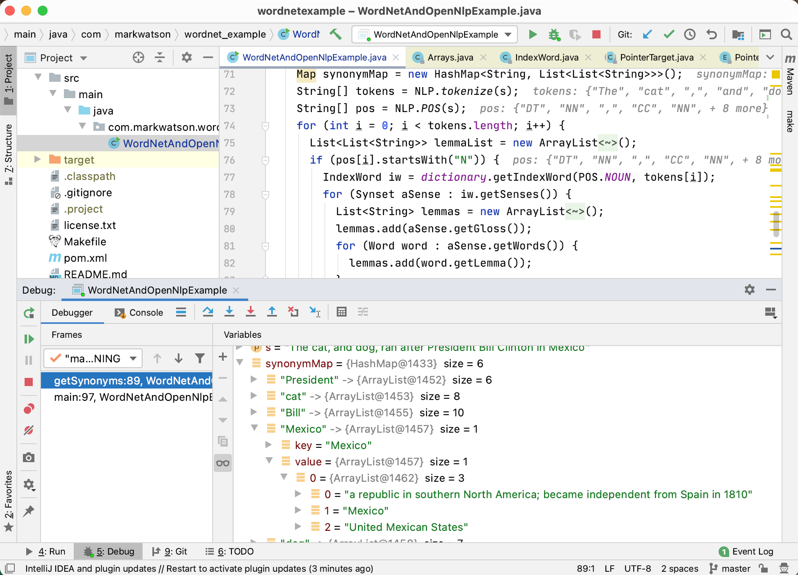

# Combining the WordNet Linguistic Database With OpenNLP

Here we build on the material from the last chapter by using OpenNLP to process input text to identify parts of speech and then looking up words with their parts of speech in WordNet. The WordNet linguistic database is complex and you may want to review the [WordNet documentation] after working through the following example of finding synonyms and hypernyms for nouns in text input.

When you look up words in WordNet you specify one of the following parts of speech (POS):

{lang="java",linenos=off}
~~~~~~~~
    POS.NOUN(1, "n", "noun"),
    POS.VERB(2, "v", "verb"),
    POS.ADJECTIVE(3, "a", "adjective"),
    POS.ADVERB(4, "r", "adverb");
~~~~~~~~

This example could have been written to not use OpenNLP to find nouns and instead try all four parts of speech on every input word. I was motivated to use OpenNLP party because I wanted to provide an example of reusing a library developed in a different chapter, in this case the previous chapter on OpenNLP.

What are hypernyms?  A hypernym is in a semantic type-of relationship with another word that is more general. As an example, the word "country" is a hypernym of the word "Mexico." The opposite of hypernym is a hyponym, that is a hyponym has a more narrow meaning. "Country" is a hyponym of the word "Mexico."

While the following example is simple, we only lookup WordNet entries for nouns and for nouns we only look at hypernyms and synonyms, in the chapter wrap-up I will give you some ideas for more extended projects that you may want to do using WordNet.

Before diving into the code I want to show you what the generated synonym and hypernym data look like.

The following two figures show the generated structured output data in a IntelliJ Community Edition debug session:

## Installing the Libraries and Linguistic Data for this Example

The maven **pom.xml** configuration file for this project contains the following requirements:

{linenos=off}
~~~~~~~~
        <dependency>
            <groupId>net.sf.extjwnl</groupId>
            <artifactId>extjwnl</artifactId>
            <version>2.0.2</version>
        </dependency>
        <!-- Princeton WordNet 3.1 data dependency -->
        <dependency>
            <groupId>net.sf.extjwnl</groupId>
            <artifactId>extjwnl-data-wn31</artifactId>
            <version>1.2</version>
        </dependency>
~~~~~~~~

The second dependency loads the WordNet linguistic database. As an alternative, you can remove the **extjwnl-data-wn31** dependency from the project **pom.xml** file and use the **Makefile** to download a local copy of the data.

I assume that you have performed a maven install for the project in the last chapter:

{linenos=off}
~~~~~~~~
    cd ~/javaai-new-code/opennlp
    mvn install -DskipTests
~~~~~~~~

We also need the OpenNLP library and my OpenNLP wrapper library developed in the last chapter:

{linenos=off}
~~~~~~~~
        <dependency>
            <groupId>opennlp</groupId>
            <artifactId>tools</artifactId>
            <version>1.5.0</version>
        </dependency>
        <dependency>
            <groupId>com.markwatson</groupId>
            <artifactId>opennlp</artifactId>
            <version>1.0-SNAPSHOT</version>
        </dependency>
~~~~~~~~

There is a **Makefile** for this example that has targets for running the example and for fetching the WordNet data:

{linenos=off}
~~~~~~~~
example:
 mvn install
 mvn exec:java -Dexec.mainClass="com.markwatson.wordnet_example.WordNetAndOpenNlpExample"

get_wordnet_data:
 wget https://wordnetcode.princeton.edu/wn3.1.dict.tar.gz
 tar xvfz wn3.1.dict.tar.gz
 rm -f wn3.1.dict.tar.gz
~~~~~~~~

If you removed the **extjwnl-data-wn31** dependency from the project **pom.xml** file, then you need to fetch the data just one time:

{linenos=off}
~~~~~~~~
    cd ~/javaai-new-code/wordnet
    make get_wordnet_data
~~~~~~~~

And then run the example:

{linenos=off}
~~~~~~~~
    make example
~~~~~~~~

The example identifies all nouns (in the example code they are: President, cat, Bill, Mexico, dog, and Clinton) and for each noun finds all WordNet "word senses." The noun "Mexico" only has  one word sense while the noun "cat" has eight word senses.

For each word sense (for each noun) the example code returns a list of strings where the first element is a descriptive "word gloss" for the particular sense and the remaining strings are hypernyms or synonym depending on if we are calling the functions **getHypernyms** or **getSynonyms** whose method signatures are:

{lang="java",linenos=off}
~~~~~~~~
static public Map<String, List<List<String>>> getHypernyms(String s)
              throws JWNLException {
static public Map<String, List<List<String>>> getSynonyms(String s)
              throws JWNLException {
~~~~~~~~
  
The values returned is a map where the keys are nouns in the input text. The map value for each key (a noun) will be a list, one element for each word sense for the noun. Each of these sub-lists is a list of strings where the first element is the gloss for the word sense and the remaining strings are either hypernyms or synonyms depending of which function is called.

Let's look at the test word "Clinton" which has four different word senses; here we list the gloss for each word sense:

- wife of President Clinton and later a woman member of the United States Senate (1947-)
- 42nd President of the United States (1946-)
- United States politician who as governor of New York supported the project to build the Erie Canal (1769-1828)
- a town in east central Iowa

As an example, the hypernyms for the first word sense are: legislator, state senator, Clinton, Hiliary Clinton, etc.

WordNet is a linguistic database and does not have the wide coverage of semantic web knowledge graphs like DBPedia and WikiData. We will discuss the semantic web and Knowledge Graphs in later chapters.

Output will look like (very little of the output is shown):

**** Hypernyms:

{President=[[an executive officer of a firm or corporation, executive, executive director, chairman of the board, chief executive officer, CEO, chief operating officer, chief financial officer, CFO, insider, president], 
 ...
 
 **** Synonyms:

{President=[[an executive officer of a firm or corporation, president], [the person who holds the office of head of state of the United States government; "the President likes to jog every morning", President of the United States, United States President, President, Chief Executive], [the chief executive of a republic, president], 
 ...

## Implementation

The example is functional in the sense that all data is static class data and the two public methods are both static. The methods **getHypernyms** (lines 27-58) and **getSynonyms** (lines 60-81) are similar except the APIs for getting synonyms (lines 68-69( differ than those for getting hypernyms (lines 39-43). These two methods could be combined into a single method with an argument to control which APIs to use but I thought the code looked simpler as it is.

{lang="java",linenos=on}
~~~~~~~~
package com.markwatson.wordnet_example;

import com.markwatson.opennlp.NLP;

import net.sf.extjwnl.JWNLException;
import net.sf.extjwnl.data.*;
import net.sf.extjwnl.data.list.PointerTargetNode;
import net.sf.extjwnl.dictionary.Dictionary;

import java.util.*;

public class WordNetAndOpenNlpExample {

  private WordNetAndOpenNlpExample() {
  }

  static Dictionary dictionary = null;
  static {
    try {
      dictionary = Dictionary.getDefaultResourceInstance();
    } catch (JWNLException e) {
      e.printStackTrace();
      System.exit(1);
    }
  }

  static public Map<String, List<List<String>>> getHypernyms(String s)
      throws JWNLException {
    Map hypernymMap = new HashMap<String, List<List<String>>>();
    String[] tokens = NLP.tokenize(s);
    String[] pos = NLP.POS(s);
    for (int i = 0; i < tokens.length; i++) {
      if (pos[i].startsWith("N")) {
        IndexWord iw = dictionary.getIndexWord(POS.NOUN, tokens[i]);
        List hypernymList = new ArrayList<List<List<String>>>();
        for (Synset aSense : iw.getSenses()) {
          List lemmaList = new ArrayList<List<String>>();
          lemmaList.add(aSense.getGloss());
          for (PointerTargetNode ptn : PointerUtils.getDirectHypernyms(aSense)) {
            List<PointerTarget> pthTargets = ptn.getPointerTarget().getTargets();
            for (Object pt : pthTargets) {
              try {
                Synset spt = (Synset) pt;
                List<Word> words = spt.getWords();
                for (Word word : words) {
                  lemmaList.add(word.getLemma());
                }
              } catch (Exception ignore) {
              }
            }
          }
          hypernymList.add(lemmaList);
        }
        if (hypernymList.size() > 0) hypernymMap.put(tokens[i], hypernymList);
      }
    }
    return hypernymMap;
  }

  static public Map<String, List<List<String>>> getSynonyms(String s)
      throws JWNLException {
    Map synonymMap = new HashMap<String, List<List<String>>>();
    String[] tokens = NLP.tokenize(s);
    String[] pos = NLP.POS(s);
    for (int i = 0; i < tokens.length; i++) {
      if (pos[i].startsWith("N")) {
        List<List<String>> lemmaList = new ArrayList<List<String>>();
        IndexWord iw = dictionary.getIndexWord(POS.NOUN, tokens[i]);
        for (Synset aSense : iw.getSenses()) {
          List<String> lemmas = new ArrayList<String>();
          lemmas.add(aSense.getGloss());
          for (Word word : aSense.getWords()) {
            lemmas.add(word.getLemma());
          }
          lemmaList.add(lemmas);
        }
        if (lemmaList.size() > 0) synonymMap.put(tokens[i], lemmaList);
      }
    }
    return synonymMap;
  }

  public static void main(String[] args)
      throws JWNLException {
    String s = "The cat, and dog, ran after President Bill Clinton in Mexico";
    System.out.println("\n**** Hypernyms:\n");
    System.out.println(getHypernyms(s));
    System.out.println("\n**** Synonyms:\n");
    System.out.println(getSynonyms(s));
  }
}
~~~~~~~~

The Java class **PointerTargetNode** (line 39) contains two instance variables: a **Sysnset** and a pointer type (e.g., noun or verb). The class **Synset** contains a part of speech (e.g., a noun), pointers to related synsets, descriptive words (or lamas) for the synset, and a descriptive gloss that we have seen examples of. The class **IndexWord** contains a part of speech for the current word sense, a descriptive word (lemma) and a list of available synsets.

Earlier you saw two screen shots examining the output data in a IntelliJ Community Edition debug session. To better understand the Java interface to WordNet, I suggest also setting breakpoints to examine the data structures used by the **net.sf.extjwnl** library, especially the Java classes **net.sf.extjwnl.data** and **net.sf.extjwnl.data.IndexWord**. 

## Other Type Relationships Supported by WordNet

The WordNet lexical database is an ongoing research project that includes many years of effort by professional linguists. My own use of WordNet over the last ten years has been simple, mainly using the database to determine synonyms (called synsets in WordNet) and looking at the possible parts of speech of words. For reference (from the [Wikipedia article on WordNet](http://en.wikipedia.org/wiki/WordNet)), here is a small subset of the type of relationships contained in WordNet for verbs shown by examples (also from the [Wikipedia article](http://en.wikipedia.org/wiki/WordNet):

- hypernym: travel (less general) is an hypernym of movement (more general)
-entailment: to sleep is entailed by to snore because you must be asleep to snore

Here are a few of the relations supported for nouns: 8

- hypernyms: canine is a hypernym of dog since every dog is of type canine
- hyponyms: dog (less general) is a hyponym of canine (more general)
- holonym : building is a holonym of window because a window is part of a building
- meronym: window is a meronym of building because a window is part of a building

Some of the related information maintained for adjectives is:

- related nouns:
- similar to

I find the WordNet book (WordNet: An Electronic Lexical Database (Language, Speech, and Communication) by Christiane Fellbaum, 1998) to be a detailed reference for WordNet but there have been several new releases of WordNet since the book was published. 

The [WordNet site](http://wordnet.princeton.edu/) and the [Wikipedia article on WordNet](http://en.wikipedia.org/wiki/WordNe) are also good sources of information if you decide to make WordNet part of your toolkit.

## Wrap-up and Ideas for Using WordNet

WordNet provides a rich linguistic database for human linguists but although I have been using WordNet since 1999, I do not often use it in automated systems. I tend to use it for manual reference and sometimes for simple tasks like augmenting a list of terms with synonyms.

We only used WordNet entries for nouns. You might want to make copies of the file **WordNetAndOpenNlpExample.java** and instead of looking up entries for nouns, you might want to try other parts of speech: verbs, adjectives, and adverbs. You might also make a copy of **WordNetAndOpenNlpExample.java** and don't use OpenNLP to tag text and rather look up all four supported parts of speech for each word in the input text.

WordNet is a powerful tool for automating natural language processing but it is not easy to work with. I hope that with this simple example that you are now motivated to dive in deeper and consider using WordNet for your projects, where it is appropriate to do so.

### Using a Part of Speech Tagger to Use the Correct WordNet Synonyms

WordNet will give us both synonyms and antonyms (opposite meaning) of words. The problem is that we can only get words with similar and opposite meanings for specific “senses” of a word. Using for  example, synonyms of the word “bank” in the sense of a verb meaning “have confidence or faith in” are:

- trust
- swear
- rely

while synonyms for “bank” in the sense of a noun meaning “a financial institution that accepts deposits and channels the money into lending activities” are:

- depository financial institution
- banking concern
- banking company

So, it does not make too much sense to try to maintain a data map of synonyms for a given word. It does make some sense to try to use some information about the context of a word. We did this with some degree of accuracy by using the part of speech tagger from the last chapter on OpenNLP to at least determine that a word in a sentence is a noun or a verb, and thus limit the mapping of possible synonyms for the word in its current context.

### Using WordNet Synonyms to Improve Document Clustering

Another suggestion for a WordNet-based project is to use the OpenNLP part of speech to identify the probable part of speech for each word in all text documents that you want to cluster, and augment the documents with sysnset (synonym) data. You can then cluster the documents similarly to how we will calculate document similarity in the Section on clustering text documents by content.

