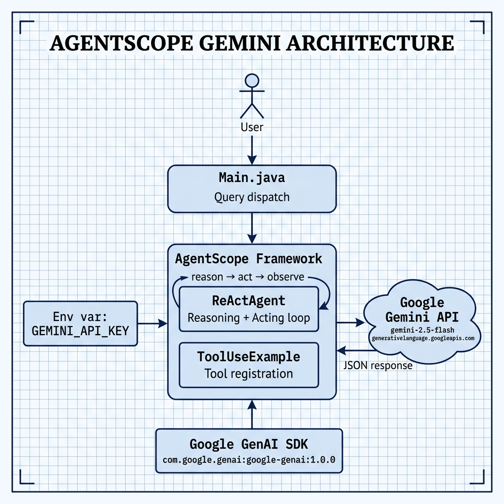

# AgentScope with Google Gemini — Example for Mark Watson's book "Practical Artificial Intelligence With Java"

Book URI: https://leanpub.com/javaai

You can read my book for free online at: https://leanpub.com/javaai/read

This example demonstrates how to use the [AgentScope](https://java.agentscope.io) multi-agent framework with Google's **Gemini 2.5 Flash** model. AgentScope provides built-in primitives for tool calling, long-term memory, RAG, and multi-agent collaboration. The central abstraction is `ReActAgent`, which implements a Reasoning + Acting loop: the agent reasons about a user message, optionally invokes tools, and returns a final response.

## Prerequisites

- Java 17+
- Maven 3.8+
- A valid Google Gemini API key ([get one here](https://aistudio.google.com/app/apikey))

## Setup

```bash
export GEMINI_API_KEY=your_key_here
```

## Build & Run

```bash
# Build and run using the Makefile
make run

# Or with Maven directly
mvn package -q
java -jar target/agentscope-gemini-1.0.0-SNAPSHOT.jar
```

## Key Dependencies

| Artifact | Purpose |
|---|---|
| `io.agentscope:agentscope:1.0.9` | AgentScope core (agents, messaging) |
| `com.google.genai:google-genai:1.0.0` | Google GenAI SDK (Gemini models) |

## Book Cover Material, Copyright, and License

This example is released using the Apache 2 license.

Copyright 2022-2026 Mark Watson. All rights reserved.

## This Book is Licensed with Creative Commons Attribution CC BY Version 3

You are free to share and adapt this content, with attribution.

## Architecture


