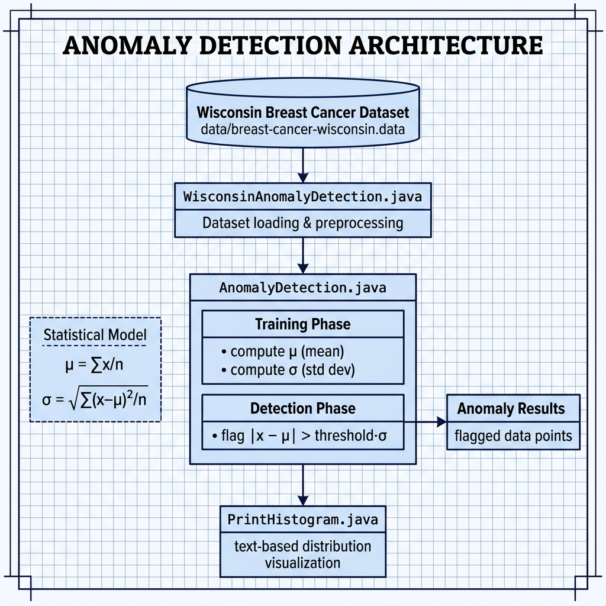

# Anomaly Detection Machine Learning — Example for Mark Watson's book "Practical Artificial Intelligence With Java"

Book URI: https://leanpub.com/javaai

You can read my book for free online at: https://leanpub.com/javaai/read

This example implements anomaly detection using statistical methods applied to the Wisconsin Diagnostic Breast Cancer dataset. The `AnomalyDetection` class calculates feature means and standard deviations from training data, then flags data points whose features deviate significantly from normal ranges. A histogram visualization utility is also included.

## Prerequisites

- Java 21+
- Maven 3.6+

## Build & Run

```bash
# Run the Wisconsin breast cancer anomaly detection example
make wisconsin

# Or manually
mvn install
mvn exec:java -Dexec.mainClass="com.markwatson.anomaly_detection.WisconsinAnomalyDetection"
```

## Project Structure

- **`AnomalyDetection.java`** — Core anomaly detection engine using mean/standard-deviation thresholds
- **`WisconsinAnomalyDetection.java`** — Applies the detector to the Wisconsin breast cancer dataset
- **`PrintHistogram.java`** — Text-based histogram printer for visualizing data distributions

## Book Cover Material, Copyright, and License

This example is released using the Apache 2 license.

Copyright 2022-2026 Mark Watson. All rights reserved.

## This Book is Licensed with Creative Commons Attribution CC BY Version 3

You are free to share and adapt this content, with attribution.

## Architecture


