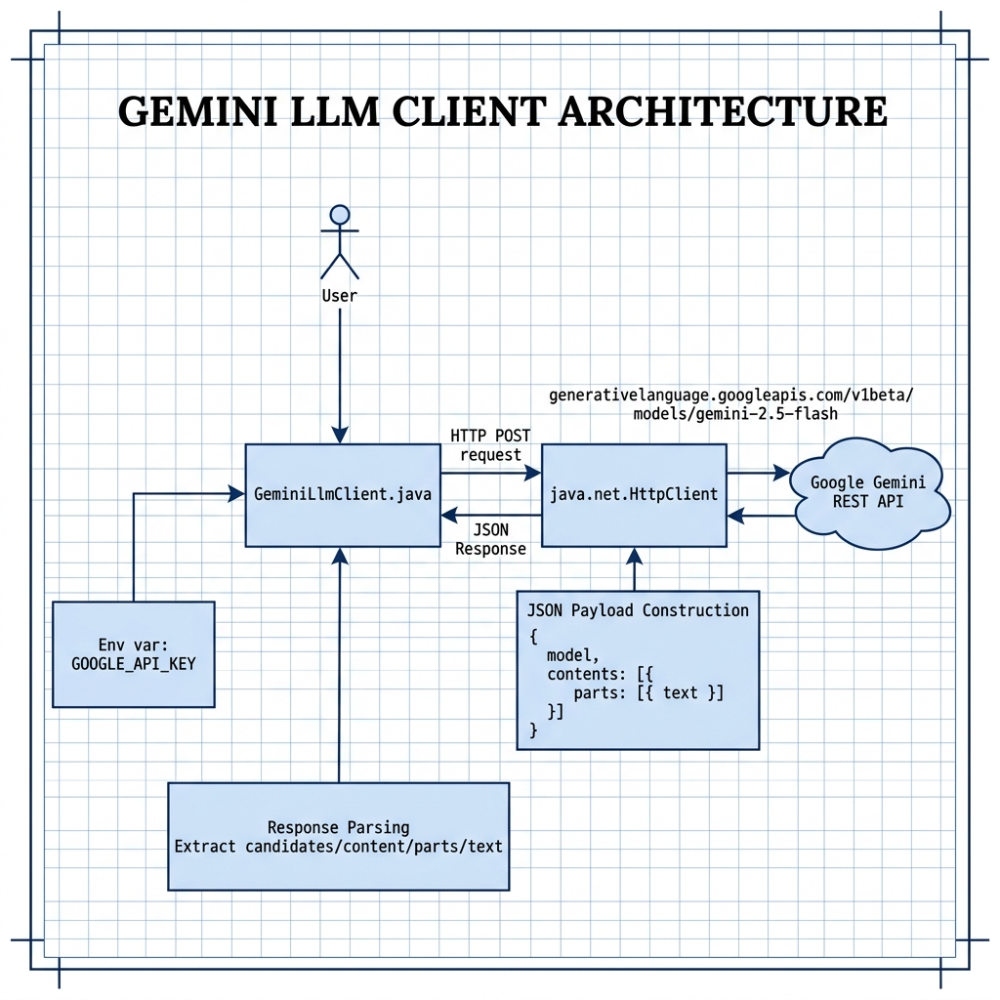

# Google Gemini LLM Client — Example for Mark Watson's book "Practical Artificial Intelligence With Java"

Book URI: https://leanpub.com/javaai

You can read my book for free online at: https://leanpub.com/javaai/read

This example shows how to call the Google Gemini large language model API directly from Java using `java.net.HttpClient`. It sends a prompt to the Gemini REST endpoint and parses the JSON response, demonstrating the fundamentals of LLM integration without any third-party SDK.

## Prerequisites

- Java 21+
- Maven 3.6+
- A valid `GOOGLE_API_KEY` environment variable ([get one here](https://aistudio.google.com/app/apikey))

## Setup

```bash
export GOOGLE_API_KEY=your_key_here
```

## Build & Run

```bash
# Run the test via the Makefile
make

# Or manually
mvn test -q
```

## Book Cover Material, Copyright, and License

This example is released using the Apache 2 license.

Copyright 2022-2026 Mark Watson. All rights reserved.

## This Book is Licensed with Creative Commons Attribution CC BY Version 3

You are free to share and adapt this content, with attribution.

## Architecture

