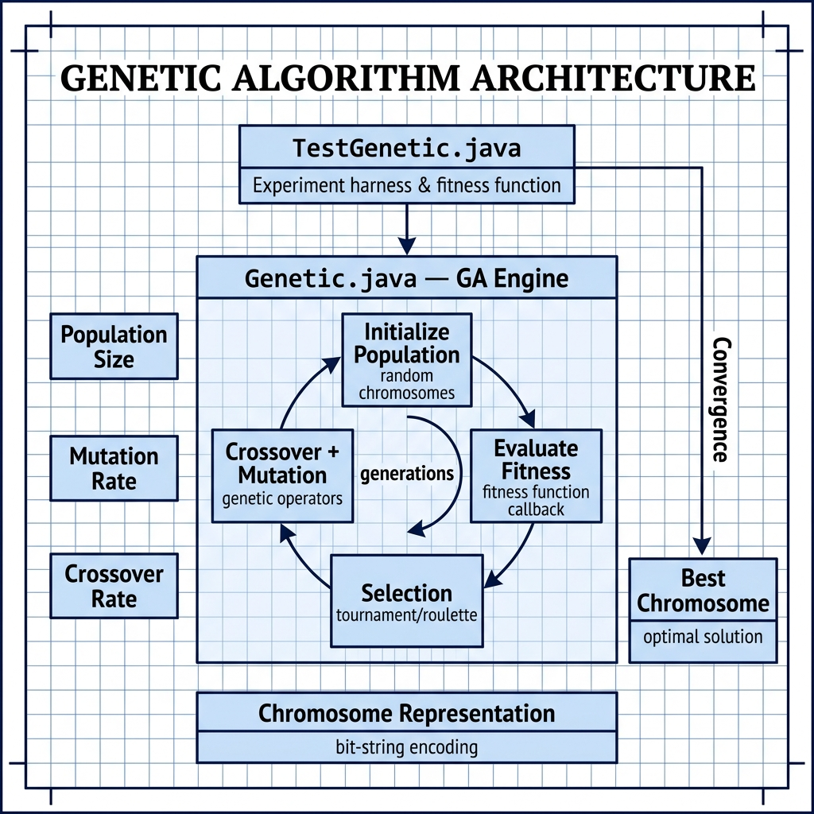

# Genetic Algorithms — Example for Mark Watson's book "Practical Artificial Intelligence With Java"

Book URI: https://leanpub.com/javaai

You can read my book for free online at: https://leanpub.com/javaai/read

This example implements a genetic algorithm framework that demonstrates evolutionary computation. The `Genetic` class provides the core GA infrastructure — chromosome representation, fitness evaluation, crossover, and mutation — while `TestGenetic` runs an optimization experiment that evolves a population toward a target solution.

## Prerequisites

- Java 8+
- Maven 3.6+

## Build & Run

```bash
# Run the genetic algorithm test
make test

# Or manually
mvn install
mvn exec:java -Dexec.mainClass="com.markwatson.geneticalgorithm.TestGenetic"
```

## Project Structure

- **`Genetic.java`** — Core GA engine with selection, crossover, and mutation operators
- **`TestGenetic.java`** — Test harness that runs the GA and prints generational fitness results

## Book Cover Material, Copyright, and License

This example is released using the Apache 2 license.

Copyright 2022-2026 Mark Watson. All rights reserved.

## This Book is Licensed with Creative Commons Attribution CC BY Version 3

You are free to share and adapt this content, with attribution.

## Architecture


