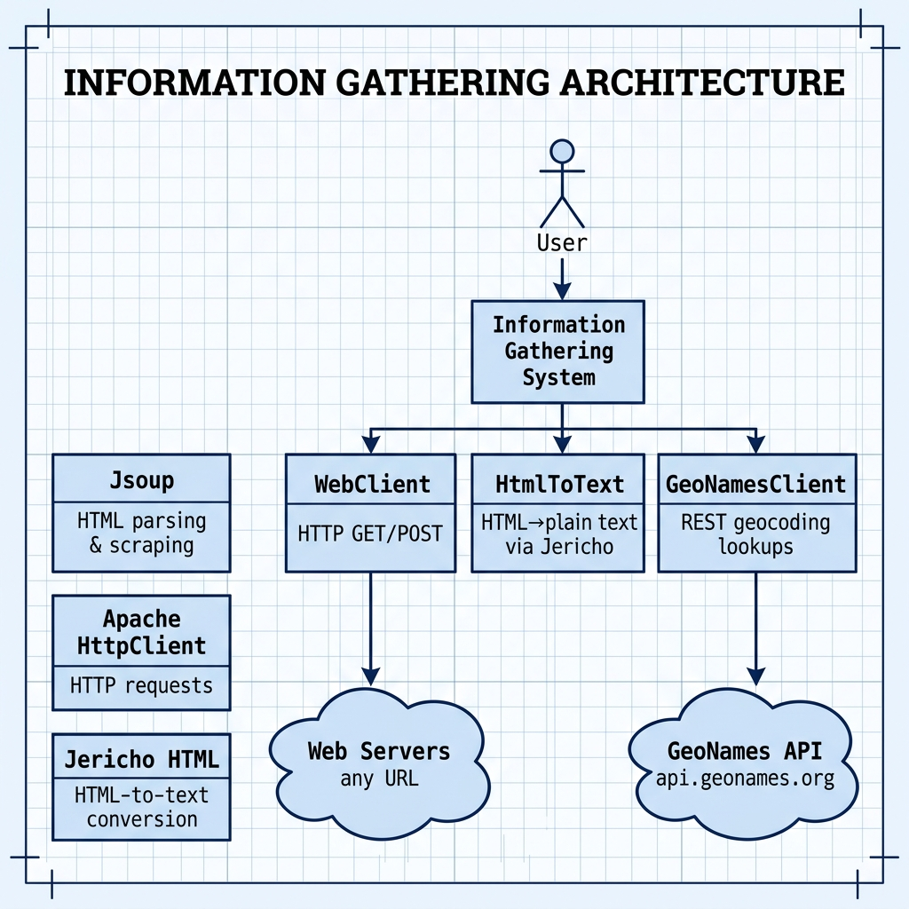

# Information Gathering — Example for Mark Watson's book "Practical Artificial Intelligence With Java"

Book URI: https://leanpub.com/javaai

You can read my book for free online at: https://leanpub.com/javaai/read

This example demonstrates techniques for gathering information from the web, including web scraping with Jsoup and querying the GeoNames geographical database API. The project includes a general-purpose web client, an HTML-to-text extractor, and a GeoNames REST client for geocoding and location lookups.

## Prerequisites

- Java 11+
- Maven 3.6+
- A free [GeoNames](https://www.geonames.org/login) account (for the GeoNames API tests)

## Build & Run

```bash
# Run the unit tests
make run_unit_tests

# Or manually
mvn test
```

## Key Dependencies

| Artifact | Purpose |
|---|---|
| `org.jsoup:jsoup` | HTML parsing and web scraping |
| `org.apache.httpcomponents:httpclient` | HTTP requests |
| `net.htmlparser.jericho:jericho-html` | HTML-to-text conversion |

## Book Cover Material, Copyright, and License

This example is released using the Apache 2 license.

Copyright 2022-2026 Mark Watson. All rights reserved.

## This Book is Licensed with Creative Commons Attribution CC BY Version 3

You are free to share and adapt this content, with attribution.

## Architecture


