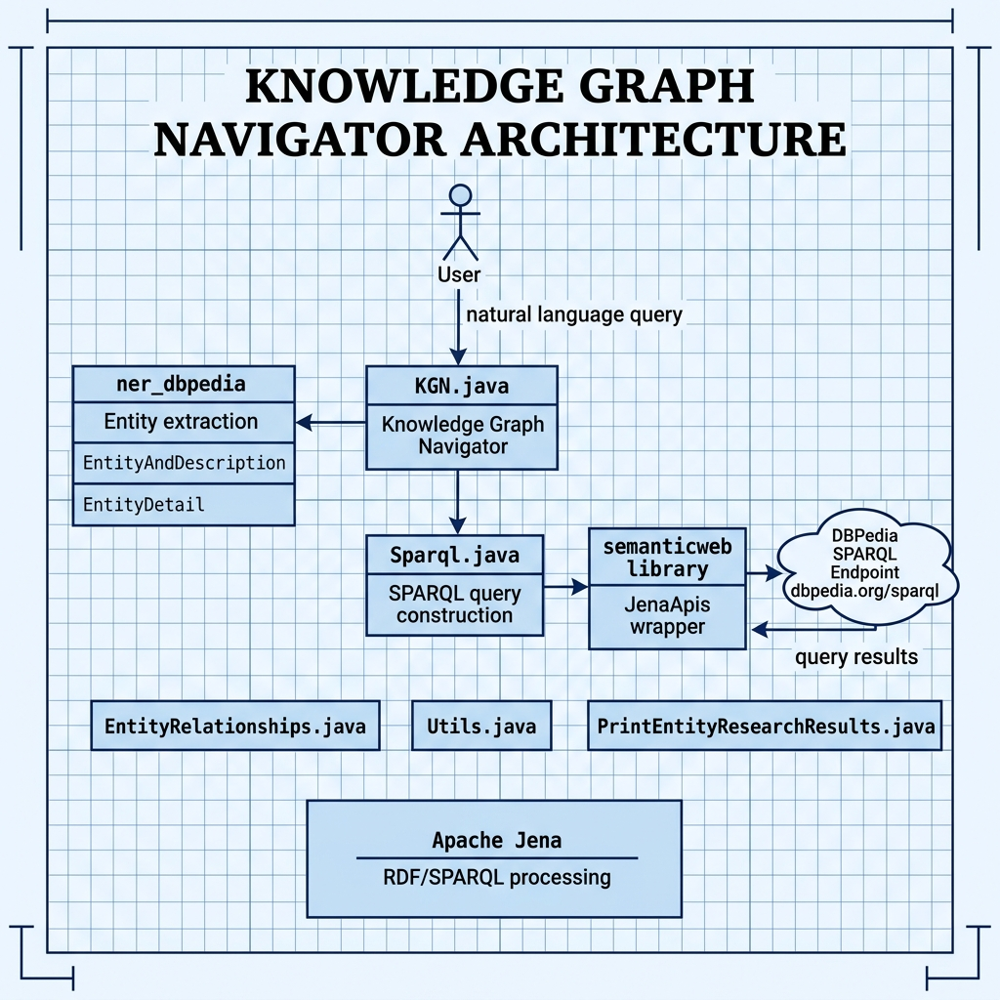

# Knowledge Graph Navigator — Example for Mark Watson's book "Practical Artificial Intelligence With Java"

Book URI: https://leanpub.com/javaai

You can read my book for free online at: https://leanpub.com/javaai/read

This example implements a Knowledge Graph Navigator that queries DBPedia's SPARQL endpoint to discover relationships between entities. Given a natural-language query, it extracts entity names, resolves them to DBPedia URIs, runs SPARQL queries to find connections, and presents the results. It combines the `ner_dbpedia` (entity recognition) and `semantic_web_apache_jena` (SPARQL querying) libraries from earlier chapters.

## Prerequisites

- Java 11+
- Maven 3.6+
- **You must build and install these local dependencies first**:

```bash
cd ../ner_dbpedia && make install
cd ../semantic_web_apache_jena && make install
```

## Build & Run

> **Note:** This example must be run as a JUnit test (or from an IDE), not via `mvn exec:java`. This is because `mvn exec` uses a limited classpath that prevents the `ner_dbpedia` dependency from loading its bundled entity-name data files.

```bash
# Install and run via JUnit
make install
mvn test
```

## Key Dependencies

| Artifact | Purpose |
|---|---|
| `com.markwatson:nerdbpedia` | Named entity recognition + DBPedia linking (local) |
| `com.markwatson:semanticweb` | SPARQL query wrapper using Apache Jena (local) |
| `org.apache.jena:apache-jena-libs` | RDF/SPARQL processing |

## Book Cover Material, Copyright, and License

This example is released using the Apache 2 license.

Copyright 2022-2026 Mark Watson. All rights reserved.

## This Book is Licensed with Creative Commons Attribution CC BY Version 3

You are free to share and adapt this content, with attribution.

## Architecture


