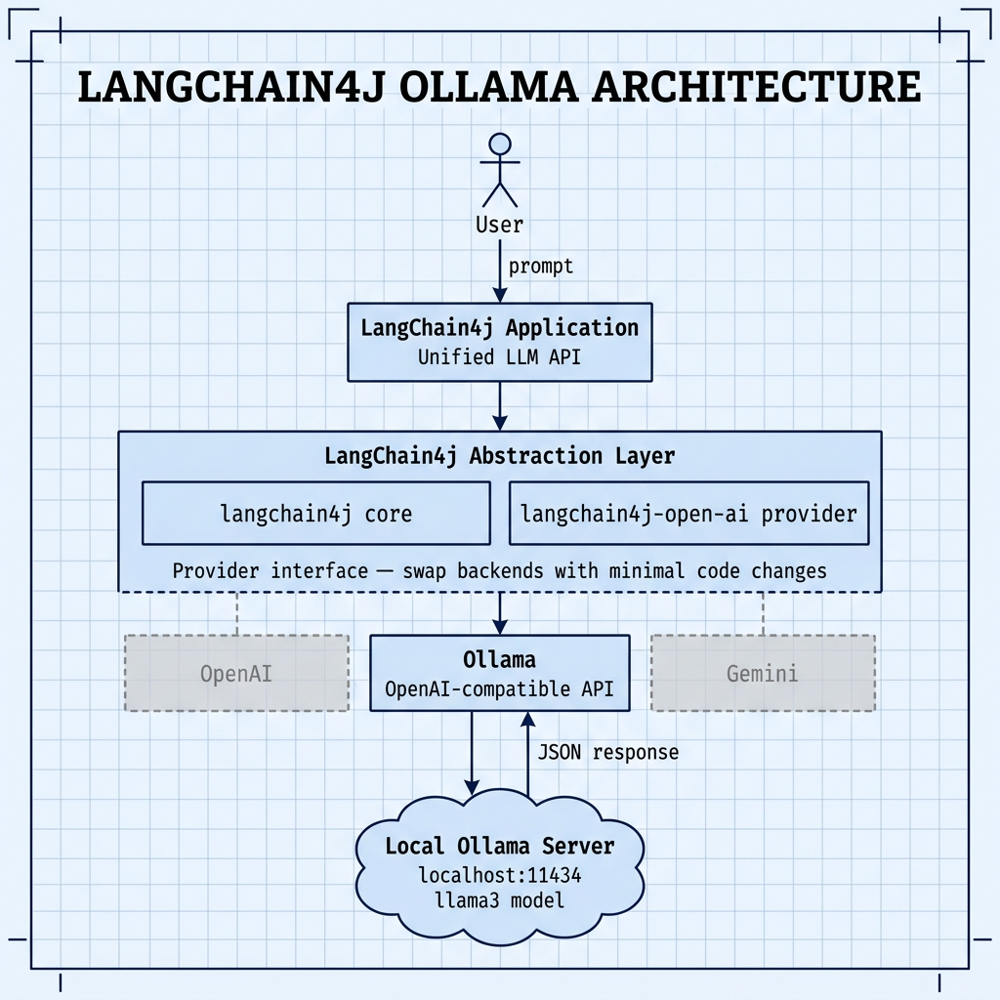

# LangChain4j with Ollama — Example for Mark Watson's book "Practical Artificial Intelligence With Java"

Book URI: https://leanpub.com/javaai

You can read my book for free online at: https://leanpub.com/javaai/read

This example shows how to use the [LangChain4j](https://docs.langchain4j.dev) library as an abstraction layer for different LLM providers. Here it is wired to a locally-running Ollama server, demonstrating that you can swap LLM backends (OpenAI, Gemini, Ollama, etc.) with minimal code changes thanks to LangChain4j's unified API.

## Prerequisites

- Java 21+
- Maven 3.6+
- [Ollama](https://ollama.com) installed with a model pulled (e.g., `ollama pull llama3.2`)

## Setup

Make sure Ollama is running before executing the example:

```bash
ollama serve
```

## Build & Run

```bash
# Run via the Makefile
make

# Or manually
mvn test -q
```

## Configuration

Set the `OLLAMA_BASE_URL` environment variable to override the default Ollama server address (`http://localhost:11434`):

```bash
export OLLAMA_BASE_URL=http://my-server:11434
```

## Key Dependencies

| Artifact | Version | Purpose |
|---|---|---|
| `dev.langchain4j:langchain4j` | 1.15.0 | LangChain4j core abstraction |
| `dev.langchain4j:langchain4j-ollama` | 1.15.0 | Native Ollama integration provider |

## Book Cover Material, Copyright, and License

This example is released using the Apache 2 license.

Copyright 2022-2026 Mark Watson. All rights reserved.

## This Book is Licensed with Creative Commons Attribution CC BY Version 3

You are free to share and adapt this content, with attribution.

## Architecture

