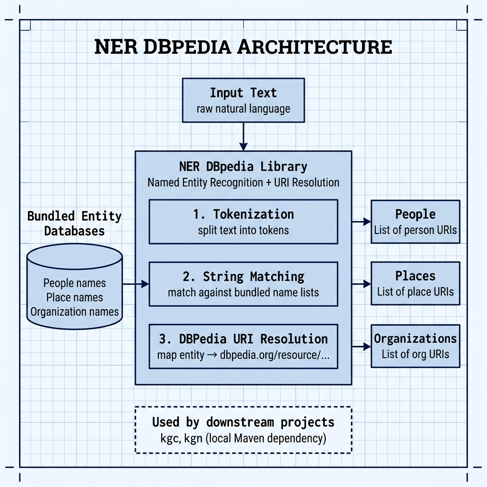

# Named Entity Recognition with DBPedia — Example for Mark Watson's book "Practical Artificial Intelligence With Java"

Book URI: https://leanpub.com/javaai

You can read my book for free online at: https://leanpub.com/javaai/read

This library resolves named entities (people, places, organizations) found in text to their corresponding DBPedia URIs. It uses bundled entity-name lists and string-matching heuristics — no external NLP service is required. This project is also used as a local Maven dependency by the `kgc` (Knowledge Graph Creator) and `kgn` (Knowledge Graph Navigator) examples.

## Prerequisites

- Java 11+
- Maven 3.6+

## Build & Install

Because other projects depend on this library, you should install it to your local Maven repository:

```bash
# Install to local Maven repo
make install

# Run the unit tests
make test
```

Or manually:

```bash
mvn install -DskipTest -Dmaven.test.skip=true -q
mvn test -q
```

## Book Cover Material, Copyright, and License

This example is released using the Apache 2 license.

Copyright 2022-2026 Mark Watson. All rights reserved.

## This Book is Licensed with Creative Commons Attribution CC BY Version 3

You are free to share and adapt this content, with attribution.

## Architecture


