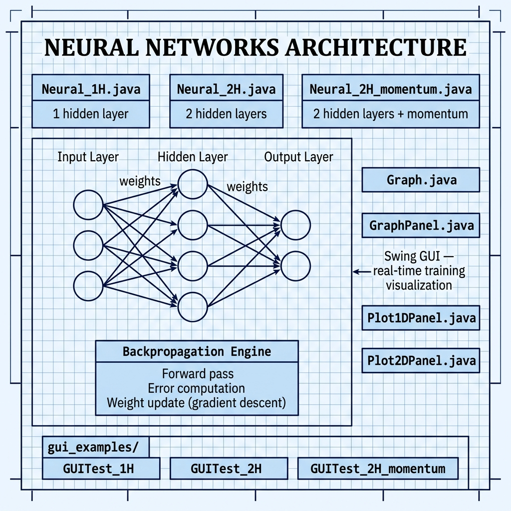

# Neural Networks — Example for Mark Watson's book "Practical Artificial Intelligence With Java"

Book URI: https://leanpub.com/javaai

You can read my book for free online at: https://leanpub.com/javaai/read

This example provides a from-scratch implementation of backpropagation neural networks in Java. Three network architectures are included — one hidden layer, two hidden layers, and two hidden layers with momentum — so you can compare how network depth and training enhancements affect learning. A Swing-based GUI visualizes training progress in real time.

## Prerequisites

- Java 8+
- Maven 3.6+
- A graphical display (for the GUI examples)

## Build & Run

```bash
# Run all three network variants
make all_examples

# Or run individually
make 1H              # 1 hidden layer
make 2H              # 2 hidden layers
make 2H_momentum     # 2 hidden layers with momentum
```

## Project Structure

- **`Neural_1H.java`** — Single hidden-layer backpropagation network
- **`Neural_2H.java`** — Two hidden-layer backpropagation network
- **`Neural_2H_momentum.java`** — Two hidden-layer network with momentum term
- **`Graph.java`**, **`GraphPanel.java`**, **`Plot1DPanel.java`**, **`Plot2DPanel.java`** — Swing GUI for training visualization
- **`gui_examples/`** — GUI test harnesses for each network type

## Book Cover Material, Copyright, and License

This example is released using the Apache 2 license.

Copyright 2022-2026 Mark Watson. All rights reserved.

## This Book is Licensed with Creative Commons Attribution CC BY Version 3

You are free to share and adapt this content, with attribution.

## Architecture


