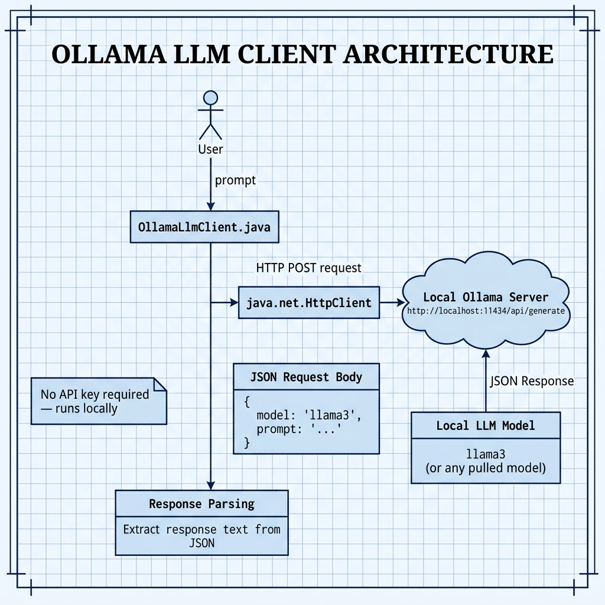

# Ollama Local LLM Client — Example for Mark Watson's book "Practical Artificial Intelligence With Java"

Book URI: https://leanpub.com/javaai

You can read my book for free online at: https://leanpub.com/javaai/read

This example demonstrates how to call a locally-running Ollama LLM server from Java using `java.net.HttpClient`. It sends a prompt to Ollama's REST API (`http://localhost:11434`) and parses the JSON response, showing how to integrate local LLMs into Java applications without any cloud API keys.

## Prerequisites

- Java 11+
- Maven 3.6+
- [Ollama](https://ollama.com) installed with a model pulled (e.g., `ollama pull llama3`)

## Setup

Make sure Ollama is running before executing the example:

```bash
ollama serve
```

## Build & Run

```bash
# Run via the Makefile
make

# Or manually
mvn test -q
```

## Book Cover Material, Copyright, and License

This example is released using the Apache 2 license.

Copyright 2022-2026 Mark Watson. All rights reserved.

## This Book is Licensed with Creative Commons Attribution CC BY Version 3

You are free to share and adapt this content, with attribution.

## Architecture

