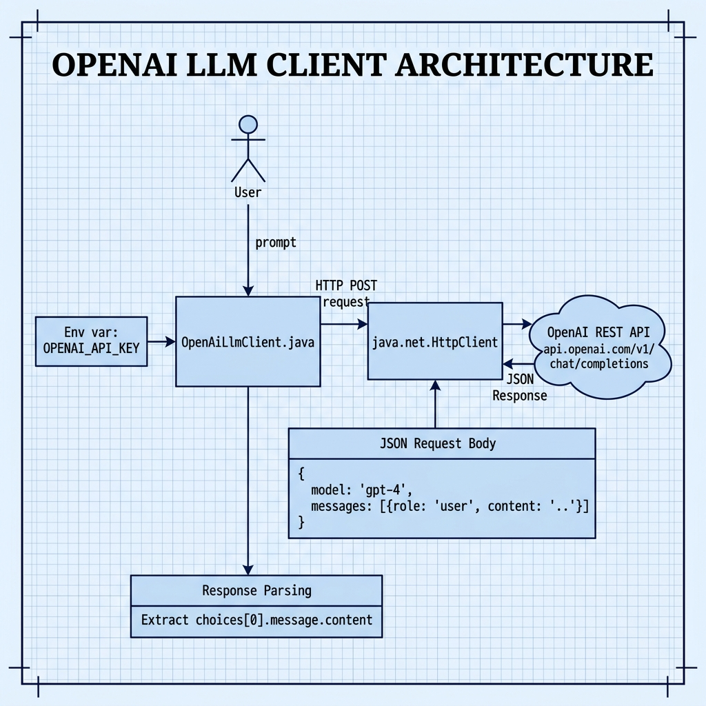

# OpenAI LLM Client — Example for Mark Watson's book "Practical Artificial Intelligence With Java"

Book URI: https://leanpub.com/javaai

You can read my book for free online at: https://leanpub.com/javaai/read

This example shows how to call the OpenAI chat completions API from Java using the [official OpenAI Java SDK](https://github.com/openai/openai-java) (`com.openai:openai-java:4.37.0`). It uses the type-safe builder API to construct requests and parse responses.

## Prerequisites

- Java 21+
- Maven 3.6+
- A valid `OPENAI_API_KEY` environment variable

## Setup

```bash
export OPENAI_API_KEY=your_key_here
```

## Build & Run

```bash
# Run via the Makefile
make

# Or manually
mvn test -q
```

## Book Cover Material, Copyright, and License

This example is released using the Apache 2 license.

Copyright 2022-2026 Mark Watson. All rights reserved.

## This Book is Licensed with Creative Commons Attribution CC BY Version 3

You are free to share and adapt this content, with attribution.

## Architecture

