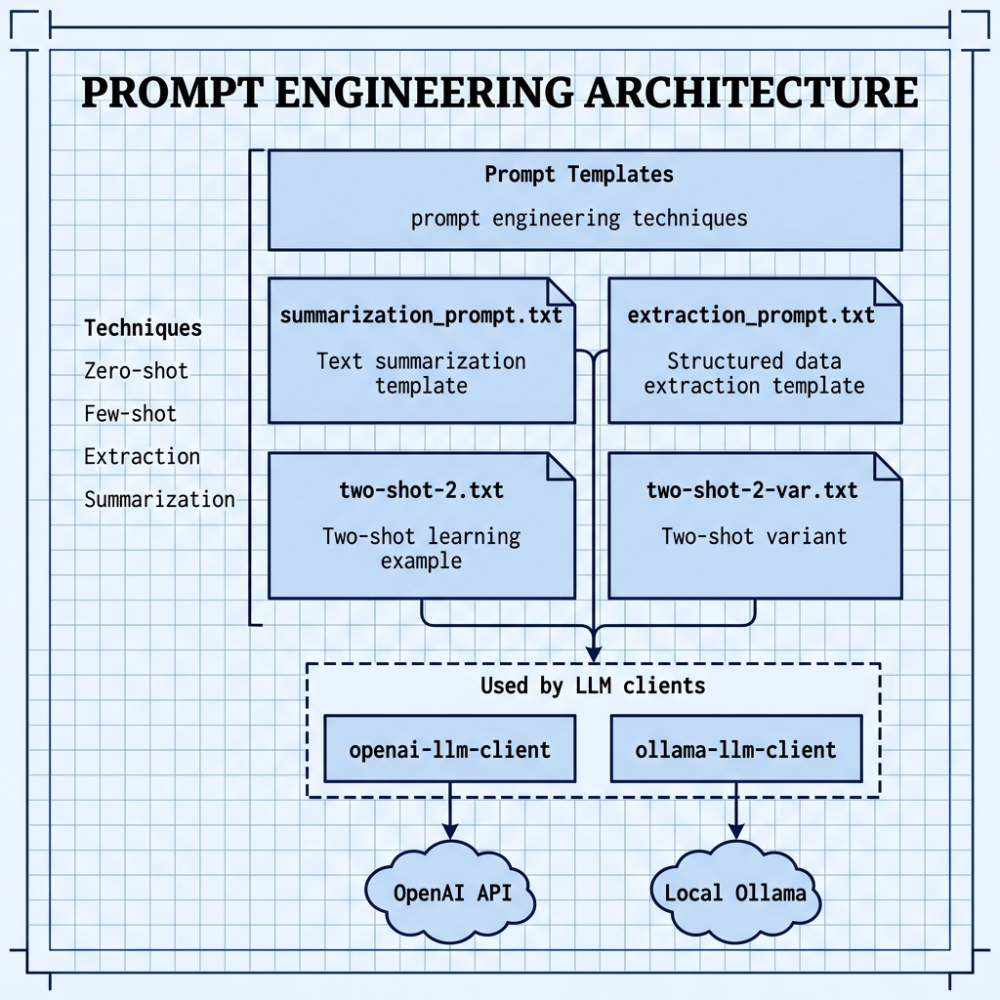

# Example Prompts — for Mark Watson's book "Practical Artificial Intelligence With Java"

Book URI: https://leanpub.com/javaai

You can read my book for free online at: https://leanpub.com/javaai/read

This directory contains example prompt templates used by the OpenAI and Ollama LLM client examples. These files demonstrate prompt engineering techniques discussed in the book, including summarization, extraction, and few-shot prompting.

## Files

| File | Description |
|---|---|
| `summarization_prompt.txt` | Prompt template for text summarization |
| `extraction_prompt.txt` | Prompt template for structured data extraction |
| `two-shot-2.txt` | Two-shot prompt example |
| `two-shot-2-var.txt` | Variation of the two-shot prompt |

## Book Cover Material, Copyright, and License

This example is released using the Apache 2 license.

Copyright 2022-2026 Mark Watson. All rights reserved.

## Architecture

