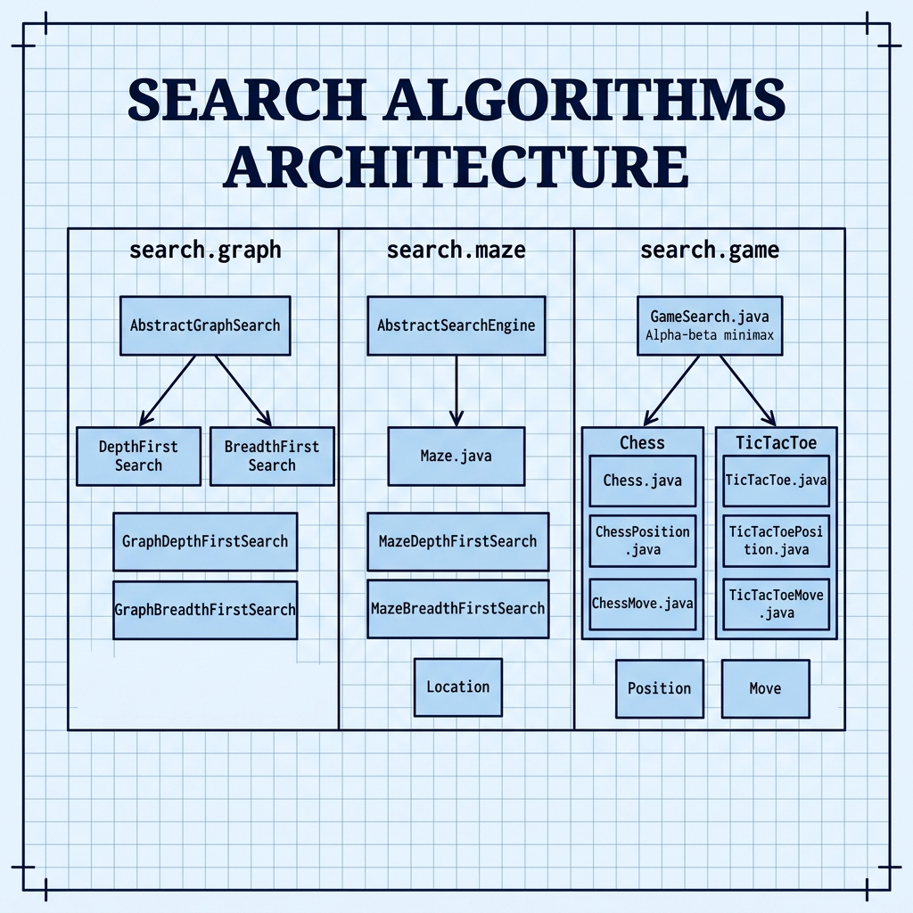

# Search Algorithms — Example for Mark Watson's book "Practical Artificial Intelligence With Java"

Book URI: https://leanpub.com/javaai

You can read my book for free online at: https://leanpub.com/javaai/read

This example implements several classic AI search algorithms: depth-first and breadth-first graph search, maze solving, and game-tree search with alpha-beta pruning. Two complete game implementations are included — Tic-Tac-Toe and a simplified Chess engine — that let you play against the computer.

## Prerequisites

- Java 8+
- Maven 3.6+

## Build & Run

```bash
# Play Chess against the AI
make chess

# Play Tic-Tac-Toe against the AI
make tictactoe

# Run the graph search demo
make graph

# Run the maze search demo
make maze
```

## Project Structure

### Graph Search (`search.graph`)
- **`AbstractGraphSearch.java`** — Base class for graph search
- **`DepthFirstSearch.java`** / **`BreadthFirstSearch.java`** — Core algorithms
- **`GraphDepthFirstSearch.java`** / **`GraphBreadthFirstSearch.java`** — Runnable demos

### Maze Search (`search.maze`)
- **`Maze.java`** — Maze representation
- **`AbstractSearchEngine.java`** — Base search engine
- **`MazeDepthFirstSearch.java`** / **`MazeBreadthFirstSearch.java`** — Maze solvers

### Game Search (`search.game`)
- **`GameSearch.java`** — Alpha-beta minimax game search
- **`Chess.java`** / **`ChessPosition.java`** / **`ChessMove.java`** — Chess implementation
- **`TicTacToe.java`** / **`TicTacToePosition.java`** / **`TicTacToeMove.java`** — Tic-Tac-Toe implementation

## Book Cover Material, Copyright, and License

This example is released using the Apache 2 license.

Copyright 2022-2026 Mark Watson. All rights reserved.

## This Book is Licensed with Creative Commons Attribution CC BY Version 3

You are free to share and adapt this content, with attribution.

## Architecture


