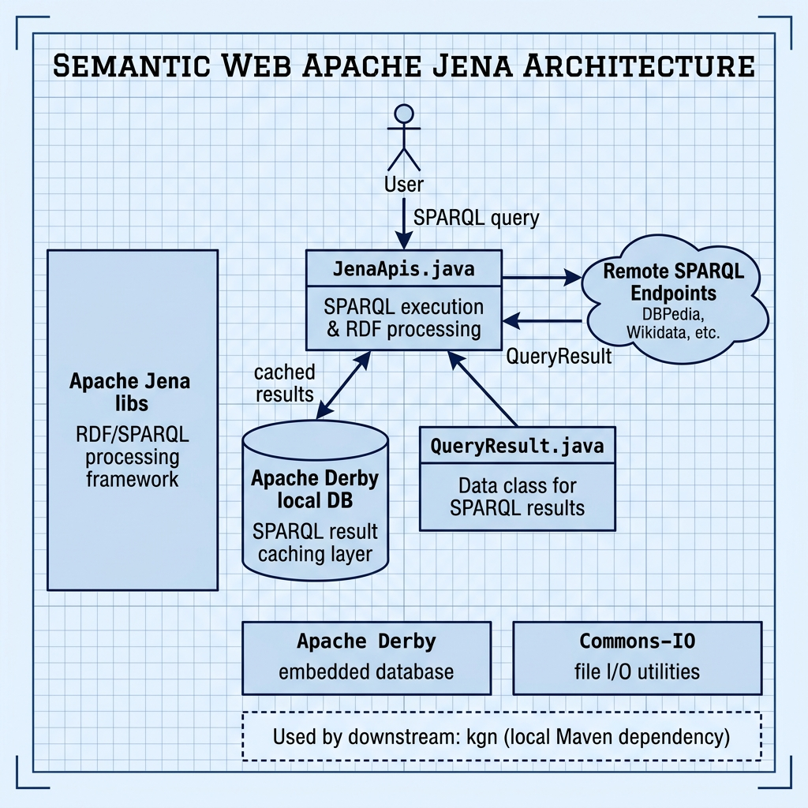

# Semantic Web with Apache Jena — Example for Mark Watson's book "Practical Artificial Intelligence With Java"

Book URI: https://leanpub.com/javaai

You can read my book for free online at: https://leanpub.com/javaai/read

This example demonstrates Semantic Web programming using the Apache Jena framework. It includes utilities for executing SPARQL queries against remote endpoints (like DBPedia), caching query results locally with Apache Derby, and parsing RDF data. This project is also used as a local Maven dependency by the `kgn` (Knowledge Graph Navigator) example.

## Prerequisites

- Java 21+ (required by Apache Jena 6)
- Maven 3.6+

## Build & Run

```bash
# Install and run the tests
make test

# Or step by step
mvn install -DskipTest -Dmaven.test.skip=true -q
mvn test -q
```

## Key Dependencies

| Artifact | Purpose |
|---|---|
| `org.apache.jena:apache-jena-libs` 6.1.0 | RDF/SPARQL processing |
| `com.h2database:h2` 2.4.240 | Local SPARQL result caching (embedded DB) |
| `commons-io:commons-io` 2.22.0 | File I/O utilities |
| `org.junit.jupiter:junit-jupiter` 6.1.0 | Testing framework |

## Project Structure

- **`JenaApis.java`** — SPARQL query execution and RDF processing
- **`Cache.java`** — Derby-backed query result cache
- **`QueryResult.java`** — Data class for SPARQL results

## Book Cover Material, Copyright, and License

This example is released using the Apache 2 license.

Copyright 2022-2026 Mark Watson. All rights reserved.

## This Book is Licensed with Creative Commons Attribution CC BY Version 3

You are free to share and adapt this content, with attribution.

## Architecture


